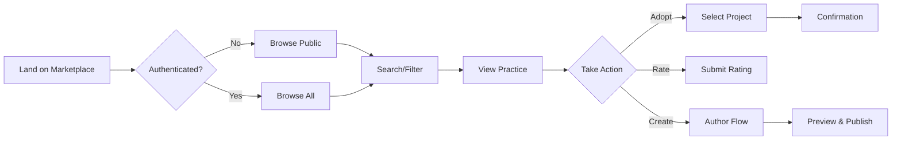

# PRD-002: Best Practices Marketplace Web UI

## Document Status
**Status**: Draft  
**Last Updated**: 2025-08-04  
**Owner**: Chris Norton  
**Stakeholders**: Ginko AI Development Team

## Executive Summary

### Problem Statement
While the Best Practices Marketplace API (Phase 1) provides complete backend functionality, users need an intuitive web interface to discover, create, adopt, and manage best practices. The current API-only approach requires technical knowledge and MCP tools, limiting adoption to developers comfortable with CLI interfaces.

### Solution Overview
A comprehensive web-based marketplace integrated into ginko.ai that provides an Amazon/GitHub Marketplace-like experience for browsing, creating, and managing development best practices. The UI will leverage the existing API endpoints and provide intuitive workflows for all user personas.

### Success Criteria
- **User Engagement**: 80% of users browse marketplace within first week
- **Content Creation**: 50+ best practices created within 30 days
- **Adoption Rate**: Average 3+ practices adopted per active project
- **User Satisfaction**: 4.5+ star rating on marketplace experience

## Context & Background

### Why Now?
- **API Foundation Complete**: Backend infrastructure ready (PRD-001)
- **User Expectation**: Web-based marketplaces are the standard (npm, GitHub, VS Code)
- **Barrier to Entry**: CLI-only access limits non-technical users
- **Community Building**: Visual marketplace encourages browsing and discovery

### Current State
- **Backend**: Fully functional REST API with all CRUD operations
- **Frontend**: Existing Next.js dashboard at `/dashboard`
- **Authentication**: GitHub OAuth already integrated
- **Design System**: Material-UI components available

### Market Research
- **GitHub Marketplace**: Clean cards, clear CTAs, social proof
- **npm Registry**: Search-focused, package stats prominent
- **VS Code Marketplace**: Categories, ratings, download counts
- **Stack Overflow**: Tags, voting, author reputation

## Goals & Objectives

### Primary Goals
1. **Seamless Discovery**: Browse and search practices with rich filtering
2. **Easy Contribution**: Simple creation flow with syntax highlighting
3. **Trust Building**: Ratings, reviews, and usage statistics
4. **Project Integration**: One-click adoption with team visibility

### Success Metrics
| Metric | Baseline | Target | Timeline | Owner |
|--------|----------|--------|----------|-------|
| Page Views/Day | 0 | 500+ | 30 days | Engineering |
| Practices Created/Week | 0 | 20+ | 30 days | Product |
| Search Queries/Day | 0 | 100+ | 30 days | Engineering |
| Adoption Actions/Day | 0 | 50+ | 30 days | Product |

### Non-Goals
- **Mobile App**: Web-responsive only for MVP
- **Real-time Collaboration**: No live editing features
- **Version Control**: Single version per practice initially
- **Paid Practices**: All practices free in Phase 2

## User Research & Insights

### Target Users
| User Segment | Description | Primary Needs | Pain Points |
|--------------|-------------|---------------|-------------|
| Practice Authors | Senior devs, tech leads | Easy publishing, recognition | Complex forms, no visibility |
| Practice Consumers | All developers | Quick discovery, trust signals | Information overload, quality concerns |
| Team Managers | Engineering managers | Standardization, governance | Enforcement, tracking adoption |
| New Developers | Junior devs, onboarding | Clear examples, guidance | Overwhelming choices, context |

### User Journey - Web Experience



## Detailed Requirements

### Functional Requirements

#### 1. Marketplace Homepage (`/marketplace`)
- **Hero Section**
  - Search bar with autocomplete
  - Quick filters: Popular, Recent, Your Practices
  - "Create Practice" CTA button
- **Featured Practices**
  - Staff picks / Most adopted this week
  - Trending by category cards
- **Browse by Category**
  - Language tiles (JavaScript, Python, Go, etc.)
  - Framework sections (React, Next.js, Django)
  - Domain areas (API, Database, Security, Testing)
- **Statistics Dashboard**
  - Total practices available
  - Active contributors
  - Adoptions this month

#### 2. Search & Discovery (`/marketplace/search`)
- **Search Interface**
  - Full-text search with highlighting
  - Tag-based filtering (multi-select)
  - Sort options: Relevance, Popular, Recent, Rating
  - Pagination with 20 results per page
- **Filter Sidebar**
  - Visibility: All, Public, Organization
  - Languages: Checkbox list
  - Frameworks: Checkbox list
  - Author: Search/select
  - Rating: Star filter (4+ stars, etc.)
  - Adoption count ranges
- **Result Cards**
  - Practice name and description preview
  - Author avatar and name
  - Tags (max 5 visible)
  - Stats: ⭐ 4.5 (23) | 👁️ 1.2k | ✓ 89 adoptions
  - "Quick Adopt" button for authenticated users

#### 3. Practice Detail Page (`/marketplace/practices/:id`)
- **Header Section**
  - Practice name (h1)
  - Author info with GitHub link
  - Created/Updated dates
  - Action buttons: Adopt, Edit (if author), Share
- **Navigation Tabs**
  - Overview (default)
  - Code Examples
  - Reviews & Ratings
  - Adoption History
- **Overview Tab**
  - Full description (Markdown rendered)
  - Tags with links to filtered search
  - Usage statistics graph (last 30 days)
  - Related practices carousel
- **Code Examples Tab**
  - Syntax-highlighted code blocks
  - Copy button on each example
  - Language detection and display
- **Reviews Tab**
  - Star rating breakdown (horizontal bars)
  - Individual reviews with:
    - Author avatar/name
    - Rating stars
    - Review text
    - Helpful/Not helpful votes
    - Date posted
  - "Write Review" button
- **Sidebar**
  - Adoption CTA card
  - Stats summary
  - Author profile card
  - Report practice link

#### 4. Create/Edit Practice (`/marketplace/create`, `/marketplace/practices/:id/edit`)
- **Form Fields**
  - Name* (text input, 100 chars)
  - Description* (rich text editor with Markdown)
  - Syntax Examples (code editor with language select)
  - Tags (tag input with autocomplete, max 10)
  - Visibility (radio: Public/Private with explanation)
- **Preview Mode**
  - Split view: Edit | Preview
  - Live preview updates
  - Mobile preview option
- **Validation**
  - Required field indicators
  - Character limits
  - Duplicate name checking
  - Syntax validation for code blocks
- **Actions**
  - Save as Draft
  - Publish (with confirmation)
  - Cancel (with unsaved changes warning)

#### 5. My Practices Dashboard (`/marketplace/my-practices`)
- **Created Practices**
  - List/Grid view toggle
  - Edit/Delete actions
  - View analytics per practice
  - Visibility toggle
- **Adopted Practices**
  - Grouped by project
  - Remove adoption option
  - Link to practice detail
  - Adoption date and notes

#### 6. Project Integration (`/dashboard/projects/:id/practices`)
- **Adopted Practices List**
  - Practice cards with full details
  - Author information
  - Adoption metadata (who, when, notes)
  - Remove button (with confirmation)
- **Browse Marketplace**
  - Embedded search/filter
  - Quick adopt flow
  - Recommendations based on project type

### Non-Functional Requirements

#### Design & UX
- **Responsive Design**: Mobile-first, works on all devices
- **Loading States**: Skeleton screens for all data fetching
- **Error Handling**: User-friendly error messages with recovery actions
- **Empty States**: Helpful guidance when no results/content
- **Accessibility**: WCAG AA compliance, keyboard navigation

#### Performance
- **Page Load**: < 2s for marketplace homepage
- **Search Results**: < 500ms for search queries
- **Image Optimization**: Lazy loading for author avatars
- **Caching**: 5-minute cache for popular practices

## Technical Considerations

### Architecture Overview
```
┌─────────────────┐     ┌──────────────────┐     ┌─────────────────┐
│                 │     │                  │     │                 │
│  Next.js Pages  │────▶│  API Routes      │────▶│  PostgreSQL     │
│  (React + MUI)  │     │  (Serverless)    │     │  (Best         │
│                 │     │                  │     │  Practices)     │
└─────────────────┘     └──────────────────┘     └─────────────────┘
         │                       │
         │                       │
         ▼                       ▼
┌─────────────────┐     ┌──────────────────┐
│   Static Assets │     │  GitHub OAuth    │
│   (Vercel CDN)  │     │  (Authentication)│
└─────────────────┘     └──────────────────┘
```

### Technology Stack
| Component | Technology | Rationale |
|-----------|------------|-----------|
| Framework | Next.js 14 (App Router) | Existing dashboard setup |
| UI Library | Material-UI v5 | Consistent with dashboard |
| State Management | React Query (TanStack) | API data caching |
| Code Highlighting | Prism.js | Lightweight, many languages |
| Markdown | react-markdown | Safe rendering |
| Forms | React Hook Form | Performance, validation |
| Search | API backend | Leverage PostgreSQL FTS |

### Component Structure
```
dashboard/src/
├── app/
│   ├── marketplace/
│   │   ├── page.tsx                 # Homepage
│   │   ├── search/page.tsx          # Search results
│   │   ├── create/page.tsx          # Create practice
│   │   ├── my-practices/page.tsx    # User's practices
│   │   └── practices/
│   │       └── [id]/
│   │           ├── page.tsx         # Practice detail
│   │           └── edit/page.tsx    # Edit practice
│   └── dashboard/
│       └── projects/
│           └── [id]/
│               └── practices/page.tsx # Project practices
├── components/
│   └── marketplace/
│       ├── PracticeCard.tsx
│       ├── SearchFilters.tsx
│       ├── RatingStars.tsx
│       ├── CodeExample.tsx
│       ├── ReviewForm.tsx
│       └── AdoptButton.tsx
└── lib/
    └── marketplace/
        ├── api.ts               # API client
        └── types.ts             # TypeScript types
```

### API Integration
- **Use Existing Endpoints**: All from PRD-001
- **Client-Side Fetching**: React Query for caching
- **Optimistic Updates**: For adopt/rate actions
- **Error Boundaries**: Graceful failure handling

## Implementation Plan

### Phase 2A: Core Browse & Search (Week 1)
**Deliverables**:
- [ ] Marketplace homepage with search
- [ ] Search results page with filters
- [ ] Practice detail page (read-only)
- [ ] Basic responsive design

### Phase 2B: User Actions (Week 2)
**Deliverables**:
- [ ] Create practice form and flow
- [ ] Edit practice (author only)
- [ ] Adopt/Unadopt functionality
- [ ] My Practices dashboard

### Phase 2C: Social Features (Week 3)
**Deliverables**:
- [ ] Star ratings system
- [ ] Written reviews
- [ ] Author profile pages
- [ ] Usage analytics display

### Phase 2D: Project Integration (Week 4)
**Deliverables**:
- [ ] Project practices page
- [ ] Adoption workflow from projects
- [ ] Team practice recommendations
- [ ] Polish and optimization

## Success Metrics & KPIs

### User Engagement
- **Daily Active Users**: Target 100+ within 30 days
- **Session Duration**: Average 5+ minutes
- **Pages per Session**: Average 4+ pages
- **Bounce Rate**: Below 40%

### Content Metrics
- **Practice Creation Rate**: 5+ per day after launch
- **Review Submission**: 2+ reviews per practice average
- **Tag Diversity**: 50+ unique tags used

### Business Impact
- **Developer Productivity**: 20% reduction in onboarding time
- **Code Consistency**: 30% reduction in style violations
- **Knowledge Sharing**: 2x increase in documented patterns

## Risk Mitigation

| Risk | Impact | Mitigation |
|------|--------|------------|
| Low quality practices | High | Implement flagging system, author reputation |
| Spam/Abuse | Medium | Rate limiting, content moderation |
| Performance at scale | Medium | Implement pagination, caching strategy |
| Complex UI overwhelming users | High | Progressive disclosure, good onboarding |

## Future Enhancements (Phase 3+)

1. **Version Control**: Track practice evolution
2. **Team Workspaces**: Private team collections
3. **AI Suggestions**: ML-based practice recommendations
4. **Export/Import**: Share practice collections
5. **Metrics Dashboard**: ROI tracking for practices
6. **Certification**: "Verified" practices program
7. **Comments/Discussion**: Community feedback threads
8. **IDE Extensions**: VS Code marketplace integration

---

## Document History
| Version | Date | Author | Changes |
|---------|------|--------|---------|
| 0.1 | 2025-08-04 | Chris Norton | Initial draft for web UI requirements |

## Approval
- **Product Owner**: Chris Norton - Pending
- **Engineering Lead**: Pending
- **Design Lead**: Pending