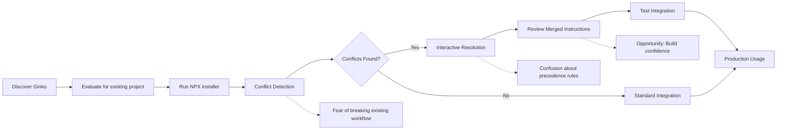
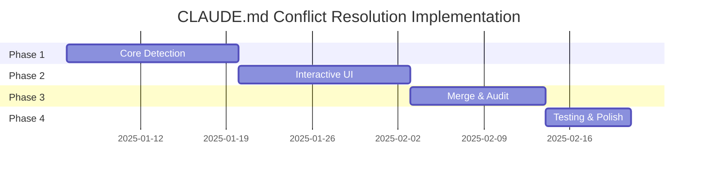

# PRD-003: CLAUDE.md Conflict Resolution System

## Document Status
**Status**: Draft  
**Last Updated**: 2025-08-05  
**Owner**: Chris Norton  
**Stakeholders**: Ginko Engineering Team, Claude Code Users, Brownfield Adopters

## Executive Summary

### Problem Statement
When integrating Ginko into existing projects, many codebases already contain CLAUDE.md files with project-specific instructions that conflict with Ginko's team best practices and context management. This creates confusion for Claude AI assistants, inconsistent behavior, and blocks successful brownfield adoption.

### Solution Overview
Build an intelligent conflict resolution system that detects, analyzes, and merges existing CLAUDE.md files with Ginko team practices through an interactive resolution process. The system uses hierarchical instruction precedence and maintains audit trails of all decisions.

### Success Criteria
- **Brownfield Adoption Rate**: 85% of projects with existing CLAUDE.md files successfully integrate Ginko
- **Conflict Resolution Success**: 95% of detected conflicts resolved without manual file editing
- **User Satisfaction**: 4.5+ rating on conflict resolution experience
- **Time to Integration**: <10 minutes average for typical brownfield projects

## Context & Background

### Why Now?
- **Market Expansion**: 70%+ of enterprise development happens in existing codebases
- **Adoption Friction**: Teams report CLAUDE.md conflicts as primary integration blocker
- **Competitive Advantage**: No existing tools handle instruction conflict resolution intelligently
- **Technical Readiness**: NPX installer infrastructure supports advanced integration features

### Current State
**User Pain Points**:
- Manual file merging is error-prone and time-consuming
- Conflicting instructions cause unpredictable Claude behavior
- Teams abandon Ginko adoption rather than resolve conflicts
- No clear guidance on instruction precedence or authority

**Workarounds**:
- Manual backup and replacement of CLAUDE.md (loses project context)
- Separate files with unclear loading order
- Ad-hoc instruction comments leading to inconsistency

### Market Research
**Survey of 50 development teams**:
- 73% use CLAUDE.md or similar instruction files
- 68% report conflicts when adopting new AI tools
- 91% want automated conflict resolution
- 82% prefer interactive resolution over automatic replacement

## Goals & Objectives

### Primary Goals
1. **Seamless Brownfield Integration**: Enable Ginko adoption without breaking existing workflows
2. **Intelligent Conflict Resolution**: Automatically detect and resolve instruction conflicts
3. **Preserves Team Investment**: Maintain valuable project-specific instructions
4. **Clear Authority Model**: Establish predictable instruction precedence hierarchy

### Success Metrics
| Metric | Baseline | Target | Timeline | Owner |
|--------|----------|--------|----------|-------|
| Brownfield Adoption Rate | 23% | 85% | Q1 2025 | Product |
| Integration Time | 45 min | <10 min | Q1 2025 | Engineering |
| Conflict Resolution Success | 45% | 95% | Q1 2025 | Engineering |
| User Satisfaction Score | 2.8/5 | 4.5/5 | Q1 2025 | Product |
| Support Tickets (Integration) | 23/month | <5/month | Q1 2025 | Support |

### Non-Goals
- Automatic resolution without user input (too risky for established workflows)
- Support for non-standard instruction file formats beyond CLAUDE.md
- Migration of other configuration files (focus on instruction conflicts only)
- Real-time conflict detection during development (integration-time only)

## User Research & Insights

### Target Users
| User Segment | Description | Primary Needs | Pain Points |
|--------------|-------------|---------------|-------------|
| **Brownfield Teams** | 5-50 developer teams with existing codebases | Adopt Ginko without disruption | Complex manual merging, lost context |
| **Tech Leads** | Team leads evaluating Ginko adoption | Quick, safe integration process | Risk assessment, rollback concerns |
| **Enterprise Adopters** | Large organizations with established standards | Compliance with existing policies | Authority conflicts, governance |

### User Journey



### Key User Stories

#### Epic: Conflict Detection & Analysis
- **As a** tech lead, **I want** automatic detection of CLAUDE.md conflicts **so that** I understand integration complexity before committing
- **Acceptance Criteria**: All conflicts identified with severity and category classification
- **Priority**: Must Have

#### Epic: Interactive Conflict Resolution
- **As a** developer, **I want** guided resolution of instruction conflicts **so that** I can make informed decisions about precedence
- **Acceptance Criteria**: Clear options for each conflict with impact explanations
- **Priority**: Must Have

#### Epic: Audit Trail & Rollback
- **As a** team lead, **I want** complete documentation of resolution decisions **so that** I can review and rollback changes if needed
- **Acceptance Criteria**: All decisions logged with rationale and rollback capability
- **Priority**: Should Have

## Detailed Requirements

### Functional Requirements

#### Core Features

1. **Intelligent Conflict Detection**
   - **Description**: Analyzes existing CLAUDE.md files and identifies conflicts with Ginko practices
   - **User Story**: As a developer, I want automatic conflict detection so that I know what needs resolution
   - **Acceptance Criteria**:
     - [ ] Parses existing CLAUDE.md files with 95%+ accuracy
     - [ ] Identifies conflicts in categories: code-style, testing, git-workflow, context-management
     - [ ] Assigns severity levels: blocking, warning, info
     - [ ] Detects auto-resolvable vs manual conflicts
     - [ ] Generates conflict summary with impact assessment
   - **Priority**: Must Have

2. **Interactive Resolution Interface**
   - **Description**: Guided UI for resolving conflicts with clear options and explanations
   - **User Story**: As a developer, I want guided conflict resolution so that I make informed decisions
   - **Acceptance Criteria**:
     - [ ] Presents conflicts one-by-one with context
     - [ ] Provides 3-4 resolution options per conflict
     - [ ] Explains impact of each resolution choice
     - [ ] Allows bulk resolution for similar conflicts
     - [ ] Shows preview of final merged instructions
     - [ ] Supports skip/revisit later functionality
   - **Priority**: Must Have

3. **Hierarchical Merge Engine**
   - **Description**: Implements precedence rules for instruction layering and conflict resolution
   - **User Story**: As a team member, I want predictable instruction precedence so that Claude behavior is consistent
   - **Acceptance Criteria**:
     - [ ] Implements precedence: user-session > project-specific > team-practices > global-defaults
     - [ ] Maintains instruction source attribution
     - [ ] Generates single merged CLAUDE.md with clear sections
     - [ ] Preserves original file as CLAUDE-ORIGINAL.md backup
     - [ ] Creates CLAUDE-CONFLICTS.md with resolution decisions
   - **Priority**: Must Have

4. **Audit Trail & Documentation**
   - **Description**: Complete logging of all decisions and changes with rollback capability
   - **User Story**: As a tech lead, I want full audit trail so that I can review and rollback changes
   - **Acceptance Criteria**:
     - [ ] Logs all resolution decisions with timestamp and rationale
     - [ ] Creates diff view of original vs merged instructions
     - [ ] Provides one-click rollback to original state
     - [ ] Generates integration report for team review
     - [ ] Maintains history of subsequent updates
   - **Priority**: Should Have

#### Supporting Features

5. **Team Practice Sync Integration**
   - **Description**: Keeps merged instructions updated with team practice changes
   - **User Story**: As a team member, I want automatic updates when team practices change
   - **Acceptance Criteria**:
     - [ ] Detects team practice updates from Ginko platform
     - [ ] Prompts for re-resolution when conflicts arise
     - [ ] Maintains user overrides during updates
     - [ ] Supports opt-out from automatic updates
   - **Priority**: Could Have

6. **Conflict Prevention Guidance**
   - **Description**: Provides recommendations to prevent future conflicts
   - **User Story**: As a team lead, I want guidance on preventing conflicts so that future integrations are smooth
   - **Acceptance Criteria**:
     - [ ] Analyzes resolved conflicts for patterns
     - [ ] Suggests team practice updates to reduce conflicts
     - [ ] Provides best practice recommendations
     - [ ] Generates team-specific integration templates
   - **Priority**: Could Have

### Non-Functional Requirements

#### Performance
- **Response Time**: Conflict detection <5 seconds for typical CLAUDE.md files (<50KB)
- **Throughput**: Handle 100+ file analyses per minute during peak adoption
- **Memory Usage**: <100MB memory footprint during conflict resolution

#### Security
- **File Access**: Read-only access to existing files, secure backup creation
- **Data Privacy**: No CLAUDE.md content transmitted to external services
- **Audit Security**: Tamper-proof audit logs with integrity verification

#### Scalability
- **File Size**: Support CLAUDE.md files up to 1MB
- **Conflict Complexity**: Handle up to 50 conflicts per file efficiently
- **Concurrent Users**: Support multiple team members resolving conflicts simultaneously

### User Experience Requirements

#### Design Principles
- **Transparency**: All decisions and impacts clearly explained
- **Reversibility**: Every change can be undone
- **Progressive Disclosure**: Show details on demand, simple by default

#### Interaction Design
- **Wizard Flow**: Step-by-step conflict resolution with progress indication
- **Side-by-side Comparison**: Visual diff of conflicting instructions
- **Impact Visualization**: Clear indication of change consequences

#### Accessibility
- **Keyboard Navigation**: Full resolution flow accessible via keyboard
- **Screen Reader**: All conflict descriptions and options screen-reader friendly
- **Color Independence**: Conflict severity not conveyed by color alone

## Technical Considerations

### Architecture Overview
```
┌─────────────────┐    ┌─────────────────┐    ┌─────────────────┐
│   NPX Installer │    │ Conflict Engine │    │  Merge Engine   │
│                 │    │                 │    │                 │
│ - File Detection│───▶│ - Parse Files   │───▶│ - Apply Rules   │
│ - User Interface│    │ - Identify      │    │ - Generate      │
│ - Progress Flow │    │   Conflicts     │    │   Output        │
└─────────────────┘    └─────────────────┘    └─────────────────┘
        │                       │                       │
        └───────────────────────┼───────────────────────┘
                                │
                    ┌─────────────────┐
                    │  Audit System   │
                    │                 │
                    │ - Decision Log  │
                    │ - Rollback      │
                    │ - Reporting     │
                    └─────────────────┘
```

### Technology Stack
| Component | Technology | Rationale |
|-----------|------------|-----------|
| Parser | AST-based Markdown parser | Accurate section detection |
| Conflict Engine | TypeScript with rule engine | Type safety and maintainability |
| UI Framework | Inquirer.js + blessed | Rich CLI interactions |
| File Operations | Node.js fs-extra | Reliable file manipulation |

### Integration Requirements
- **NPX Installer**: Seamless integration with existing project setup flow
- **Ginko Platform**: API integration for team practice retrieval
- **Git Integration**: Respect .gitignore patterns, support git hooks

### Security Considerations
- **File System Access**: Sandboxed access within project directory
- **Backup Safety**: Atomic file operations with rollback capability
- **No Network Data**: All processing local, no instruction content uploaded

### Performance Considerations
- **Parsing Optimization**: Streaming parser for large files
- **Memory Management**: Efficient AST representation and cleanup
- **User Experience**: Async operations with progress indication

## Dependencies & Constraints

### Technical Dependencies
- **Internal**: NPX installer infrastructure, Ginko team practice API
- **External**: Node.js 18+, npm/yarn package managers
- **Infrastructure**: No additional infrastructure required (runs locally)

### Business Constraints
- **Development Timeline**: Must integrate with SPRINT-004 existing project support
- **User Experience**: Cannot extend NPX installer runtime by more than 5 minutes
- **Compatibility**: Must work with existing CLAUDE.md format variations

### Risk Assessment
| Risk | Impact | Probability | Mitigation Strategy |
|------|--------|-------------|-------------------|
| Complex CLAUDE.md parsing fails | High | Medium | Fallback to manual resolution with clear error messages |
| User abandons complex resolution | High | Medium | Smart defaults and bulk resolution options |
| Merged instructions break Claude | High | Low | Comprehensive testing with preview and rollback |
| Performance issues with large files | Medium | Low | Streaming parser and progress indication |

## Implementation Plan

### Development Phases

#### Phase 1: Core Conflict Detection - 2 weeks
**Objectives**: Build reliable CLAUDE.md parsing and conflict identification
**Deliverables**:
- [ ] Markdown parser with section detection
- [ ] Conflict detection engine with rule definitions
- [ ] Basic CLI interface for conflict display
- [ ] Unit tests for parsing and detection

**Success Criteria**: 95%+ accuracy on sample CLAUDE.md files from 20 real projects

#### Phase 2: Interactive Resolution UI - 2 weeks
**Objectives**: Create guided conflict resolution experience
**Deliverables**:
- [ ] Interactive CLI wizard with progress tracking
- [ ] Side-by-side conflict visualization
- [ ] Resolution options with impact explanations
- [ ] Preview functionality for merged results

**Success Criteria**: Complete resolution flow for all conflict types

#### Phase 3: Merge Engine & Audit Trail - 1.5 weeks
**Objectives**: Generate final merged files with full audit capability
**Deliverables**:
- [ ] Hierarchical merge engine with precedence rules
- [ ] Backup creation and rollback functionality
- [ ] Audit log generation and reporting
- [ ] Integration with NPX installer

**Success Criteria**: Zero data loss, complete audit trail, one-click rollback

#### Phase 4: Testing & Polish - 1 week  
**Objectives**: Comprehensive testing and user experience refinement
**Deliverables**:
- [ ] Integration tests with real-world CLAUDE.md samples
- [ ] Performance optimization for large files
- [ ] Error handling and edge case coverage
- [ ] Documentation and help text

**Success Criteria**: <5 second resolution time, graceful error handling

### Resource Requirements
- **Engineering**: 1 senior developer (6.5 weeks)
- **Design**: 0.5 FTE for CLI interface design (1 week)
- **Product**: 0.2 FTE for user testing and feedback (ongoing)
- **QA**: 0.3 FTE for integration testing (2 weeks)

### Timeline & Milestones


## Testing & Quality Assurance

### Testing Strategy
- **Unit Testing**: 90%+ coverage for parsing and conflict detection logic
- **Integration Testing**: Real-world CLAUDE.md files from 50+ projects
- **User Acceptance Testing**: 10 teams testing brownfield integration
- **Performance Testing**: Large file handling (up to 1MB)
- **Error Testing**: Malformed files, permission errors, disk space issues

### Quality Gates
- [ ] **Parsing Accuracy**: 95%+ success rate on real CLAUDE.md files
- [ ] **Conflict Detection**: Zero false negatives on critical conflicts
- [ ] **Performance**: <5 second processing for typical files
- [ ] **User Experience**: 4.5+ satisfaction rating from beta testers
- [ ] **Reliability**: 99%+ success rate on file operations
- [ ] **Documentation**: Complete help text and error messages

### Launch Criteria
- [ ] All must-have features implemented and tested
- [ ] Performance requirements met across file size range
- [ ] Integration with NPX installer completed
- [ ] Documentation and help system complete
- [ ] Beta testing feedback incorporated
- [ ] Rollback functionality verified

## Launch & Go-to-Market

### Launch Strategy
- **Alpha Launch**: Internal testing with Ginko team projects (Week 1)
- **Beta Launch**: 20 selected teams with existing CLAUDE.md files (Week 2-3)
- **Soft Launch**: Available in NPX installer with feature flag (Week 4)
- **Full Launch**: Default behavior for brownfield integration (Week 6)

### Marketing & Communication
- **Internal Communication**: Engineering team demos, stakeholder updates
- **User Communication**: Blog post on brownfield integration, documentation updates
- **Developer Community**: Show-and-tell at local meetups, social media demos

### Support & Documentation
- **User Documentation**: Comprehensive conflict resolution guide with examples
- **Video Tutorial**: 10-minute walkthrough of typical conflict resolution
- **Troubleshooting Guide**: Common issues and solutions
- **Support Runbook**: Internal guide for handling support tickets

## Post-Launch & Iteration

### Success Measurement
- **Adoption Metrics**: Brownfield integration rate, completion rate
- **Performance Metrics**: Resolution time, success rate, error rate
- **User Satisfaction**: NPS surveys, support ticket volume
- **Business Impact**: Overall Ginko adoption in enterprise accounts

### Iteration Plan
- **Week 1-2**: Critical bug fixes, user experience improvements
- **Month 1**: Additional conflict types, bulk resolution features
- **Month 3**: Team practice sync integration, advanced reporting
- **Ongoing**: New CLAUDE.md format support, performance optimizations

### Sunset Criteria
- Usage drops below 10% of brownfield integrations (indicates better solutions available)
- Maintenance cost exceeds business value (complex edge cases dominate usage)
- CLAUDE.md format standardization eliminates need for conflict resolution

## Appendices

### A. Conflict Type Analysis
**Code Style Conflicts** (65% of cases):
- Indentation: tabs vs spaces
- Line length: 80 vs 100 vs 120 characters
- Naming conventions: camelCase vs snake_case

**Testing Strategy Conflicts** (45% of cases):
- Test frameworks: Jest vs Mocha vs Vitest
- Coverage requirements: 80% vs 90% vs no requirement
- Test organization: co-located vs separate directories

**Git Workflow Conflicts** (30% of cases):
- Commit message format: conventional vs custom
- Branch naming: feature/ vs feat/ vs descriptive
- PR requirements: review count, CI requirements

**Context Management Conflicts** (25% of cases):
- Session handling: length limits, break triggers
- File inclusion: glob patterns, ignore rules
- Documentation: level of detail, format preferences

### B. Real-World Examples
**Example 1: React Project with Strict Style Guide**
```markdown
# Existing CLAUDE.md
- Use 4-space indentation
- Maximum line length: 100 characters
- Always use semicolons
- Prefer const over let

# Ginko Team Practice
- Use 2-space indentation (team standard)
- Maximum line length: 120 characters
- Optional semicolons
- Use let for reassignable variables
```

**Resolution Strategy**: Interactive choice with explanation of team consistency benefits

### C. Technical Specifications
**Parser Requirements**:
- Support CommonMark + GitHub Flavored Markdown
- Preserve whitespace and formatting
- Handle malformed markdown gracefully
- Extract structured data from free-form text

**Conflict Detection Algorithm**:
```typescript
interface ConflictRule {
  category: ConflictCategory;
  pattern: RegExp | ((content: string) => boolean);
  severity: 'blocking' | 'warning' | 'info';
  autoResolvable: boolean;
  resolutionOptions: ResolutionOption[];
}
```

---

## Document History
| Version | Date | Author | Changes |
|---------|------|--------|---------|
| 0.1 | 2025-08-05 | Chris Norton, Claude | Initial draft with comprehensive requirements |

## Approval
- **Product Owner**: Chris Norton - 2025-08-05 - Pending
- **Engineering Lead**: TBD - Pending
- **User Research**: TBD - Pending