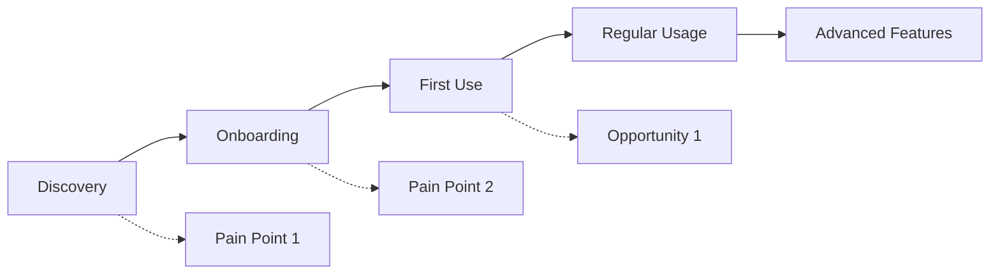

# PRD-XXX: [Feature/Product Name]

> **Template Usage**: Replace XXX with sequential number (001, 002, etc.) and update all bracketed placeholders with actual content.

## Document Status
**Status**: [Draft | In Review | Approved | In Development | Shipped | Deprecated]  
**Last Updated**: YYYY-MM-DD  
**Owner**: [Product Owner/Team Lead Name]  
**Stakeholders**: [List key stakeholders]

## Executive Summary

### Problem Statement
*Describe the core problem this product/feature solves in 2-3 sentences.*

[Placeholder: What specific pain point are we addressing? Who experiences this problem?]

### Solution Overview
*High-level description of the proposed solution.*

[Placeholder: What are we building? How does it solve the problem?]

### Success Criteria
*Primary metrics that define success.*

- **Key Metric 1**: [Target value and timeframe]
- **Key Metric 2**: [Target value and timeframe]
- **Key Metric 3**: [Target value and timeframe]

## Context & Background

### Why Now?
*Business justification and timing rationale.*

[Placeholder: Market conditions, competitive landscape, user feedback, technical readiness]

### Current State
*Description of existing solutions/workarounds and their limitations.*

[Placeholder: What do users do today? What are the pain points?]

### Market Research
*Relevant user research, competitive analysis, and market data.*

[Placeholder: User interviews, surveys, competitor analysis, market size]

## Goals & Objectives

### Primary Goals
1. **[Goal 1]**: [Specific, measurable outcome]
2. **[Goal 2]**: [Specific, measurable outcome]
3. **[Goal 3]**: [Specific, measurable outcome]

### Success Metrics
| Metric | Baseline | Target | Timeline | Owner |
|--------|----------|--------|----------|-------|
| [Metric 1] | [Value] | [Target] | [Timeframe] | [Person] |
| [Metric 2] | [Value] | [Target] | [Timeframe] | [Person] |
| [Metric 3] | [Value] | [Target] | [Timeframe] | [Person] |

### Non-Goals
*Explicitly state what this project will NOT address.*

- [Non-goal 1: Clear boundary statement]
- [Non-goal 2: Clear boundary statement]
- [Non-goal 3: Clear boundary statement]

## User Research & Insights

### Target Users
| User Segment | Description | Primary Needs | Pain Points |
|--------------|-------------|---------------|-------------|
| [Segment 1] | [Description] | [Needs list] | [Pain points] |
| [Segment 2] | [Description] | [Needs list] | [Pain points] |

### User Journey
*Map the current and future user experience.*



### Key User Stories

#### Epic: [Epic Name]
- **As a** [user type], **I want** [functionality] **so that** [benefit/value]
- **Acceptance Criteria**: [Specific conditions that must be met]
- **Priority**: [High/Medium/Low]

#### Epic: [Epic Name]
- **As a** [user type], **I want** [functionality] **so that** [benefit/value]
- **Acceptance Criteria**: [Specific conditions that must be met]
- **Priority**: [High/Medium/Low]

## Detailed Requirements

### Functional Requirements

#### Core Features
1. **[Feature 1 Name]**
   - **Description**: [What it does]
   - **User Story**: [As a... I want... so that...]
   - **Acceptance Criteria**:
     - [ ] [Specific testable criterion]
     - [ ] [Specific testable criterion]
     - [ ] [Specific testable criterion]
   - **Priority**: [Must Have | Should Have | Could Have | Won't Have]

2. **[Feature 2 Name]**
   - **Description**: [What it does]
   - **User Story**: [As a... I want... so that...]
   - **Acceptance Criteria**:
     - [ ] [Specific testable criterion]
     - [ ] [Specific testable criterion]
     - [ ] [Specific testable criterion]
   - **Priority**: [Must Have | Should Have | Could Have | Won't Have]

#### Supporting Features
*List secondary features that enhance the core experience.*

### Non-Functional Requirements

#### Performance
- **Response Time**: [Specific targets, e.g., < 200ms for API calls]
- **Throughput**: [Specific targets, e.g., 1000 requests/second]
- **Availability**: [Specific targets, e.g., 99.9% uptime]

#### Security
- **Authentication**: [Requirements and methods]
- **Authorization**: [Permissions and access control]
- **Data Protection**: [Encryption, privacy compliance]

#### Scalability
- **User Load**: [Expected concurrent users]
- **Data Volume**: [Expected data growth]
- **Geographic**: [Multi-region requirements]

### User Experience Requirements

#### Design Principles
- [Principle 1: e.g., "Simplicity over features"]
- [Principle 2: e.g., "Mobile-first approach"]
- [Principle 3: e.g., "Accessibility by default"]

#### Interaction Design
- **Navigation**: [How users move through the product]
- **Information Architecture**: [Content organization]
- **Visual Design**: [Style guidelines, brand compliance]

#### Accessibility
- **WCAG Compliance**: [Level AA/AAA requirements]
- **Keyboard Navigation**: [Full keyboard accessibility]
- **Screen Reader**: [Screen reader compatibility]

## Technical Considerations

### Architecture Overview
*High-level technical approach and key architectural decisions.*

```
[Include architecture diagram or reference existing ADR documents]
```

### Technology Stack
| Component | Technology | Rationale |
|-----------|------------|-----------|
| Frontend | [Technology] | [Why chosen] |
| Backend | [Technology] | [Why chosen] |
| Database | [Technology] | [Why chosen] |
| Infrastructure | [Technology] | [Why chosen] |

### Integration Requirements
- **External APIs**: [List required integrations]
- **Internal Services**: [Dependencies on existing systems]
- **Data Migration**: [Any migration requirements]

### Security Considerations
- **Authentication/Authorization**: [Implementation approach]
- **Data Privacy**: [PII handling, GDPR compliance]
- **Security Testing**: [Penetration testing, vulnerability scans]

### Performance Considerations
- **Caching Strategy**: [Redis, CDN, browser caching]
- **Database Optimization**: [Indexing, query optimization]
- **Monitoring**: [APM, logging, alerting]

## Dependencies & Constraints

### Technical Dependencies
- **Internal**: [Other team deliverables, system updates]
- **External**: [Third-party services, vendor deliverables]
- **Infrastructure**: [Hardware, platform requirements]

### Business Constraints
- **Budget**: [Cost limitations and approvals needed]
- **Timeline**: [Hard deadlines, market windows]
- **Resources**: [Team availability, skill requirements]

### Risk Assessment
| Risk | Impact | Probability | Mitigation Strategy |
|------|--------|-------------|-------------------|
| [Risk 1] | [High/Med/Low] | [High/Med/Low] | [Mitigation plan] |
| [Risk 2] | [High/Med/Low] | [High/Med/Low] | [Mitigation plan] |
| [Risk 3] | [High/Med/Low] | [High/Med/Low] | [Mitigation plan] |

## Implementation Plan

### Development Phases

#### Phase 1: [Phase Name] - [Timeline]
**Objectives**: [What will be accomplished]
**Deliverables**:
- [ ] [Specific deliverable]
- [ ] [Specific deliverable]
- [ ] [Specific deliverable]

**Success Criteria**: [How to measure phase completion]

#### Phase 2: [Phase Name] - [Timeline]
**Objectives**: [What will be accomplished]
**Deliverables**:
- [ ] [Specific deliverable]
- [ ] [Specific deliverable]
- [ ] [Specific deliverable]

**Success Criteria**: [How to measure phase completion]

#### Phase 3: [Phase Name] - [Timeline]
**Objectives**: [What will be accomplished]
**Deliverables**:
- [ ] [Specific deliverable]
- [ ] [Specific deliverable]
- [ ] [Specific deliverable]

**Success Criteria**: [How to measure phase completion]

### Resource Requirements
- **Engineering**: [FTE requirements by skill]
- **Design**: [Design resource needs]
- **Product**: [Product management time]
- **QA**: [Testing resource requirements]

### Timeline & Milestones
```mermaid
gantt
    title Project Timeline
    dateFormat  YYYY-MM-DD
    section Phase 1
    Design & Planning    :2025-XX-XX, 2w
    Development         :2w
    Testing             :1w
    section Phase 2
    Feature Development :4w
    Integration Testing :1w
    section Phase 3
    Polish & Launch     :2w
    Post-Launch Support :ongoing
```

## Testing & Quality Assurance

### Testing Strategy
- **Unit Testing**: [Coverage requirements, frameworks]
- **Integration Testing**: [API testing, service integration]
- **End-to-End Testing**: [User journey validation]
- **Performance Testing**: [Load testing, stress testing]
- **Security Testing**: [Vulnerability assessment, pen testing]

### Quality Gates
- [ ] **Code Review**: All code reviewed by senior developer
- [ ] **Automated Testing**: 90%+ test coverage, all tests passing
- [ ] **Performance**: All performance benchmarks met
- [ ] **Security**: Security scan passed, no critical vulnerabilities
- [ ] **Accessibility**: WCAG AA compliance verified
- [ ] **User Acceptance**: Key user scenarios validated

### Launch Criteria
- [ ] All must-have features implemented and tested
- [ ] Performance requirements met
- [ ] Security review completed
- [ ] Documentation completed
- [ ] Support processes established
- [ ] Monitoring and alerting configured

## Launch & Go-to-Market

### Launch Strategy
- **Beta Launch**: [Timeline, user selection, feedback collection]
- **Soft Launch**: [Limited rollout, monitoring, iteration]
- **Full Launch**: [Marketing, announcements, success metrics]

### Marketing & Communication
- **Internal Communication**: [Team updates, stakeholder briefings]
- **User Communication**: [Feature announcements, documentation]
- **External Communication**: [Press releases, social media, blog posts]

### Support & Documentation
- **User Documentation**: [Help articles, tutorials, API docs]
- **Internal Documentation**: [Runbooks, troubleshooting guides]
- **Training Materials**: [Support team training, user onboarding]

## Post-Launch & Iteration

### Success Measurement
- **Monitoring**: [Key metrics, dashboards, alerts]
- **User Feedback**: [Collection methods, analysis process]
- **Business Impact**: [Revenue, engagement, satisfaction metrics]

### Iteration Plan
- **Week 1-2**: [Immediate bug fixes, critical issues]
- **Month 1**: [First iteration based on user feedback]
- **Month 3**: [Major improvements, new features]
- **Ongoing**: [Regular updates, feature evolution]

### Sunset Criteria
*Conditions under which this feature might be deprecated or sunset.*

- [Criterion 1: e.g., "Usage drops below 5% of user base"]
- [Criterion 2: e.g., "Superior alternative is available"]
- [Criterion 3: e.g., "Maintenance cost exceeds business value"]

## Appendices

### A. User Research Data
*Link to or include relevant user research, surveys, interviews*

### B. Competitive Analysis
*Detailed comparison with competing solutions*

### C. Technical Specifications
*Detailed technical requirements, API specifications*

### D. Design Mockups
*Link to design files, wireframes, prototypes*

### E. Market Analysis
*Detailed market research, opportunity sizing*

---

## Document History
| Version | Date | Author | Changes |
|---------|------|--------|---------|
| 0.1 | YYYY-MM-DD | [Author] | Initial draft |
| 0.2 | YYYY-MM-DD | [Author] | Stakeholder feedback incorporated |
| 1.0 | YYYY-MM-DD | [Author] | Final approved version |

## Approval
- **Product Owner**: [Name] - [Date] - [Approved/Pending]
- **Engineering Lead**: [Name] - [Date] - [Approved/Pending]
- **Design Lead**: [Name] - [Date] - [Approved/Pending]
- **Business Stakeholder**: [Name] - [Date] - [Approved/Pending]