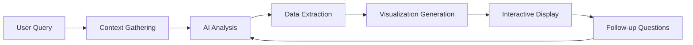

# AI-Powered Insights Command System - Product Requirements Document

## Executive Summary

Replace traditional canned reports with an AI-powered insights command that generates contextual, relevant analytics on-demand. Like the handoff command, users can request specific insights through natural language, with AI generating both data analysis and visualizations dynamically. A community marketplace enables sharing and discovery of useful visualization patterns.

## Core Concept

### The Problem with Traditional Reporting
- **Information Overload**: Dozens of pre-built reports, most irrelevant
- **Rigid Structure**: Can't adapt to unique team needs
- **Maintenance Burden**: Each report needs updates and testing
- **Discovery Problem**: Users don't know which report to use
- **Static Views**: Can't ask follow-up questions

### The Ginko Solution: AI-First Analytics

```bash
# Instead of navigating menus for reports, just ask:
ginko insights "show me our velocity trend this sprint"
ginko insights "why did we miss our goals last week?"
ginko insights "what's blocking the team right now?"
ginko insights "compare my productivity to team average"

# Or use quick shortcuts:
Cmd+I → Interactive insights mode
Cmd+Shift+I → Team insights dashboard
```

## System Architecture

### Command Flow



### Core Components

#### 1. Natural Language Interface
```typescript
interface InsightsCommand {
  // Parse user intent
  parseQuery(input: string): InsightIntent;
  
  // Gather relevant context
  gatherContext(): SessionContext;
  
  // Generate insight
  generateInsight(intent: InsightIntent, context: SessionContext): Insight;
  
  // Create visualization
  renderVisualization(insight: Insight): Visualization;
}
```

#### 2. Context-Aware Analysis
```typescript
interface ContextualInsights {
  // Automatic context loading
  currentSprint: SprintContext;
  recentSessions: SessionHistory;
  teamActivity: TeamMetrics;
  
  // Smart defaults based on context
  suggestedQueries: string[];
  relevantMetrics: Metric[];
}
```

#### 3. Dynamic Visualization Engine
```typescript
interface VisualizationEngine {
  // AI chooses best visualization type
  selectVisualizationType(data: InsightData): VisualizationType;
  
  // Generate visualization code
  generateD3Code(type: VisualizationType, data: InsightData): string;
  
  // Interactive features
  enableDrillDown: boolean;
  supportFollowUp: boolean;
}
```

## Feature Specifications

### Basic Insights Commands

#### Personal Productivity
```bash
ginko insights me
# Shows: Session frequency, context switches, productivity trends

ginko insights "my progress on [task]"
# Shows: Task timeline, blockers, completion estimate
```

#### Team Analytics
```bash
ginko insights team
# Shows: Team velocity, collaboration patterns, bottlenecks

ginko insights "team health"
# Shows: Burnout indicators, workload distribution, morale signals
```

#### Project Status
```bash
ginko insights sprint
# Shows: Sprint progress, risks, completion probability

ginko insights "blockers"
# Shows: Current blockers, impact analysis, suggested solutions
```

### Advanced Queries

#### Comparative Analysis
```bash
ginko insights "compare this sprint to last"
# Generates: Side-by-side metrics, trend analysis, key differences

ginko insights "how do I compare to team"
# Generates: Personal vs team metrics, growth areas, strengths
```

#### Predictive Insights
```bash
ginko insights "will we hit our deadline?"
# Generates: Completion probability, risk factors, recommendations

ginko insights "forecast next sprint"
# Generates: Velocity prediction, capacity planning, suggested scope
```

#### Root Cause Analysis
```bash
ginko insights "why are we slowing down?"
# Generates: Performance degradation analysis, contributing factors

ginko insights "what changed last week?"
# Generates: Change detection, impact analysis, correlation findings
```

## Visualization Marketplace

### Concept
A community-driven library of visualization patterns that can be shared, discovered, and reused.

### Structure
```yaml
marketplace/
  visualizations/
    velocity-chart/
      metadata.json       # Author, description, tags
      template.js        # D3.js visualization code
      example-data.json  # Sample data structure
      preview.png        # Screenshot
    
    burndown-enhanced/
      metadata.json
      template.js
      custom-styles.css
      README.md
```

### Marketplace Features

#### 1. Discovery
```typescript
interface MarketplaceSearch {
  // Find visualizations by intent
  searchByQuery(query: string): Visualization[];
  
  // Browse by category
  categories: ['productivity', 'team', 'planning', 'custom'];
  
  // Sort by popularity
  trending: Visualization[];
  mostUsed: Visualization[];
  newest: Visualization[];
}
```

#### 2. Contribution Model
```typescript
interface VisualizationContribution {
  // Submit new visualization
  submit(viz: Visualization): Promise<void>;
  
  // Community features
  rating: number;
  downloads: number;
  forks: number;
  
  // Monetization option
  pricing: 'free' | 'freemium' | 'paid';
  tipJar?: string; // Optional donations
}
```

#### 3. Integration
```bash
# Install from marketplace
ginko viz install "advanced-burndown"

# Use in insights
ginko insights "sprint progress" --viz advanced-burndown

# Create custom visualization
ginko viz create "my-custom-chart"

# Share with community
ginko viz publish "my-custom-chart"
```

## AI Visualization Generation

### How It Works

1. **Query Analysis**
   - AI determines data needs
   - Identifies visualization intent
   - Selects appropriate chart type

2. **Code Generation**
   - AI writes D3.js/Chart.js code
   - Generates responsive design
   - Adds interactivity

3. **Refinement Loop**
   ```bash
   User: "Make the trend line more prominent"
   AI: [Adjusts visualization styling]
   
   User: "Add confidence intervals"
   AI: [Enhances with statistical overlays]
   
   User: "Export as dashboard widget"
   AI: [Generates embeddable component]
   ```

### Example AI-Generated Visualization

```javascript
// AI generates this based on "show team velocity with confidence"
const velocityChart = {
  type: 'line',
  data: {
    labels: generateSprintLabels(6),
    datasets: [{
      label: 'Velocity',
      data: teamVelocity,
      borderColor: 'rgb(75, 192, 192)',
      tension: 0.1
    }, {
      label: 'Confidence Band',
      data: confidenceUpper,
      backgroundColor: 'rgba(75, 192, 192, 0.1)',
      borderColor: 'transparent',
      fill: '+1'
    }]
  },
  options: {
    responsive: true,
    plugins: {
      tooltip: {
        callbacks: {
          afterLabel: (context) => {
            return `Confidence: ${calculateConfidence(context)}%`;
          }
        }
      }
    }
  }
};
```

## Implementation Roadmap

### Phase 1: Core Command System (Week 1-2)
- [ ] Natural language query parser
- [ ] Basic insights generation
- [ ] Simple text-based outputs
- [ ] Integration with existing data

### Phase 2: Visualization Engine (Week 3-4)
- [ ] AI visualization selection
- [ ] Basic chart generation
- [ ] Interactive features
- [ ] Export capabilities

### Phase 3: Marketplace MVP (Week 5-6)
- [ ] Marketplace infrastructure
- [ ] Submission system
- [ ] Discovery interface
- [ ] Installation mechanism

### Phase 4: Community Features (Month 2)
- [ ] Ratings and reviews
- [ ] Forking and customization
- [ ] Tip jar integration
- [ ] Featured visualizations

## Competitive Advantages

### vs Linear's Fixed Reports
| Linear | Ginko AI Insights |
|--------|------------------|
| 30+ static reports | Infinite query combinations |
| Navigate menus | Natural language |
| Fixed visualizations | AI-generated charts |
| No customization | Fully adaptive |
| Can't ask why | Interactive Q&A |

### vs Jira's Analytics
| Jira | Ginko AI Insights |
|------|------------------|
| Complex configuration | Zero configuration |
| Dashboard building | Auto-generated views |
| SQL-like JQL queries | Plain English |
| Static dashboards | Dynamic insights |

## Monetization Opportunities

### Free Tier
- Basic insights commands
- 5 queries per day
- Access to free marketplace visualizations
- Standard chart types

### Pro Tier ($10/month)
- Unlimited insights queries
- Advanced AI analysis
- Premium marketplace access
- Custom visualization saving
- API access for insights

### Enterprise
- Custom visualization development
- Private marketplace
- Dedicated AI model training
- White-label visualizations

### Marketplace Revenue
- **Featured Listings**: $50/month for top placement
- **Premium Visualizations**: 70/30 revenue split with creators
- **Sponsored Visualizations**: Companies promote their charts
- **Certification Program**: $200 for "Verified Creator" badge

## Success Metrics

### Usage Metrics
- Insights commands per user per day
- Query complexity evolution
- Visualization generation rate
- Follow-up question depth

### Marketplace Metrics
- Visualizations published per month
- Download/install rate
- Creator retention
- Revenue per visualization

### Value Metrics
- Time saved vs traditional reporting
- Insights acted upon
- Decision velocity improvement
- User satisfaction scores

## Technical Requirements

### AI Model Requirements
- Natural language understanding
- Code generation capability
- Data analysis proficiency
- Visualization best practices knowledge

### Infrastructure
- Real-time data processing
- Visualization rendering engine
- Marketplace CDN
- Version control for visualizations

### Security
- Sandboxed visualization execution
- Code review for marketplace submissions
- Data access controls
- API rate limiting

## Example User Journeys

### Journey 1: Quick Sprint Review
```bash
User: ginko insights sprint
AI: "Sprint 24 is 67% complete with 3 days remaining. 
     Velocity is 15% below average. Main blocker: 
     PR reviews taking 2x longer than usual.
     [Shows interactive burndown chart]
     Would you like to see PR review analytics?"

User: "yes, show PR bottlenecks"
AI: [Generates PR review time distribution chart]
    "3 PRs waiting >48 hours. Sarah has 7 pending reviews.
     Suggestion: Redistribute review load or pair review session."
```

### Journey 2: Personal Improvement
```bash
User: ginko insights "how can I improve"
AI: "Based on your last 30 days:
     ✅ Strengths: Fast implementation, good test coverage
     📈 Growth areas: Context switching (37 switches/day)
     💡 Suggestion: Batch similar tasks, use focus blocks
     [Shows personal productivity heatmap]
     Want to see optimal focus time recommendations?"
```

### Journey 3: Custom Visualization
```bash
User: ginko insights "team collaboration patterns" --create-viz
AI: "I'll create a custom network diagram showing collaboration.
     [Generates interactive force-directed graph]
     Insights: 2 isolated team members, 3 collaboration clusters.
     Would you like to save this visualization to your library?"

User: "yes, and share to marketplace"
AI: "Visualization saved as 'Team Collaboration Network'.
     To publish: ginko viz publish team-collab-network
     Suggested tags: #teamwork #network #collaboration"
```

## Conclusion

The AI-powered insights command system transforms analytics from a static reporting burden into a dynamic conversation with your data. By combining natural language queries, AI-generated visualizations, and a community marketplace, Ginko can offer infinitely more value than traditional tools while maintaining simplicity.

This approach:
- **Eliminates report sprawl** - One command, infinite insights
- **Reduces learning curve** - Just ask questions naturally
- **Enables discovery** - AI suggests relevant insights
- **Builds community** - Marketplace creates network effects
- **Generates revenue** - Premium features and marketplace commissions

The system positions Ginko as the most intelligent and adaptive analytics platform for AI-assisted development teams.