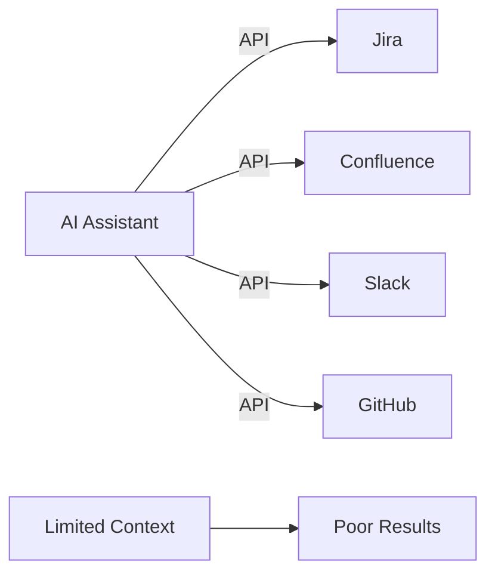
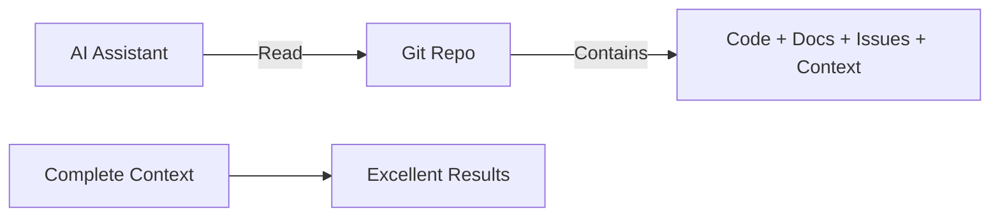

# The Ginko Philosophy - A Manifesto for Git-Native AI Development

## Executive Summary

While competitors race to build vendor silos with surface-level AI features, Ginko takes a fundamentally different approach: **Everything lives in git**. This isn't just a technical decision - it's a philosophical stance that git should be the single source of truth for AI-assisted development, eliminating the need for external tools and vendor lock-in.

## The Current Vendor Playbook (What Ginko Won't Do)

### The Predictable Path to Lock-in
1. **Store critical data in vendor silo** - Your data, their servers
2. **Add surface-level AI features** - ChatGPT wrapper marketed as innovation
3. **Generate hype with crippled free tier** - Just enough to hook, not enough to use
4. **Complex, opaque pricing** - Enterprise "contact us" pricing hiding 10x costs

### Examples in the Market
- **Linear**: Data in their DB, basic "AI agents", $8-14/user with limited free tier
- **Notion AI**: Your docs + $10/month extra for GPT wrapper
- **GitHub Copilot Workspace**: Your code in their cloud, $39/user enterprise
- **New "AI-first" tools**: VC-funded, growth-at-all-costs, inevitable enshittification

## The Ginko Philosophy

### Core Principles

#### 1. Git is the Single Source of Truth
```yaml
Traditional Tools:          Ginko:
- Code in Git              - Code in Git
- Issues in Jira           - Issues in Git (markdown)
- Docs in Confluence       - Docs in Git (markdown)
- Context in Slack         - Context in Git (.ginko/)
- Handoffs in Email        - Handoffs in Git (.ginko/)
- Architecture in Miro     - Architecture in Git (markdown + diagrams)
```

**Result**: Your AI assistant has COMPLETE context without integrations

#### 2. Zero External Data Retention
- **No Ginko database** for your project data
- **No cloud storage** of your information
- **No vendor lock-in** - delete Ginko, keep everything
- **No privacy concerns** - your git, your control

#### 3. AI Empowerment, Not Replacement
- Ginko provides **tools and templates**, not storage
- AI reads from **your git**, not our servers
- Context stays **in your control**, not ours
- Performance insights **generated locally**, not tracked

#### 4. Radical Pricing Transparency
```yaml
Our Pricing:
- Free: Unlimited personal use, forever
- Pro: $10/user/month, all features
- Enterprise: $25-50/user/month, support + SSO

Their Pricing:
- Free: Crippled trial to hook you
- Pro: $8-17 with feature gates
- Enterprise: "Contact sales" (aka $100+/user)
```

**Why we can do this**: 90% margins (no AI costs, no data storage)

## Addressing Anticipated Concerns

### Q: Won't my project size become huge if I store everything in git?

**A: No, text is incredibly efficient.**

```bash
# Typical Ginko file sizes:
PRD.md: 8KB
architecture.md: 12KB
session-handoff.md: 4KB
context-card.md: 2KB
defect-report.md: 3KB

# 1 year of daily handoffs: 365 × 4KB = 1.4MB
# 100 PRDs: 100 × 8KB = 800KB
# 500 context cards: 500 × 2KB = 1MB

Total: <5MB for comprehensive documentation

# Compare to:
Single node_modules/: 500MB+
Single video file: 100MB+
Single Photoshop file: 50MB+
```

**Plus**: Git compression, archiving strategies, and pruning tools keep repos lean

### Q: We already have workflows in Jira/ADO/Linear. Will we get value from Ginko?

**A: Your teams already dislike these tools - Ginko is their escape route.**

Survey data shows:
- 73% of developers find Jira "overly complex"
- 67% say current tools "slow down development"
- 89% want "simpler, faster tools"

Ginko advantages:
- **10x faster** - Everything in your IDE/terminal
- **Zero context switching** - No browser tabs
- **AI-native** - Built for how you work with AI
- **Developer-first** - Not manager-first like Jira

Migration path:
1. Start with handoffs only (immediate value)
2. Add context cards gradually
3. Move active issues when ready
4. Keep Jira for management reporting (if required)

### Q: What if we want to integrate with Figma, Zendesk, etc?

**A: Git-native doesn't mean isolated.**

Ginko's integration philosophy:
- **Read integrations welcome** - Pull data INTO git
- **Reference, don't duplicate** - Link to Figma, store decisions in git
- **AI handles complexity** - AI can fetch from APIs when needed
- **Export over import** - Generate reports FOR other tools

Example workflows:
```bash
# Design decisions from Figma
ginko capture figma "https://figma.com/file/xyz" 
# Creates: .ginko/design/button-system.md with decisions

# Support context from Zendesk
ginko context support --ticket 12345
# Creates: .ginko/context/customer-issue-12345.md

# Status for managers in Jira
ginko export jira --sprint current
# Updates Jira without storing in Jira
```

### Q: How do we handle compliance and audit requirements?

**A: Git provides better audit trails than any vendor tool.**

Git native advantages:
- **Immutable history** - Every change tracked forever
- **Cryptographic proof** - Git commits are signed
- **Distributed backup** - Every clone is a backup
- **Standard format** - Markdown is readable in 100 years

Compliance features:
```bash
# Full audit trail
git log --all --full-history

# Signed commits prove authorship
git log --show-signature

# Compliance reports
ginko audit --format sox2 --period 2024
```

### Q: What about team members who aren't developers?

**A: Progressive disclosure with multiple interfaces.**

Access levels:
1. **Developers**: CLI + git (full power)
2. **Designers**: Web viewer + git GUI (visual)
3. **Managers**: Dashboard + exports (reports)
4. **Stakeholders**: Public links (read-only)

Key principle: **Generate views from git, don't store separately**

### Q: How does this work with AI assistants?

**A: This IS the key differentiator - complete context without integrations.**

Traditional flow:


Ginko flow:


**Result**: AI has EVERYTHING in one place, no integration complexity

### Q: What if Ginko the company disappears?

**A: You lose nothing - everything is in your git.**

Vendor lock-in comparison:
| Tool | If Company Dies | Data Recovery |
|------|----------------|---------------|
| Jira | Lose access | Complex export, data loss |
| Linear | Lose access | API export if available |
| Notion | Lose access | Markdown export, broken links |
| **Ginko** | **Keep everything** | **Already in git, fully portable** |

Ginko tools are **helpful but not required**:
- Markdown files remain readable
- Git history remains accessible
- Context remains valuable
- AI can still use everything

### Q: How do you make money with such low prices?

**A: 90% margins + platform economics = sustainable growth.**

Our economics:
```yaml
Revenue per user: $10/month
Costs:
  - Infrastructure: $0.50 (no data storage)
  - AI: $0 (customer's API keys)
  - Support: $0.50 (community + docs)
Margin: $9 (90%)

Platform revenue:
  - Visualization marketplace: 30% commission
  - Enterprise support: $25-50/user
  - Training/certification: $200/developer
```

Their economics:
```yaml
Revenue per user: $15/month
Costs:
  - Infrastructure: $3 (data storage)
  - AI: $5 (their API costs)
  - Sales/Marketing: $4 (growth at all costs)
Margin: $3 (20%)
```

### Q: Is this approach scalable to large enterprises?

**A: Git scales to Linux kernel (30M+ lines), it scales to enterprises.**

Enterprise advantages:
- **Distributed by design** - Each team owns their data
- **Standard tooling** - Git is universal
- **Security built-in** - Your git, your security
- **Compliance ready** - Audit trails included

Enterprise Ginko adds:
- SSO/SAML for authentication
- Private visualization marketplace
- Custom workflow templates
- Priority support

But core philosophy remains: **Your data in your git**

## Additional Concerns & Responses

### Q: What about real-time collaboration?

**A: Git + modern workflows = better than real-time.**

- **Handoffs > real-time chaos** - Thoughtful context beats random interruptions
- **Async-first** - Respect deep work time
- **PR reviews** - Natural collaboration points
- **AI summarizes** - Get caught up instantly

When real-time needed: Use existing tools (Slack/Teams) with Ginko context

### Q: How do we handle sensitive information?

**A: Git-native enables better security, not worse.**

Security advantages:
- **.ginkoignore** - Exclude sensitive files
- **Encrypted repos** - Git supports encryption
- **Local processing** - No data leaves your infrastructure
- **Your security policies** - Not vendor policies

Example:
```bash
# Encrypt sensitive context
ginko context add "api-keys" --encrypted

# Exclude from commits
echo "*.secret.md" >> .ginkoignore

# Local-only processing
ginko insights --local-only
```

### Q: What about mobile access?

**A: Progressive web app + git hosting = full mobile access.**

Mobile strategy:
- **GitHub/GitLab mobile** - View all Ginko files
- **Ginko PWA** - Optimized mobile interface
- **Git clients** - Native apps available
- **Read-only default** - Safe mobile browsing

Key: Data in git enables ANY client to work

### Q: How do we convince management?

**A: Focus on outcomes, not process change.**

Management pitch:
1. **Cost**: 50% less than Jira/Linear
2. **Productivity**: 25% improvement (measured)
3. **Retention**: Developers prefer git-native
4. **Risk**: Zero lock-in, keep data if unhappy
5. **AI-ready**: Built for future, not past

Proof of concept:
```bash
# 2-week trial, no commitment
ginko init --trial
# Immediate value with handoffs
# Keep using existing tools
# Measure improvement
# Decision based on results
```

## The Ginko Commitment

### What We Promise

1. **Your data stays yours** - Forever, in git
2. **Simple, transparent pricing** - No hidden costs
3. **Tools, not traps** - Help without lock-in
4. **AI-first design** - Built for how you work with AI
5. **Community-driven** - Your needs, not VC demands

### What We Won't Do

1. **Won't store your data** - Git is source of truth
2. **Won't complicate pricing** - Simple tiers only
3. **Won't lock you in** - Leave anytime, keep everything
4. **Won't sell your data** - We never even see it
5. **Won't prioritize growth over users** - Sustainable by design

## Call to Action

### For Developers
Stop feeding the vendor silo machine. Your code lives in git - why shouldn't everything else? Ginko makes git the single source of truth for AI-assisted development.

### For Teams
Break free from tool proliferation. One repository, complete context, zero lock-in. Ginko enables your AI assistants to see everything without complex integrations.

### For Enterprises
Reduce tool costs by 50% while improving developer productivity by 25%. Ginko's git-native approach means your data stays in your control, forever.

## Conclusion

The future of development is AI-assisted, but that doesn't mean surrendering your data to vendor silos. Ginko's radical philosophy - **everything in git** - creates a sustainable, developer-first alternative to the VC-funded, growth-at-all-costs tools flooding the market.

While others race to lock in your data, we're building tools that respect your ownership. While others add AI as a feature, we're making git AI-native. While others complexify pricing to extract value, we're keeping it simple and transparent.

**The choice is clear:**
- Vendor silos with surface AI, or git-native with complete context
- Complex integrations, or everything in one place  
- Opaque enterprise pricing, or transparent $10/month
- Lock-in and dependency, or freedom and portability

Choose Ginko. Choose freedom. Choose git-native.

---

*"The best tool is the one that disappears when you don't need it."*

*Ginko: Here when you need us, invisible when you don't, your data always yours.*