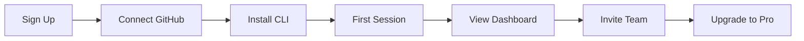

# Ginko Go-to-Market Plan - Execution Strategy

## Executive Summary

Ginko's go-to-market strategy focuses on developer-led growth through a generous free tier, viral adoption within teams, and content marketing that positions Ginko as the essential tool for AI-assisted development. The strategy emphasizes organic growth, community building, and product-led acquisition to achieve $240K ARR by end of Year 1.

## Market Positioning

### Unique Value Proposition

#### Primary Message
**"Where AI Development Becomes Visible"**

Make your AI collaboration transparent, measurable, and continuously improving with Ginko - the privacy-first platform that turns hidden context into actionable insights.

#### Supporting Messages
1. **For Individuals**: "Never lose context between AI sessions again"
2. **For Teams**: "See how your team really works with AI"
3. **For Enterprises**: "Replace Jira with AI-native project management"

### Target Audience Segments

#### Primary: AI-Forward Developers
- **Size**: ~2M developers actively using AI assistants
- **Characteristics**: Early adopters, productivity-focused
- **Channels**: Twitter/X, GitHub, Dev.to, HackerNews
- **Message**: "Built by developers using AI, for developers using AI"

#### Secondary: Development Team Leads
- **Size**: ~500K team leads managing AI adoption
- **Characteristics**: Responsible for team productivity, tool selection
- **Channels**: LinkedIn, team forums, Slack communities
- **Message**: "Understand and improve how your team uses AI"

#### Tertiary: DevOps/Platform Engineers
- **Size**: ~200K platform engineers
- **Characteristics**: Tool evaluators, infrastructure decisions
- **Channels**: DevOps communities, conferences
- **Message**: "Git-native, privacy-first, zero infrastructure"

## Launch Strategy

### Phase 1: Beta Launch (Weeks 1-2)

#### Week 1: Private Beta
- **Target**: 50 hand-picked users from network
- **Incentive**: Lifetime 50% discount
- **Goals**:
  - Fix critical bugs
  - Gather testimonials
  - Refine onboarding

#### Week 2: Limited Beta
- **Target**: 200 users from waitlist
- **Incentive**: 6 months at 50% off
- **Goals**:
  - Test infrastructure scaling
  - Identify feature gaps
  - Build community nucleus

### Phase 2: Public Launch (Weeks 3-4)

#### Week 3: Soft Launch
- **Monday**: Update website with pricing
- **Tuesday**: Email beta users about public availability
- **Wednesday**: First blog post: "Ginko is Now Available"
- **Thursday**: GitHub announcement in relevant repos
- **Friday**: Collect week 1 feedback

#### Week 4: Amplified Launch
- **Monday**: ProductHunt launch (aim for #1)
- **Tuesday**: HackerNews post (peak hours)
- **Wednesday**: Dev.to article series begins
- **Thursday**: Twitter/X thread with demos
- **Friday**: Week 1 metrics review

### Phase 3: Growth Mode (Months 2-6)

#### Content Calendar
- **Weekly**: Blog post on AI development best practices
- **Bi-weekly**: Video tutorial/demo
- **Monthly**: Case study from power user
- **Quarterly**: State of AI Development report

## Customer Acquisition Strategy

### Developer-Led Growth

#### 1. Free Tier Excellence
```yaml
Strategy: Generous free tier that provides real value
Tactics:
  - Unlimited personal use
  - No credit card required
  - Full feature access for 30 days
  - Clear upgrade prompts when limits reached
Expected: 60% of users stay on free tier (that's OK)
```

#### 2. Viral Loops
```yaml
Built-in Virality:
  - Shareable session links
  - "Powered by Ginko" on public views
  - Team invites with onboarding
  - GitHub integration visibility
  
Incentivized Sharing:
  - Refer 3 users, get 1 month free
  - Team discounts for bulk signups
  - Public sessions boost SEO
```

#### 3. Community Building
```yaml
Discord Community:
  - Daily standups channel
  - AI-tips-and-tricks
  - Show-and-tell sessions
  - Direct access to founders
  
GitHub Presence:
  - Open source CLI tool
  - Public roadmap
  - Community contributions
  - Integration examples
```

### Content Marketing Strategy

#### SEO-Optimized Content
1. **"How to" Series**
   - "How to track AI coding sessions with Git"
   - "How to measure AI collaboration effectiveness"
   - "How to migrate from Jira to Ginko"

2. **Comparison Content**
   - "Ginko vs Jira for AI Development"
   - "Why developers are leaving Azure DevOps"
   - "The true cost of AI development tools"

3. **Thought Leadership**
   - "The future of human-AI collaboration"
   - "Why privacy matters in AI development"
   - "Building trust in AI-assisted coding"

#### Distribution Channels

##### Owned Channels
- **Blog**: 2-3 posts per week
- **Documentation**: Comprehensive guides
- **Newsletter**: Weekly tips and updates
- **YouTube**: Tutorial videos

##### Earned Channels
- **GitHub**: Open source presence
- **Product Hunt**: Launch and updates
- **HackerNews**: Valuable contributions
- **Reddit**: r/programming, r/devops

##### Paid Channels (Limited)
- **Google Ads**: Competitor keywords only
- **Twitter/X Ads**: Retargeting only
- **Sponsorships**: Developer podcasts
- **Budget**: $1,000/month initially

### Partnership Strategy

#### Technology Partners
1. **IDE Integrations**
   - VS Code extension (priority)
   - JetBrains plugin
   - Neovim plugin
   - Cursor integration

2. **AI Providers**
   - OpenAI partnership program
   - Anthropic Claude integration
   - Google Gemini compatibility
   - Local LLM support

3. **Development Platforms**
   - GitHub Marketplace listing
   - GitLab integration
   - Bitbucket app

#### Community Partners
1. **Developer Communities**
   - Dev.to syndication
   - Hashnode cross-posting
   - Medium publications
   - Stack Overflow presence

2. **Influencer Partnerships**
   - Developer advocates
   - AI researchers
   - Tech YouTubers
   - Newsletter authors

## Sales Strategy

### Self-Serve Motion (Primary)

#### Onboarding Flow


#### Conversion Optimization
1. **Free to Paid Triggers**
   - Multiple projects (need Pro)
   - Team collaboration (need Pro)
   - Advanced analytics (need Pro)
   - API access (need Pro)

2. **Upgrade Prompts**
   - In-app notifications at limits
   - Email at 80% of free tier usage
   - Dashboard showing locked features
   - Success stories from Pro users

### Sales-Assisted Motion (Enterprise)

#### Target Accounts
- Companies with 50+ developers
- AI-first organizations
- Jira/ADO users over $10K/year
- Security-conscious industries

#### Sales Process
1. **Identify**: LinkedIn Sales Navigator
2. **Qualify**: Discovery call
3. **Demo**: Customized for use case
4. **POC**: 30-day pilot program
5. **Close**: Annual contract
6. **Expand**: Seat growth quarterly

## Pricing & Packaging Evolution

### Month 1-3: Simple Tiers
- Free: Individual developers
- Pro: $10/user/month
- Enterprise: Contact sales

### Month 4-6: Refined Offerings
- Free: Unchanged
- Pro: Add annual discount
- Team: 5-pack bundles
- Enterprise: Published pricing

### Month 7-12: Advanced Packaging
- Usage-based option
- Platform/API pricing
- Marketplace add-ons
- Professional services

## Success Metrics

### North Star Metrics
1. **Weekly Active Users (WAU)**: Target 1,000 by Month 3
2. **Paid Conversion Rate**: Target 5% by Month 6
3. **Net Revenue Retention**: Target 110% by Month 12
4. **Team Adoption Rate**: Target 30% invite teammates

### Leading Indicators
| Metric | Month 1 | Month 3 | Month 6 | Month 12 |
|--------|---------|---------|---------|----------|
| Sign-ups | 200 | 1,000 | 5,000 | 20,000 |
| Activation Rate | 40% | 50% | 60% | 70% |
| Free to Paid | 2% | 3% | 4% | 5% |
| MRR | $500 | $3,000 | $10,000 | $30,000 |

### Channel Performance
- **Organic Search**: 40% of traffic
- **Direct**: 25% of traffic
- **Referral**: 20% of traffic
- **Social**: 15% of traffic

## Marketing Budget Allocation

### Year 1 Budget: $50,000

#### Allocation
- **Content Creation**: $20,000 (40%)
  - Blog writers: $10,000
  - Video production: $5,000
  - Design assets: $5,000

- **Paid Acquisition**: $10,000 (20%)
  - Google Ads: $5,000
  - Social ads: $3,000
  - Sponsorships: $2,000

- **Events & Community**: $10,000 (20%)
  - Conference sponsorships: $5,000
  - Meetup sponsorships: $2,000
  - Swag and giveaways: $3,000

- **Tools & Software**: $10,000 (20%)
  - Marketing automation: $3,000
  - Analytics tools: $2,000
  - SEO tools: $2,000
  - Design tools: $3,000

### ROI Expectations
- **CAC Target**: <$50 per paid user
- **LTV/CAC Ratio**: >3x
- **Payback Period**: <6 months
- **Marketing Efficiency**: 20% of revenue

## Launch Week Checklist

### Pre-Launch (Week -1)
- [ ] Website updated with pricing
- [ ] Documentation complete
- [ ] Blog posts scheduled
- [ ] Social media assets ready
- [ ] Email templates prepared
- [ ] Support docs written
- [ ] Beta user testimonials collected

### Launch Day
- [ ] ProductHunt submission (12:01 AM PST)
- [ ] HackerNews post (9 AM PST)
- [ ] Twitter/X announcement thread
- [ ] Email to waitlist
- [ ] Discord announcement
- [ ] Team on standby for support

### Launch Week
- [ ] Daily social media updates
- [ ] Respond to all comments/questions
- [ ] Collect and share metrics
- [ ] Fix critical bugs immediately
- [ ] Send thank you to early adopters
- [ ] Plan week 2 based on feedback

## Risk Mitigation

### Launch Risks
| Risk | Probability | Impact | Mitigation |
|------|------------|--------|------------|
| Server overload | Medium | High | Auto-scaling, CDN ready |
| Negative feedback | Low | Medium | Quick response team |
| Competitive response | Medium | Low | Focus on unique value |
| Low adoption | Low | High | Aggressive follow-up |

### Contingency Plans
1. **If low sign-ups**: Increase free tier benefits
2. **If low conversion**: Extend trial period
3. **If high churn**: Interview churned users
4. **If competitive threat**: Accelerate feature development

## Post-Launch Optimization

### Week 1-2: Stabilize
- Fix critical bugs
- Optimize onboarding
- Respond to feedback

### Week 3-4: Analyze
- Cohort analysis
- Funnel optimization
- Channel performance

### Month 2-3: Optimize
- A/B test pricing
- Refine messaging
- Expand content

### Month 4-6: Scale
- Increase ad spend
- Hire growth marketer
- Launch referral program

## Success Criteria

### 30-Day Targets
- 1,000 sign-ups
- 50 paying customers
- 10 team accounts
- 4.5+ star reviews

### 90-Day Targets
- 5,000 sign-ups
- 250 paying customers
- 50 team accounts
- $5,000 MRR

### 1-Year Targets
- 20,000 sign-ups
- 2,000 paying customers
- 200 team accounts
- $30,000 MRR

## Conclusion

Ginko's go-to-market strategy leverages developer-led growth, community building, and content marketing to achieve rapid adoption with minimal marketing spend. By focusing on providing immediate value through a generous free tier and clear upgrade path, Ginko can achieve sustainable growth while maintaining high gross margins.

The key to success will be maintaining laser focus on the core value proposition: making AI development visible and measurable while respecting developer privacy and workflow preferences. With disciplined execution of this plan, Ginko is positioned to capture significant market share in the rapidly growing AI development tools market.