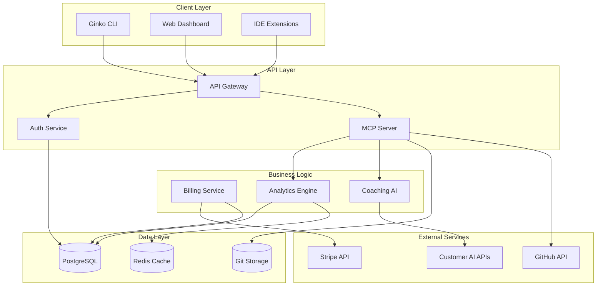

# Ginko Monetization - Technical Architecture Analysis

## Current State Assessment

### Infrastructure Inventory (70% Complete)

#### ✅ Production-Ready Components

##### 1. Web Dashboard (dashboard/)
- **Framework**: Next.js 14 with App Router
- **Deployment**: Vercel at app.ginko.ai
- **Authentication**: Supabase OAuth (GitHub/Google providers)
- **State**: Production-deployed, needs monetization features
- **Key Files**:
  - `dashboard/src/app/dashboard/page.tsx` - Main dashboard
  - `dashboard/src/lib/supabase/` - Auth configuration
  - `dashboard/src/types/database.ts` - Type definitions

##### 2. Database Layer
- **Provider**: Supabase PostgreSQL
- **Schema**: Comprehensive tables for sessions, analytics, profiles
- **State**: Production-ready, includes billing structure
- **Tables**:
  - `profiles` - User management
  - `sessions` - Collaboration sessions
  - `session_analytics` - Event tracking
  - Ready for: `subscriptions`, `billing_events`, `usage_metrics`

##### 3. MCP Server (api/)
- **Architecture**: Serverless Vercel functions
- **Tools**: 21 MCP tools implemented
- **Endpoints**: `/api/mcp/tools/call.ts`
- **State**: Production-deployed at mcp.ginko.ai

##### 4. GitHub Integration
- **Webhooks**: Commit tracking, PR analysis
- **Authentication**: App-based auth flow
- **State**: Functional, needs UI for configuration

##### 5. Session Management
- **Handoff System**: Git-native storage in `.ginko/`
- **Context Modules**: Modular knowledge system
- **State**: CLI-functional, needs web viewer

#### 🔨 Components Requiring Development

##### 1. Billing Integration (1 week)
```typescript
// Required implementation in dashboard/src/lib/stripe/
interface StripeIntegration {
  products: SubscriptionTier[];
  checkout: CheckoutSession;
  portal: CustomerPortal;
  webhooks: WebhookHandler;
}
```

##### 2. Public Session Viewer (3 days)
```typescript
// New route: dashboard/src/app/session/[id]/page.tsx
interface PublicSession {
  id: string;
  shareToken: string;
  visibility: 'public' | 'team' | 'private';
  expiresAt?: Date;
}
```

##### 3. Analytics Dashboard (1 week)
```typescript
// Enhanced dashboard/src/app/dashboard/analytics/page.tsx
interface AnalyticsDashboard {
  sessionMetrics: SessionScorecard[];
  teamComparisons: TeamMetrics;
  coachingInsights: AIInsight[];
  exportOptions: ExportFormat[];
}
```

##### 4. API Key Management (3 days)
```typescript
// New: dashboard/src/lib/apikeys/
interface APIKeyManager {
  store: EncryptedKeyStore;
  proxy: AIProviderProxy;
  audit: UsageAuditLog;
}
```

## Architecture Design

### System Architecture



### Data Flow Architecture

#### Session Creation Flow
1. User initiates session via CLI/Web
2. Session created in PostgreSQL
3. Context loaded from Git storage
4. Real-time updates via WebSocket
5. Handoff saved to Git on completion

#### Analytics Generation Flow
1. Session events logged to PostgreSQL
2. Background job processes events
3. AI analysis using customer API keys
4. Insights cached in Redis
5. Dashboard displays real-time metrics

#### Billing Flow
1. User selects plan on dashboard
2. Stripe checkout session created
3. Webhook confirms payment
4. Database updated with subscription
5. Features unlocked in real-time

### Security Architecture

#### Zero-Knowledge Design
```typescript
interface SecurityLayers {
  // Layer 1: API Gateway
  gateway: {
    rateLimit: '100 req/min';
    authentication: 'JWT/OAuth';
    encryption: 'TLS 1.3';
  };
  
  // Layer 2: Data Isolation
  isolation: {
    tenancy: 'row-level security';
    encryption: 'AES-256 at rest';
    keys: 'customer-managed';
  };
  
  // Layer 3: AI Proxy
  aiProxy: {
    storage: 'encrypted vault';
    usage: 'pass-through only';
    logging: 'audit trail';
  };
}
```

#### Privacy Compliance
- **GDPR**: Right to deletion, data portability
- **CCPA**: Opt-out mechanisms, data disclosure
- **SOC 2**: Audit logs, access controls
- **HIPAA**: Optional BAA for healthcare

## Implementation Architecture

### Phase 1: MVP Architecture (Weeks 1-2)

#### 1.1 Stripe Integration
```typescript
// dashboard/src/lib/stripe/client.ts
import Stripe from 'stripe';

export class StripeClient {
  private stripe: Stripe;
  
  async createCheckoutSession(tier: 'pro' | 'enterprise') {
    return this.stripe.checkout.sessions.create({
      payment_method_types: ['card'],
      line_items: [{
        price: PRICE_IDS[tier],
        quantity: 1,
      }],
      mode: 'subscription',
      success_url: `${BASE_URL}/dashboard?session_id={CHECKOUT_SESSION_ID}`,
      cancel_url: `${BASE_URL}/pricing`,
    });
  }
}
```

#### 1.2 Public Session Viewer
```typescript
// dashboard/src/app/session/[id]/page.tsx
export default async function PublicSessionPage({ 
  params 
}: { 
  params: { id: string } 
}) {
  const session = await getPublicSession(params.id);
  
  if (!session || !isShareable(session)) {
    return <NotFound />;
  }
  
  return (
    <SessionViewer
      session={session}
      isPublic={true}
      features={getFeaturesByTier(session.owner.tier)}
    />
  );
}
```

### Phase 2: Advanced Features (Weeks 3-4)

#### 2.1 Analytics Engine
```typescript
// dashboard/src/lib/analytics/engine.ts
export class AnalyticsEngine {
  async generateInsights(sessionId: string, apiKey: string) {
    // Fetch session data
    const session = await this.getSession(sessionId);
    
    // Analyze with customer's AI
    const analysis = await this.aiProxy.analyze(
      session,
      apiKey,
      ANALYSIS_PROMPT
    );
    
    // Cache results
    await this.cache.set(
      `insights:${sessionId}`,
      analysis,
      TTL_1_HOUR
    );
    
    return analysis;
  }
}
```

#### 2.2 Team Collaboration
```typescript
// dashboard/src/lib/teams/collaboration.ts
interface TeamCollaboration {
  async shareSession(sessionId: string, teamId: string) {
    // Verify permissions
    await this.verifyTeamMember(userId, teamId);
    
    // Create team share
    await this.db.teamShares.create({
      sessionId,
      teamId,
      sharedBy: userId,
      permissions: ['view', 'comment'],
    });
    
    // Notify team
    await this.notify.team(teamId, 'new_session_shared');
  }
}
```

### Phase 3: Enterprise Features (Months 3-6)

#### 3.1 Custom Workflows
```typescript
// dashboard/src/lib/workflows/custom.ts
export class WorkflowEngine {
  templates = {
    scrum: ScrumTemplate,
    safe: SAFeTemplate,
    kanban: KanbanTemplate,
    togaf: TOGAFTemplate,
  };
  
  async createCustomWorkflow(
    orgId: string,
    template: WorkflowTemplate,
    customizations: WorkflowCustomization
  ) {
    const workflow = this.templates[template.type]
      .customize(customizations)
      .forOrganization(orgId);
    
    await this.db.workflows.create(workflow);
    
    return workflow;
  }
}
```

#### 3.2 SSO Integration
```typescript
// dashboard/src/lib/auth/sso.ts
export class SSOProvider {
  async configureSAML(orgId: string, config: SAMLConfig) {
    // Validate SAML metadata
    const metadata = await this.validateMetadata(config.metadataUrl);
    
    // Store configuration
    await this.db.ssoConfigs.upsert({
      orgId,
      provider: 'saml',
      config: encrypted(config),
      metadata,
    });
    
    // Test connection
    return this.testSAMLConnection(config);
  }
}
```

## Performance Architecture

### Scaling Strategy

#### Horizontal Scaling
- **API Layer**: Serverless auto-scaling via Vercel
- **Database**: Read replicas for analytics queries
- **Cache**: Redis cluster for session data
- **Storage**: Git distribution across regions

#### Optimization Points
1. **Database Queries**
   - Indexed columns: user_id, session_id, created_at
   - Materialized views for analytics
   - Connection pooling via Supabase

2. **Caching Strategy**
   - Session data: 5-minute TTL
   - Analytics: 1-hour TTL
   - User profiles: 24-hour TTL

3. **CDN Distribution**
   - Static assets via Vercel CDN
   - Session viewers cached at edge
   - API responses with appropriate cache headers

### Monitoring & Observability

```typescript
interface MonitoringStack {
  metrics: {
    provider: 'DataDog' | 'NewRelic';
    custom: ['session_duration', 'ai_calls', 'conversion_rate'];
  };
  
  logs: {
    aggregator: 'LogDNA' | 'Papertrail';
    retention: '30 days';
  };
  
  alerts: {
    errorRate: '> 1%';
    responseTime: '> 500ms';
    paymentFailure: 'immediate';
  };
}
```

## Development Environment

### Local Development Setup
```bash
# Environment variables
NEXT_PUBLIC_SUPABASE_URL=xxx
NEXT_PUBLIC_SUPABASE_ANON_KEY=xxx
STRIPE_SECRET_KEY=sk_test_xxx
STRIPE_WEBHOOK_SECRET=whsec_xxx
OPENAI_API_KEY=sk-xxx # For testing only

# Start services
npm run dev          # Dashboard on :3000
vercel dev          # API on :3001
supabase start      # Local Supabase
stripe listen       # Webhook forwarding
```

### Testing Strategy
```typescript
// Test coverage targets
interface TestCoverage {
  unit: '80%';        // Business logic
  integration: '70%'; // API endpoints
  e2e: '60%';        // Critical paths
  
  criticalPaths: [
    'signup → subscription → first session',
    'session → handoff → resume',
    'team invite → collaboration → insights',
  ];
}
```

## Migration Path

### From Current to Monetized

#### Step 1: Database Migration
```sql
-- Add subscription tables
CREATE TABLE subscriptions (
  id UUID PRIMARY KEY,
  user_id UUID REFERENCES profiles(id),
  stripe_customer_id TEXT,
  stripe_subscription_id TEXT,
  tier TEXT CHECK (tier IN ('free', 'pro', 'enterprise')),
  status TEXT,
  current_period_end TIMESTAMP,
  created_at TIMESTAMP DEFAULT NOW()
);

-- Add usage tracking
CREATE TABLE usage_events (
  id UUID PRIMARY KEY,
  user_id UUID REFERENCES profiles(id),
  event_type TEXT,
  metadata JSONB,
  created_at TIMESTAMP DEFAULT NOW()
);
```

#### Step 2: Feature Flags
```typescript
// Gradual rollout configuration
export const FEATURE_FLAGS = {
  billing: {
    enabled: process.env.ENABLE_BILLING === 'true',
    tiers: ['free', 'pro', 'enterprise'],
  },
  publicSessions: {
    enabled: true,
    requiresAuth: false,
  },
  teamFeatures: {
    enabled: process.env.TIER === 'pro',
    maxTeamSize: 10,
  },
};
```

#### Step 3: Backward Compatibility
- Maintain CLI functionality unchanged
- Add web features as progressive enhancement
- Grandfather existing users into free tier
- Optional migration to paid tiers

## Risk Mitigation

### Technical Debt Management
1. **Code Quality**
   - Automated testing for new features
   - Code review requirements
   - Performance budgets

2. **Documentation**
   - API documentation auto-generated
   - User guides for each feature
   - Architecture decision records

3. **Monitoring**
   - Error tracking with Sentry
   - Performance monitoring
   - User behavior analytics

### Disaster Recovery
```yaml
backup_strategy:
  database:
    frequency: hourly
    retention: 30_days
    tested: weekly
  
  git_repos:
    mirror: github_backup_org
    frequency: daily
  
  api_keys:
    vault: hashicorp_vault
    rotation: quarterly
```

## Conclusion

The technical architecture is 70% complete with solid foundations in place. The remaining 30% focuses on monetization-specific features that can be implemented in 4-6 weeks. The architecture prioritizes:

1. **Privacy**: Zero-knowledge design with customer API keys
2. **Scalability**: Serverless architecture with auto-scaling
3. **Maintainability**: Modular design with clear separation
4. **Security**: Multiple layers of protection and compliance

The phased approach allows for rapid MVP deployment while maintaining a clear path to enterprise features. The existing infrastructure provides a strong foundation for building a monetized platform without significant technical debt or architectural changes.