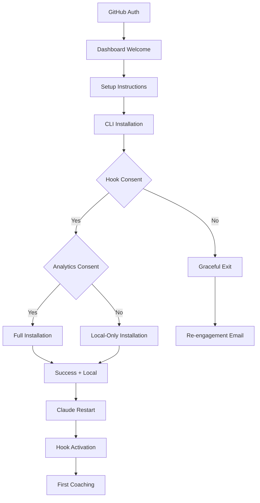

# Installation Flow Specifications

**Document Type**: UX/UI Specifications  
**Version**: 1.0  
**Last Updated**: 2025-08-19  
**Audience**: Engineering, Design, QA

---

## Overview

This document specifies the exact user interface flows, copy, and decision trees for Ginko statusline intelligence installation. Use this as the authoritative source for implementation.

---

## Flow Architecture



---

## Screen-by-Screen Specifications

### 1. Dashboard Welcome Screen

#### Layout Requirements
- **Container**: Full-width hero section
- **Typography**: 
  - H1: 32px, bold, primary color
  - Body: 16px, line-height 1.6
  - CTAs: 18px, medium weight
- **Colors**: Brand primary, success green, warning amber
- **Spacing**: 24px vertical rhythm

#### Copy (Exact Text)
```
🎯 Welcome to Ginko Intelligence!

Transform your Claude Code sessions with real-time
coaching that helps you stay productive and focused.

✨ What you'll get:
  🎯 Smart pattern recognition
  💬 Contextual coaching messages
  ⚡ Real-time feedback (sub-second latency)
  📊 Productivity insights

🏠 Privacy First:
  • All processing happens on your machine
  • No file contents or personal data collected
  • Complete control over data sharing

Ready to get started?

[🚀 Set Up Claude Code Integration] [📚 Learn More]
```

#### Interactive Elements
- **Primary CTA**: "Set Up Claude Code Integration"
  - Color: Primary blue (#0066CC)
  - Style: Solid button, 12px padding, rounded corners
  - Hover: Darken 10%
- **Secondary CTA**: "Learn More"
  - Color: Secondary gray (#666666)
  - Style: Outline button
  - Action: Open documentation in new tab

### 2. Setup Instructions Modal

#### Modal Specifications
- **Width**: 600px
- **Height**: Auto (max 80vh)
- **Backdrop**: Semi-transparent overlay
- **Animation**: Fade in over 200ms

#### Copy (Exact Text)
```
📋 Claude Code Integration Setup

Follow these steps to enable intelligent coaching:

Step 1: Install Ginko CLI
> npm install -g @ginko/cli

Step 2: Run the coaching setup
> ginko setup-coaching

Step 3: Follow the installation prompts
(We'll guide you through permissions and privacy)

Step 4: Restart Claude Code and activate hooks
> /hooks

💡 The entire process takes 3-5 minutes and all data
   stays on your machine unless you opt into analytics

[📋 Copy Commands] [🎬 Watch Video Guide] [❌ Close]
```

#### Interactive Elements
- **Copy Commands**: Copies text to clipboard, shows toast confirmation
- **Watch Video Guide**: Opens video in new tab/embedded player
- **Close**: Closes modal, returns to dashboard

### 3. CLI Installation Interface

#### Terminal UI Specifications
- **Font**: Monospace, 14px
- **Colors**: Green for success, yellow for warnings, red for errors
- **Animations**: Text appears with typewriter effect (optional)
- **Progress**: Step-by-step confirmation checkmarks

#### Installation Phases

##### Phase 1: Welcome & Value Proposition
```bash
🚀 === Ginko Statusline Intelligence Installer === 🚀

Transform your Claude Code experience with intelligent, real-time coaching!

✨ What you'll get:
  🎯 Smart pattern recognition - detects when you're in flow, stuck, or exploring
  💬 Contextual coaching messages - helpful hints at just the right moment
  ⚡ Real-time feedback - updates within milliseconds of your actions
  🔒 Complete privacy - all processing happens locally on your machine

Examples of intelligent coaching:
  🚀 "Great momentum! Keep exploring" (when rapidly using diverse tools)
  🔄 "Repeating Bash. Try something different?" (when stuck in a pattern)
  💭 "Quiet moment. What's next?" (during idle periods)
  🎯 "Focused work. Stay on target!" (when working intensively)
```

##### Phase 2: Technical Explanation
```bash
📋 Technical Details
━━━━━━━━━━━━━━━━━━━━
This feature uses Claude Code's official 'hooks' system to monitor your
tool usage patterns. Here's exactly what happens:

How it works:
  ✅ Monitors tool usage (Read, Write, Bash, etc.) for patterns
  ✅ Generates helpful coaching messages based on your workflow
  ✅ Stores pattern data locally in /Users/user/.ginko
  ✅ Updates your statusline with contextual guidance

Privacy & Data Usage:
  🏠 **LOCAL PROCESSING ONLY** - All coaching happens on your machine
  🚫 **NO DATA TRANSMISSION** - Nothing sent to Ginko servers  
  👁️  **MINIMAL DATA** - Only tool names and timing, never file contents
  🛡️  **READ-ONLY** - Never modifies your files or projects
  📁 **TRANSPARENT** - Hook scripts stored in ~/.claude/hooks (inspect anytime)

The hooks system runs small shell scripts when you use Claude Code tools.
All pattern analysis and coaching generation happens entirely on your machine.
```

##### Phase 3: Primary Consent (Required)
```bash
🎉 Ready to enable intelligent statusline coaching? (y/N): 
```

**Input Validation**: 
- Accepts: y, Y, yes, YES, Yes
- Rejects: n, N, no, NO, No, [Enter], any other input
- Timeout: None (waits indefinitely)

##### Phase 4A: Consent Granted - Analytics Choice
```bash
🤔 Optional: Help Improve Coaching for Everyone
━━━━━━━━━━━━━━━━━━━━━━━━━━━━━━━━━━━━━━━━━━━━━━━━━

Ginko can learn from anonymous usage patterns to improve coaching
quality for all users. This is completely separate from your local coaching.

If you opt in, we would occasionally collect:
  📊 Anonymous pattern summaries (e.g., "flow state lasted 15 minutes")
  🎯 Coaching effectiveness data (which messages help most)
  📈 Aggregate productivity indicators

We would NEVER collect:
  ❌ File names, paths, or contents
  ❌ Personal identifiers or project details
  ❌ Individual commands or specific activities

Benefits of sharing:
  🚀 Help build better coaching algorithms
  🎯 Contribute to evidence-based productivity insights
  📊 Access to anonymous community insights (future feature)

📊 Enable anonymous analytics to help improve coaching? (y/N): 
```

##### Phase 4B: Consent Declined - Graceful Exit
```bash
We understand! Hooks are a big decision. 🤗

Unfortunately, Ginko's intelligent coaching requires hooks to work.
Without them, there wouldn't be any real-time pattern detection or
coaching messages - you'd miss the core Ginko experience.

💡 Take your time to consider it. When you're ready:
   • Re-run this installer anytime: ginko setup-coaching
   • Read more about hooks at: https://docs.anthropic.com/en/docs/claude-code/hooks
   • Check out our privacy design: privacy-permissions-design.md

We'd love to help you be more productive when you're ready! 🚀
Thanks for considering Ginko.
```

**Exit Code**: 0 (clean exit)
**Follow-up**: Email with educational content after 24 hours

##### Phase 5: Installation Progress
```bash
🔧 Starting installation...

📁 Creating directories...
💾 Creating backups...
  ✅ Backed up /Users/user/.claude/settings.json
🎣 Installing hook script...
✅ Hook script installed
⚙️  Configuring Claude Code settings...
✅ Claude Code settings updated
💾 Saving privacy preferences...
✅ Privacy preferences saved
📊 Installing command-line utilities...
✅ Statusline reader installed: ginko-status
✅ Privacy manager installed: ginko-privacy
💡 Add /Users/user/.local/bin to your PATH to use these commands globally
🧪 Testing installation...
✅ Hook script is executable
✅ Settings file configured correctly
```

**Progress Indicators**:
- Each step shows immediately upon completion
- Failures stop process and show error message
- Rollback on any failure

##### Phase 6: Success Summary
```bash
🎉 Installation Complete!

Next Steps:
━━━━━━━━━━
1. 🔄 Restart Claude Code completely (required for hooks to activate)
2. 🎯 In your new Claude Code session, run: /hooks
3. ✅ Verify hooks are active (should see confirmation message)
4. 🚀 Start using Claude Code - coaching will appear automatically!

Commands Available:
• Check coaching: ginko-status
• Detailed view: ginko-status details
• Privacy settings: ginko-privacy

Your Privacy Settings:
• 🏠 Local coaching: ENABLED
• 📊 Anonymous analytics: [ENABLED/DISABLED]
  └─ [Helps improve coaching for everyone / All data stays local]
  └─ Can be [disabled/enabled] anytime: ginko-privacy [disable/enable]-analytics

Happy coding with intelligent statusline coaching! 🚀
```

---

## Decision Tree Logic

### Hook Consent Decision
```javascript
if (hookConsent === 'yes') {
    showAnalyticsChoice();
} else {
    showGracefulExit();
    trackEvent('installation_declined', {reason: 'hooks_consent'});
    sendFollowUpEmail('hooks_education', delay: '24h');
    process.exit(0);
}
```

### Analytics Consent Decision
```javascript
if (analyticsConsent === 'yes') {
    installationType = 'full';
    analyticsEnabled = true;
    trackEvent('installation_analytics_enabled');
} else {
    installationType = 'local_only'; 
    analyticsEnabled = false;
    trackEvent('installation_analytics_declined');
}
proceedWithInstallation(installationType, analyticsEnabled);
```

### Installation Error Handling
```javascript
try {
    createDirectories();
    backupExistingFiles();
    installHookScript();
    updateClaudeSettings();
    savePrivacySettings();
    installUtilities();
    runTests();
    showSuccessMessage();
} catch (error) {
    rollbackChanges();
    showErrorMessage(error);
    trackEvent('installation_failed', {error: error.message});
    process.exit(1);
}
```

---

## Copy Guidelines

### Tone & Voice
- **Friendly**: Use emojis and conversational language
- **Transparent**: Explain exactly what happens
- **Respectful**: Honor user's privacy concerns
- **Helpful**: Provide clear next steps
- **Professional**: Maintain technical accuracy

### Key Phrases (Consistent Usage)
- "intelligent coaching" (not "smart coaching" or "AI coaching")
- "pattern recognition" (not "pattern detection" in user-facing copy)
- "real-time feedback" (not "instant feedback")
- "completely local" (not "local only" or "locally processed")
- "anonymous analytics" (not "telemetry" or "usage data")

### Emoji Usage Standards
- 🚀 Launch, getting started, excitement
- 🎯 Goals, targeting, precision
- 💬 Messages, communication
- ⚡ Speed, real-time
- 🔒 Privacy, security
- 📊 Analytics, data
- ✅ Success, completion
- 🤔 Consideration, thinking
- 💡 Tips, ideas

---

## Error States & Recovery

### Common Errors

#### Permission Denied
```bash
❌ Error: Permission denied accessing /Users/user/.claude/settings.json

This usually happens when Claude Code is running. Please:
1. Close Claude Code completely
2. Re-run: ginko setup-coaching

Need help? Contact support with this error code: PERM_001
```

#### Hook Installation Failed
```bash
❌ Error: Failed to install hook script

Possible causes:
• Claude Code is currently running (please close it)
• Insufficient disk space
• Antivirus software blocking file creation

Troubleshooting:
1. Close all Claude Code windows
2. Check available disk space: df -h
3. Temporarily disable antivirus
4. Re-run installation

Error code: HOOK_001
```

#### Settings Backup Failed
```bash
❌ Error: Cannot backup existing settings

Your current Claude Code settings could not be backed up for safety.
Installation cancelled to protect your existing configuration.

Please check:
• File permissions on ~/.claude/settings.json
• Available disk space
• File is not locked by another process

Error code: BACKUP_001
```

### Recovery Procedures
1. **Rollback**: Restore original files from backups
2. **Clean State**: Remove partial installation files
3. **Retry**: Offer to restart installation
4. **Support**: Provide error code and contact information

---

## Testing Checklist

### Functional Tests
- [ ] Fresh installation on clean system
- [ ] Installation with existing Claude Code settings
- [ ] Consent declined flow
- [ ] Analytics consent variations
- [ ] Error recovery procedures
- [ ] Uninstallation process

### User Experience Tests
- [ ] Copy clarity and tone
- [ ] Visual hierarchy and readability
- [ ] Response time expectations
- [ ] Error message helpfulness
- [ ] Success celebration impact

### Cross-Platform Tests
- [ ] macOS (Intel and Apple Silicon)
- [ ] Linux (Ubuntu, CentOS)
- [ ] Windows (WSL required)
- [ ] Different terminal applications
- [ ] Various Claude Code versions

---

## Analytics & Metrics

### Installation Funnel Tracking
```javascript
// Track key decision points
trackEvent('installation_started');
trackEvent('hook_consent', {decision: 'yes|no'});
trackEvent('analytics_consent', {decision: 'yes|no'});
trackEvent('installation_completed', {
  type: 'full|local_only',
  duration_ms: completionTime,
  errors_encountered: errorCount
});
```

### User Behavior Metrics
- Time spent reading consent screens
- Scroll behavior on long explanations
- Drop-off points in installation flow
- Error recovery success rates
- Support ticket volume by error code

### Success Criteria
- **Installation Completion Rate**: >70% for users who start
- **Time to Complete**: <5 minutes median
- **Error Rate**: <10% of installations
- **User Satisfaction**: >4/5 on post-install survey

---

*Document maintained by: Ginko Engineering Team*  
*Implementation status: Ready for development*  
*Next review: Before public beta release*