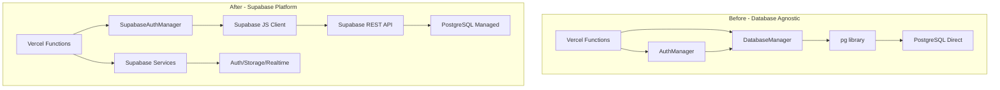
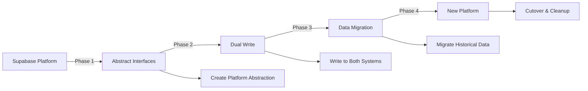

# ADR-007: Adopt Supabase as Primary Platform for MVP

**Status**: Accepted  
**Date**: August 9, 2025  
**Decision Makers**: Chris Norton  
**Related ADRs**: ADR-004 (Identity, Entitlements & Billing), ADR-006 (Serverless-First Architecture)

## Context

Ginko MCP initially attempted to maintain database-agnostic architecture using direct PostgreSQL connections with custom authentication, session management, and database pooling. This approach failed catastrophically in the serverless environment due to:

1. **Connection Pool Exhaustion**: Serverless functions creating new connections per invocation
2. **SASL Authentication Failures**: Direct PostgreSQL auth incompatible with Vercel's environment
3. **Complex Schema Management**: Manual migration scripts and trigger maintenance
4. **Development Velocity**: Too much time spent on infrastructure vs product features

Simultaneously, we migrated from a complex enterprise schema to a simplified MVP schema to accelerate development.

## Decision

**We will adopt Supabase as our primary platform for the MVP phase, using:**

1. **Supabase Auth**: For OAuth and user management
2. **Supabase REST API**: For all database operations (no direct PostgreSQL connections)
3. **Supabase Realtime**: For future WebSocket needs
4. **Supabase Storage**: For file uploads and session artifacts
5. **MVP Schema**: Simplified database schema optimized for rapid iteration

**We explicitly accept platform lock-in as a worthwhile tradeoff for the MVP.**

## Detailed Design

### Architecture Changes



### MVP Schema Structure

```sql
-- Simplified schema optimized for Supabase
CREATE TABLE user_profiles (
    id UUID PRIMARY KEY DEFAULT gen_random_uuid(),
    email TEXT UNIQUE NOT NULL,
    api_key_hash TEXT UNIQUE,
    api_key_prefix TEXT,
    subscription_tier TEXT DEFAULT 'free',
    is_active BOOLEAN DEFAULT true,
    created_at TIMESTAMPTZ DEFAULT NOW()
);

CREATE TABLE sessions (
    id UUID PRIMARY KEY DEFAULT gen_random_uuid(),
    user_id UUID REFERENCES user_profiles(id),
    session_data JSONB,
    created_at TIMESTAMPTZ DEFAULT NOW()
);

-- Leverages Supabase auth.users for OAuth
-- Uses Supabase RLS for security
-- Triggers integrated with Supabase functions
```

### Implementation Strategy

```typescript
// Before: Direct PostgreSQL
class DatabaseManager {
  private pool: Pool;
  async connect() {
    this.pool = new Pool({
      connectionString: process.env.POSTGRES_URL,
      ssl: { rejectUnauthorized: false }
    });
  }
}

// After: Supabase Platform
class SupabaseAuthManager {
  private supabase: SupabaseClient;
  constructor() {
    this.supabase = createClient(
      process.env.SUPABASE_URL,
      process.env.SUPABASE_SERVICE_ROLE_KEY
    );
  }
}
```

## Consequences

### Positive Consequences

1. **Immediate Functionality**: Authentication working within hours vs weeks
2. **Reduced Complexity**: No connection pooling, SSL certificates, or SASL configuration
3. **Better Serverless Fit**: REST API designed for stateless functions
4. **Integrated Services**: Auth, storage, and realtime in one platform
5. **Development Velocity**: 10x faster feature development
6. **Automatic Scaling**: Supabase handles connection pooling and scaling
7. **Built-in Features**: OAuth, RLS, Edge Functions without custom code
8. **Cost Efficiency**: Free tier sufficient for MVP validation

### Negative Consequences

1. **Platform Lock-in**: Tightly coupled to Supabase services
2. **Migration Complexity**: Future migration requires significant refactoring
3. **Vendor Risk**: Dependent on Supabase availability and pricing
4. **Limited Customization**: Must work within Supabase constraints
5. **Data Portability**: Export requires Supabase-specific tooling
6. **Debugging Complexity**: Additional abstraction layer
7. **Feature Limitations**: Some PostgreSQL features not exposed via REST API
8. **Network Latency**: REST API adds ~50-100ms vs direct connection

## Platform Lock-in Analysis

### Lock-in Points

1. **Supabase Auth**
   - User sessions tied to Supabase auth.users table
   - OAuth flows integrated with Supabase endpoints
   - Magic links and password reset flows

2. **Supabase Client Library**
   - All database operations use Supabase JS SDK
   - RLS policies written in Supabase-specific format
   - Realtime subscriptions use Supabase channels

3. **Environment Dependencies**
   - Service role keys specific to Supabase
   - URL structure assumes Supabase endpoints
   - Database migrations via Supabase CLI

4. **Feature Dependencies**
   - Edge Functions for webhooks
   - Storage API for file uploads
   - Realtime for WebSocket features

### Migration Strategy (If Needed)



**Phase 1: Abstract Interfaces** (2 weeks)
- Create `IPlatformAdapter` interface
- Wrap Supabase-specific code
- Add feature flags for gradual migration

**Phase 2: Dual Write** (4 weeks)
- Implement new platform adapter
- Write to both systems
- Monitor data consistency

**Phase 3: Data Migration** (2 weeks)
- Export all Supabase data
- Transform to new schema
- Validate data integrity

**Phase 4: Cutover** (1 week)
- Switch feature flags
- Monitor error rates
- Remove Supabase dependencies

**Estimated Total Migration: 9 weeks + testing**

## Risk Mitigation

### Vendor Risk
- **Mitigation**: Regular data exports, maintain migration plan
- **Monitoring**: Track Supabase incidents and pricing changes
- **Fallback**: Keep PostgreSQL connection code in version control

### Performance Risk
- **Mitigation**: Cache frequently accessed data
- **Monitoring**: Track API latency and rate limits
- **Fallback**: Implement connection pooling if needed

### Feature Risk
- **Mitigation**: Validate all features available via REST API
- **Monitoring**: Track Supabase roadmap for deprecated features
- **Fallback**: Use Edge Functions for custom logic

## Decision Criteria

We chose Supabase platform adoption because:

1. **MVP Priority**: Speed to market > architectural purity
2. **Resource Constraints**: Small team can't maintain infrastructure
3. **Proven Success**: Many successful startups built on Supabase
4. **Exit Strategy**: Clear migration path if needed
5. **Cost Effective**: Free tier covers MVP validation

## Alternatives Considered

### Alternative 1: Fix PostgreSQL Direct Connection
- **Pros**: No vendor lock-in, full control
- **Cons**: Complex connection pooling, ongoing maintenance
- **Rejected**: Too much engineering effort for MVP

### Alternative 2: AWS RDS + Lambda
- **Pros**: Industry standard, good tooling
- **Cons**: Complex setup, higher cost, still need auth solution
- **Rejected**: Over-engineered for current needs

### Alternative 3: MongoDB Atlas + Serverless
- **Pros**: Better serverless fit, built-in connection pooling
- **Cons**: Complete schema rewrite, NoSQL learning curve
- **Rejected**: Too disruptive to current progress

### Alternative 4: Firebase
- **Pros**: Similar integrated platform, Google backing
- **Cons**: NoSQL only, less PostgreSQL compatibility
- **Rejected**: Team prefers SQL, existing schema investment

## Success Metrics

Track these metrics to validate the decision:

1. **Development Velocity**: Features shipped per sprint (target: 2x increase)
2. **System Reliability**: Auth success rate (target: >99.9%)
3. **Response Time**: API latency p95 (target: <200ms)
4. **Cost Efficiency**: Monthly infrastructure cost (target: <$100 during MVP)
5. **Migration Readiness**: Time to implement new adapter (target: <1 week)

## Review Schedule

- **3 Months**: Evaluate MVP success and platform fit
- **6 Months**: Assess need for migration based on scale
- **12 Months**: Final decision on long-term platform strategy

## Conclusion

Adopting Supabase as our primary platform is the right decision for the MVP phase. We explicitly accept platform lock-in as a worthwhile tradeoff for:
- 10x development velocity
- Integrated authentication and storage
- Serverless-optimized architecture
- Minimal operational overhead

The lock-in risk is manageable with our documented migration strategy. If Ginko succeeds, the 9-week migration cost is acceptable. If it fails, the platform choice won't be the reason.

**The best infrastructure decision is the one that lets you focus on building product, not infrastructure.**

---

*Signed: Chris Norton*  
*Date: August 9, 2025*