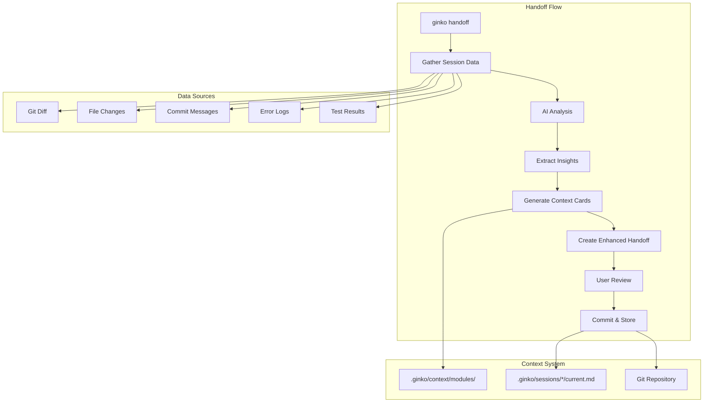

# FEATURE-018: Automatic Context Capture - Technical Architecture

## Executive Summary

Enhance the `ginko handoff` command to automatically analyze development sessions and extract pivotal learning moments, creating permanent context modules without interrupting developer flow. This feature will increase knowledge capture from 10% to 90% by embedding insight extraction directly into the natural handoff workflow.

## Architecture Overview



## Technical Components

### 1. Session Data Collection

```typescript
interface SessionData {
  // Git information
  branch: string;
  commits: GitCommit[];
  diff: string;
  stagedDiff: string;
  filesChanged: FileChange[];
  
  // Development activity
  testResults?: TestResult[];
  errorLogs?: ErrorLog[];
  buildOutput?: string;
  
  // Time information
  sessionStart: Date;
  sessionEnd: Date;
  duration: number;
  
  // Context
  workMode: 'exploring' | 'developing' | 'testing' | 'debugging';
  previousHandoff?: string;
}
```

### 2. AI Analysis Engine

```typescript
interface InsightExtractor {
  /**
   * Analyzes session data to identify pivotal moments
   */
  async extractInsights(session: SessionData): Promise<SessionInsight[]> {
    const prompt = this.buildAnalysisPrompt(session);
    const analysis = await this.aiProvider.analyze(prompt);
    return this.parseInsights(analysis);
  }
  
  /**
   * Filters insights for lasting value
   */
  filterHighValueInsights(insights: SessionInsight[]): SessionInsight[] {
    return insights.filter(insight => 
      insight.reusabilityScore > 0.7 &&
      insight.timeSavingPotential > 30 // minutes
    );
  }
}
```

### 3. Context Module Generator

```typescript
interface ContextModuleGenerator {
  /**
   * Creates a context module from an insight
   */
  async generateModule(insight: SessionInsight): Promise<ContextModule> {
    const module: ContextModule = {
      filename: this.generateFilename(insight),
      content: this.formatModule(insight),
      metadata: {
        type: insight.type,
        tags: this.extractTags(insight),
        relevance: this.calculateRelevance(insight),
        created: new Date().toISOString(),
        dependencies: insight.dependencies
      }
    };
    
    await this.writeModule(module);
    return module;
  }
}
```

### 4. Enhanced Handoff Builder

```typescript
interface HandoffBuilder {
  /**
   * Creates enhanced handoff with auto-captured context
   */
  async buildEnhancedHandoff(
    session: SessionData,
    insights: SessionInsight[],
    modules: ContextModule[]
  ): Promise<string> {
    return `
# Session Handoff

## 📊 Session Summary
${this.generateSummary(session)}

## 🎯 Key Achievements
${this.listAchievements(session)}

## 💡 Captured Insights (${insights.length})
${this.formatInsights(insights, modules)}

## 📁 Context Modules Created
${this.listModules(modules)}

## 🔄 Current State
${this.captureCurrentState(session)}

## 📝 Next Steps
${this.suggestNextSteps(session, insights)}
    `;
  }
}
```

## Implementation Strategy

### Phase 1: Data Collection Enhancement (Week 1)

1. **Extend Session Data Gathering**
   - Capture test results from common test runners
   - Parse error logs from terminal output
   - Track file access patterns
   - Monitor debugging sessions

2. **Create Session Activity Model**
   - Define comprehensive SessionData interface
   - Implement data collectors for each source
   - Add buffering for real-time capture
   - Store session telemetry

### Phase 2: AI Analysis Integration (Week 1-2)

1. **Build Analysis Prompts**
   - Design prompt templates for insight extraction
   - Create scoring rubrics for insight value
   - Implement multi-model routing (ADR-026)
   - Add context-aware filtering

2. **Integrate AI Provider**
   - Use existing AI adapter pattern
   - Implement fallback for no-API-key scenarios
   - Add response validation
   - Handle rate limiting gracefully

### Phase 3: Context Module System (Week 2)

1. **Module Generation Pipeline**
   - Create module templates for each insight type
   - Implement filename generation (kebab-case)
   - Add frontmatter with metadata
   - Ensure git-trackable format

2. **Module Management**
   - Implement deduplication logic
   - Add module versioning
   - Create module index
   - Enable module search/discovery

### Phase 4: Handoff Enhancement (Week 2-3)

1. **Integrate with Existing Handoff**
   - Extend handoff-ai.ts command
   - Add --capture flag (default enabled)
   - Maintain backward compatibility
   - Preserve quick mode option

2. **User Experience Polish**
   - Add progress indicators
   - Show insight preview
   - Enable selective inclusion
   - Add review/edit capability

## Data Flow

```
1. Developer runs: ginko handoff
2. CLI collects session data (git, files, tests)
3. Data sent to AI for analysis
4. AI identifies 3-6 high-value insights
5. Each insight becomes a context module
6. Modules saved to .ginko/context/modules/
7. Handoff references new modules
8. User reviews and commits
9. Next session loads modules automatically
```

## AI Prompt Design

### Insight Extraction Prompt

```yaml
Role: You are analyzing a development session to extract pivotal learning moments.

Session Data:
  - Git diff: [provided]
  - Files changed: [list]
  - Commits: [messages]
  - Errors encountered: [if any]
  - Tests run: [results]

Task: Identify 3-6 insights that have lasting value.

For each insight, determine:
  1. Type: [gotcha|pattern|decision|discovery|optimization]
  2. Problem: What challenge was faced?
  3. Solution: How was it resolved?
  4. Impact: Time saved in future (minutes)
  5. Reusability: Likelihood of encountering again (0-1)
  6. Code Example: Relevant snippet if applicable
  7. Prevention: How to avoid the issue

Filter criteria:
  - Would forgetting this cause rework? (must be yes)
  - Will this save >30 minutes if remembered? (should be yes)
  - Is this specific to current project? (should be no)

Output format: Structured JSON with insights array
```

## File Structure

```
.ginko/
├── context/
│   ├── modules/
│   │   ├── gotcha-react-hooks-must-follow.md      # Auto-generated
│   │   ├── pattern-error-boundary-implementation.md # Auto-generated
│   │   ├── decision-use-tanstack-query.md         # Auto-generated
│   │   └── discovery-vercel-env-variables.md      # Auto-generated
│   └── index.json                                 # Module registry
├── sessions/
│   └── user@example.com/
│       ├── current.md                             # Enhanced handoff
│       └── insights.json                          # Session insights cache
└── config.json
```

## Configuration

```json
{
  "handoff": {
    "autoCapture": true,              // Enable by default
    "captureThreshold": 0.7,          // Minimum insight score
    "maxInsightsPerSession": 6,       // Prevent overwhelming
    "aiModel": "auto",                 // Use ADR-026 routing
    "reviewBeforeSave": false,        // Show insights before saving
    "deduplicateModules": true        // Prevent duplicate insights
  }
}
```

## Success Metrics

| Metric | Current | Target | Measurement |
|--------|---------|--------|-------------|
| Knowledge Capture Rate | 10% | 90% | Insights captured / Insights discovered |
| Developer Time Saved | 0 hrs/week | 2-4 hrs/week | Survey + telemetry |
| AI Effectiveness | Baseline | 3x | Problem resolution speed |
| Module Reuse Rate | N/A | >50% | Module references in future sessions |
| User Adoption | 0% | 80% | Active users with auto-capture enabled |

## Security & Privacy

- All analysis happens locally or via user's API keys
- No session data sent to Ginko servers
- Context modules stored in git (user-controlled)
- Sensitive data filtering before AI analysis
- Opt-out available via config

## Migration Plan

1. **Soft Launch** (Week 3)
   - Feature flag: --capture
   - Opt-in for early adopters
   - Collect feedback

2. **Default Enablement** (Week 4)
   - Make --capture default behavior
   - Add --no-capture for opt-out
   - Monitor usage metrics

3. **Full Integration** (Week 5)
   - Remove feature flag
   - Integrate with all handoff modes
   - Add to VS Code extension

## Technical Decisions

### Why Embed in Handoff?
- Natural pause point in workflow
- Developer already context-switching
- Handoff already gathers session data
- Zero additional friction

### Why 3-6 Insights?
- Cognitive load management
- Quality over quantity
- Matches working memory capacity
- Prevents information overload

### Why Auto-Generate Filenames?
- Consistency across team
- Searchability
- Prevents naming paralysis
- Git-friendly format

## Testing Strategy

1. **Unit Tests**
   - Insight extraction logic
   - Module generation
   - Deduplication algorithm
   - Relevance scoring

2. **Integration Tests**
   - Full handoff flow
   - AI provider integration
   - File system operations
   - Git operations

3. **User Acceptance**
   - A/B test with/without capture
   - Measure time saved
   - Survey satisfaction
   - Track module reuse

## Rollback Plan

If issues arise:
1. Disable via feature flag
2. Preserve generated modules
3. Revert to basic handoff
4. Address issues
5. Re-enable gradually

## Future Enhancements

- **Team Insights**: Share high-value insights across team
- **Insight Analytics**: Track which insights save most time
- **Smart Suggestions**: Proactively suggest relevant modules
- **IDE Integration**: Surface insights in editor
- **Learning Paths**: Build knowledge graphs from insights

## Conclusion

Automatic context capture transforms Ginko from a handoff tool into a learning amplifier. By capturing insights at the natural pause point of handoffs, we preserve 90% of valuable learnings with zero additional friction. This creates a compound learning effect where each session builds on previous discoveries, dramatically improving both human and AI effectiveness.