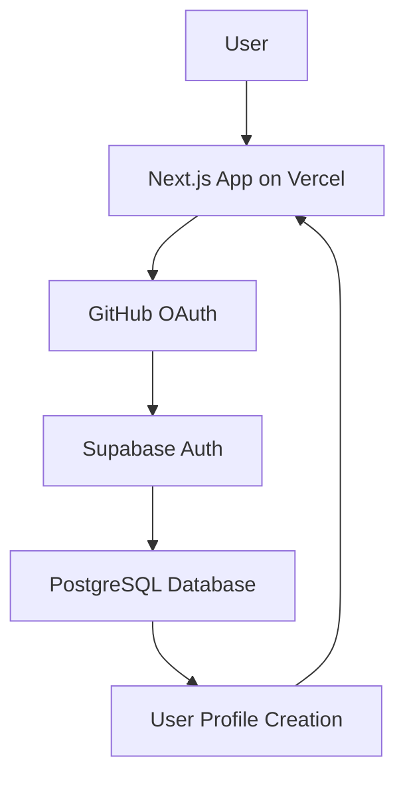

# OAuth Implementation Post-Mortem: Vercel + Supabase + GitHub

**Date**: 2025-08-01  
**Project**: ContextMCP Dashboard  
**Stack**: Next.js 14, Vercel, Supabase, GitHub OAuth  
**Duration**: ~3 hours of debugging  
**Outcome**: ✅ Successful implementation

## Summary

This post-mortem documents the challenges encountered while implementing GitHub OAuth authentication in a Next.js application deployed on Vercel with Supabase as the backend. The implementation required solving multiple interconnected issues related to URL management, database triggers, and OAuth flow handling.

## Architecture Overview



## Major Challenges Encountered

### 1. Dynamic URL Management with Vercel Deployments

**Problem**: Each Vercel deployment generates a new unique URL (e.g., `dashboard-abc123-user.vercel.app`), requiring manual updates to Supabase and GitHub OAuth configurations after every deployment.

**Root Cause**: 
- Vercel's default deployment behavior creates unique URLs
- OAuth providers require exact URL matches for security
- Manual configuration updates are error-prone and tedious

**Solution Attempted**: 
- Used wildcard patterns in Supabase: `https://*.vercel.app/auth/callback`
- Implemented dynamic URL detection: `${window.location.origin}/auth/callback`

**Lesson Learned**: 
- Plan for URL stability from the beginning
- Consider custom domains or Vercel aliases for production apps
- Wildcard patterns in OAuth configurations can solve dynamic URL issues

### 2. Database Trigger Failures Blocking User Creation

**Problem**: OAuth flow completed successfully with GitHub, but Supabase returned "Database error saving new user".

**Root Cause**: 
- The `handle_new_user()` trigger function was failing when creating user profiles
- Missing or malformed GitHub user metadata fields
- Strict database constraints without proper fallbacks

**Initial Error**: 
```
Database error saving new user
Error: server_error, error_code: unexpected_failure
```

**Solution**: 
```sql
CREATE OR REPLACE FUNCTION public.handle_new_user()
RETURNS TRIGGER AS $$
BEGIN
    BEGIN
        INSERT INTO public.user_profiles (...)
        VALUES (
            NEW.id,
            COALESCE(NEW.email, NEW.raw_user_meta_data->>'email'),
            COALESCE(
                NEW.raw_user_meta_data->>'full_name', 
                NEW.raw_user_meta_data->>'name',
                NEW.raw_user_meta_data->>'login',
                'Unknown'
            ),
            -- ... other fields with fallbacks
        );
    EXCEPTION WHEN others THEN
        RAISE LOG 'Error creating user profile: %', SQLERRM;
    END;
    RETURN NEW;
END;
$$
```

**Lesson Learned**: 
- Always implement graceful error handling in database triggers
- Provide multiple fallbacks for user metadata fields
- Log errors without failing the primary operation (user creation)

### 3. OAuth Code Exchange vs. Hash Fragment Handling

**Problem**: Created server-side callback route expecting OAuth code in query parameters, but no code was received.

**Debugging Process**:
```
Server logs: "Code: missing"
Expected: /auth/callback?code=abc123
Actual: User redirected to homepage with no session
```

**Root Cause**: 
- Misunderstanding of Supabase OAuth flow
- Supabase handles OAuth code exchange internally
- Returns authentication tokens as URL hash fragments, not query parameters

**Flow Clarification**:
```
1. App → GitHub OAuth
2. GitHub → Supabase (/auth/v1/callback) 
3. Supabase processes code internally
4. Supabase → App with tokens in URL hash (#access_token=...)
```

**Solution**: 
- Removed complex server-side callback processing
- Implemented client-side hash fragment detection
- Let Supabase client library handle token extraction automatically

**Lesson Learned**: 
- Understand the complete OAuth flow of your auth provider
- Supabase handles OAuth code exchange internally - don't duplicate this
- Hash fragments are client-side only, query parameters are server-side accessible

### 4. Middleware Interference with Authentication State

**Problem**: Complex middleware was intercepting all requests and redirecting authenticated users back to login.

**Root Cause**: 
- Overly broad middleware matcher patterns
- Middleware running on auth routes causing loops
- Session state not properly synchronized between server and client

**Solution**: 
```typescript
// Simplified middleware - only protect specific routes
export const config = {
  matcher: ['/dashboard/:path*'] // Only protect dashboard routes
}
```

**Lesson Learned**: 
- Keep middleware scope minimal and specific
- Avoid protecting auth routes with authentication middleware
- Test middleware behavior thoroughly across all routes

### 5. Environment Variable and Configuration Management

**Problem**: Multiple configuration points that needed to stay synchronized:
- Supabase Site URL
- Supabase Redirect URLs  
- GitHub OAuth App settings
- Vercel environment variables

**Solution**: 
- Used wildcard patterns where possible (`https://*.vercel.app/*`)
- Implemented dynamic URL detection in application code
- Documented all configuration points clearly

**Lesson Learned**: 
- Minimize configuration touch points
- Use patterns and wildcards to reduce manual updates
- Document all external service configurations

## Technical Implementation Details

### Final Working OAuth Flow

```typescript
// Client-side OAuth initiation
const { error } = await supabase.auth.signInWithOAuth({
  provider: 'github',
  options: {
    redirectTo: `${window.location.origin}/auth/callback`
  }
})

// Client-side auth state detection
const { data: { subscription } } = supabase.auth.onAuthStateChange((event, session) => {
  if (event === 'SIGNED_IN' && session) {
    router.push('/dashboard')
  }
})
```

### Database Schema Considerations

```sql
-- Key learnings for user profile creation
CREATE TABLE user_profiles (
    api_key TEXT UNIQUE NOT NULL, -- Always generate, never null
    github_username TEXT, -- Can be null, use COALESCE
    full_name TEXT DEFAULT 'Unknown', -- Always have fallback
    -- ... other fields with appropriate defaults
);
```

### Supabase Configuration

```
Site URL: https://your-latest-deployment.vercel.app
Redirect URLs: 
  - https://*.vercel.app/auth/callback (wildcard pattern)
  - https://*.vercel.app/dashboard
```

## Debugging Techniques That Worked

### 1. Server-Side Logging
```typescript
console.log('=== OAUTH CALLBACK DEBUG ===')
console.log('URL:', request.url)
console.log('Code:', code ? 'present' : 'missing')
console.log('Error:', error)
```

### 2. Client-Side State Tracking
```typescript
const { user, loading } = useSupabase()
console.log('Auth state:', { user: !!user, loading, email: user?.email })
```

### 3. Vercel Function Logs
```bash
vercel logs dashboard-url.vercel.app --follow
```

### 4. Database Trigger Logging
```sql
RAISE LOG 'Creating profile for user %: %', NEW.id, NEW.email;
```

## Recommendations for Future Implementations

### Pre-Implementation
1. **Plan URL strategy early** - consider custom domains or aliases
2. **Design database triggers with error handling** from the start
3. **Understand your auth provider's complete flow** before implementing
4. **Set up comprehensive logging** for debugging

### During Implementation
1. **Test each component in isolation** before integration
2. **Use wildcard patterns** in OAuth configurations when possible
3. **Implement graceful fallbacks** for all user data fields
4. **Keep middleware scope minimal**

### Testing Strategy
1. **Test OAuth flow end-to-end** in production environment
2. **Verify database trigger execution** with various user data scenarios
3. **Test edge cases** like missing user metadata
4. **Validate redirect behavior** across different deployment URLs

## Time Investment Breakdown

- **Initial implementation**: 30 minutes
- **URL management issues**: 45 minutes  
- **Database trigger debugging**: 60 minutes
- **OAuth flow understanding**: 45 minutes
- **Final debugging and testing**: 30 minutes

**Total**: ~3.5 hours (could have been 1 hour with proper understanding)

## Tools and Resources That Helped

### Documentation
- [Supabase Auth with Next.js](https://supabase.com/docs/guides/auth/auth-helpers/nextjs)
- [GitHub OAuth Apps](https://docs.github.com/en/developers/apps/building-oauth-apps)
- [Vercel Functions Logs](https://vercel.com/docs/functions/logs)

### Debugging Tools
- Browser DevTools (Network tab for redirect flows)
- Vercel Dashboard Function Logs
- Supabase Dashboard SQL Editor
- Console logging with structured data

## Conclusion

The OAuth implementation was ultimately successful but required debugging multiple interconnected systems. The key insight was understanding that modern auth providers like Supabase handle much of the OAuth complexity internally, and the application should work with their flow rather than trying to implement custom handling.

**Success Metrics Achieved**:
- ✅ Seamless GitHub OAuth authentication
- ✅ Automatic user profile creation
- ✅ Session management across page refreshes
- ✅ Production-ready deployment on Vercel
- ✅ Proper error handling and logging

**Key Takeaway**: Modern auth flows are powerful but require understanding the complete system interaction. Invest time upfront in understanding the flow rather than debugging implementation details.