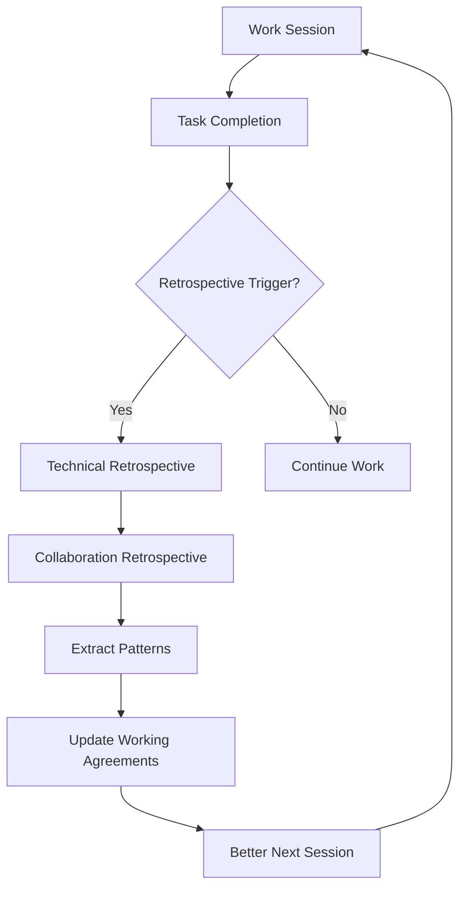

# Retrospective Methodology

**Purpose**: Continuous improvement through systematic reflection on both technical outcomes and collaboration quality.

## Two-Level Retrospective Process

### 1. Technical Retrospective
**Focus**: What we built, how we built it, what worked/didn't in our approach

**Template**:
```markdown
# Technical Retrospective: [Feature/Sprint]
**Date**: [Date]
**Participants**: [Names]
**Duration**: [Time period]

## What We Built
- [Accomplishment 1]
- [Accomplishment 2]
- [Accomplishment 3]

## What Went Well
- [Technical success 1]
- [Process that worked 1]
- [Tool/pattern that helped]

## What Didn't Go Well
- [Technical challenge 1]
- [Process friction 1]
- [Tool/pattern that hindered]

## Lessons Learned
- [Key insight 1]
- [Key insight 2]
- [Pattern to repeat/avoid]

## Action Items
- [ ] [Improvement 1]
- [ ] [Improvement 2]
- [ ] [Process change]
```

### 2. Collaboration Retrospective
**Focus**: How we worked together, interaction quality, communication patterns

**Template**:
```markdown
# Collaboration Retrospective: [Session/Feature]
**Date**: [Date]
**Participants**: [Names]
**Session Type**: [Planning/Building/Debugging/Learning/Shipping]

## What Each Party Did Well
### Human Strengths:
- [Specific helpful actions]
- [Communication patterns that worked]
- [Decision-making approaches]

### AI Strengths:
- [Effective approaches]
- [Helpful information presentation]
- [Good interaction patterns]

## Frustration Points
### Human Frustrations:
- [What caused friction]
- [Unmet expectations]
- [Communication gaps]

### AI Frustrations:
- [Areas of confusion]
- [Need for more guidance]
- [Context mismatches]

## Interaction Analysis
- **Communication Style**: [Too verbose/terse/just right?]
- **Pacing**: [Too fast/slow/well-matched?]
- **Context Sharing**: [Too much/little/wrong type?]
- **Question/Answer Balance**: [Appropriate leadership?]

## Breakthrough Moments
- [When understanding clicked]
- [Insights that emerged from interaction]
- [Collaborative problem-solving wins]

## Collaboration Grade: [A-F]
**Rationale**: [Why this grade and what would make it A+]

## Meta-Insights
- [What we learned about working together]
- [Patterns to repeat/avoid]
- [Collaboration improvements discovered]

## Adjustments for Next Session
### Human will:
- [Specific behavior change]
- [Communication adjustment]

### AI will:
- [Approach modification]
- [Context handling change]
```

## When to Trigger Retrospectives

### Automatic Triggers
- ✅ After completing a major task/feature
- 🔧 After resolving a complex debugging session
- 📋 After a planning session with significant decisions
- ❌ After a failed attempt or abandoned approach
- 🎯 At mode transitions (Planning → Building)
- 📅 Weekly sprint retrospectives

### Manual Triggers
Either party can request:
- "Let's do a collaboration review"
- "This might be a good time for a retrospective"
- "Before we move on, should we reflect on this?"

### Natural Moments for Collaboration Review
- "That was tricky - should we review how we handled it?"
- "Nice work! What made that go so smoothly?"
- "Before we switch tasks, let's capture what we learned"
- "I'm feeling some friction - can we check in?"

## The Meta-Learning Loop



## Integration with Session Handoff

Retrospective insights should influence session capture:

```typescript
interface SessionHandoff {
  // ... other fields
  collaborationNotes?: {
    lastReviewDate?: Date;
    workingStyle?: {
      preferredVerbosity: 'concise' | 'detailed' | 'adaptive';
      contextPreference: 'minimal' | 'comprehensive' | 'mode-aware';
      frustrationPoints: string[];
      strengthsToLeverage: string[];
    };
    nextSessionHints?: {
      humanShould: string[];  // "Please specify success criteria upfront"
      aiShould: string[];     // "Ask clarifying questions before starting"
    };
  };
}
```

## Compounding Effect

Over time, retrospectives create personalized working relationships:

- **Sessions 1-5**: Learning communication styles
- **Sessions 6-10**: Optimizing interaction patterns  
- **Sessions 11+**: Highly efficient, low-friction collaboration

## Success Metrics

Track these across retrospectives:
- **Collaboration Grade Trend**: Should improve over time
- **Frustration Points**: Should decrease
- **Breakthrough Moments**: Should increase
- **Time to Productivity**: Should decrease
- **Session Satisfaction**: Should increase

## Storage and Organization

### File Structure
```
docs/retrospectives/
├── RETROSPECTIVE-METHODOLOGY.md (this file)
├── COLLABORATION-REVIEW-TEMPLATE.md
├── TECHNICAL-RETROSPECTIVE-TEMPLATE.md
├── 2025-08/
│   ├── 2025-08-09-auth-debug-collab.md
│   ├── 2025-08-10-feature-planning.md
│   └── weekly-2025-08-09.md
└── patterns/
    ├── successful-interactions.md
    └── common-friction-points.md
```

### Naming Convention
- **Collaboration**: `YYYY-MM-DD-[task]-collab.md`
- **Technical**: `YYYY-MM-DD-[task]-tech.md`  
- **Weekly**: `weekly-YYYY-MM-DD.md`

## The Ultimate Goal

Transform every session into a learning opportunity about collaboration itself.

**Not just**: "Did we fix the bug?"
**But also**: "Did we work well together? How can we work better?"

This is how we evolve from "AI as tool" to "AI as true collaborator" - by explicitly optimizing the collaboration itself.

---

*"The best teams are not just good at their craft - they're good at getting better at their craft."*