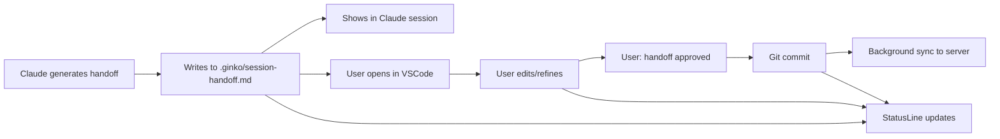

# FEATURE-012: Git-Native Session Handoffs

**Status**: 🚀 PLANNED  
**Priority**: CRITICAL  
**Created**: 2025-08-17  
**Author**: Chris Norton & Claude  
**Impact**: Fundamental paradigm shift - AI sessions as permanent team knowledge

## Executive Summary

Transform Ginko's session handoffs from ephemeral API calls into permanent, git-tracked markdown files that become part of the project's knowledge base. This approach solves technical challenges while creating a revolutionary new value proposition: **AI sessions are first-class citizens in the development workflow**.

## The Innovation

Instead of fighting Claude's markdown escaping and complex display issues, we embrace the file system:
1. Claude writes `.ginko/session-handoff.md` as a regular file
2. Developers review/edit in their preferred markdown editor
3. Git tracks all changes, creating permanent history
4. Background sync provides team visibility
5. StatusLine shows ambient awareness of handoff state

## Value Proposition Evolution

### Before: "Context Management for AI Coding"
- Ephemeral sessions
- Complex server dependencies
- Display/formatting challenges
- Separate from code workflow

### After: "Version Control for AI Sessions"
- Permanent team knowledge
- Git-native workflow
- Local-first, server-enhanced
- Integrated with code history
- Diff-driven learning

## Core Workflow



## Technical Architecture

### File Structure
```
project/
├── .ginko/
│   ├── session-handoff.md          # Current session (git tracked)
│   ├── session-handoff.draft.md    # Claude's working copy (git ignored)
│   ├── templates/
│   │   ├── bug-fix.md              # Team templates
│   │   ├── feature.md
│   │   └── refactor.md
│   ├── archive/                    # Historical handoffs
│   │   └── 2025-01/
│   │       ├── 15-auth-bug.md
│   │       └── 14-api-feature.md
│   └── metrics.json                # Local performance metrics
```

### Three-Layer Sync Strategy
```
Layer 1: Immediate (Local Git Hook)
├── pre-commit: Validate handoff format
├── post-commit: Queue for server sync
└── Status: Instant local feedback

Layer 2: Near-Instant (Filesystem Watcher)
├── Watch: .ginko/*.md
├── Debounce: 2-second delay
└── Sync: Direct to server API

Layer 3: Eventual (GitHub Webhook)
├── Push event: Trigger sync
├── PR event: Add to PR description
└── Backup: Ensures server consistency
```

## Key Benefits

### For Individual Developers
- **Familiar**: Just markdown files and git
- **Flexible**: Use any editor/viewer
- **Offline**: Works without internet
- **Private**: Sensitive handoffs stay local
- **Reviewable**: Edit/refine before committing

### For Teams
- **Discoverable**: Handoffs in git history
- **PR Integration**: Part of code review process
- **Analyzable**: Git analytics work on handoffs
- **Shareable**: Templates improve team patterns
- **Blameable**: `git blame` shows AI session history

### For Ginko
- **Differentiator**: No competitor does this
- **Stickiness**: Becomes core workflow
- **Network Effects**: Team templates create moat
- **Learning Opportunity**: Diff patterns show improvements
- **Reduced Complexity**: No special markdown handling

## Implementation Phases

### Phase 1: Basic File Flow (Week 1)
- [ ] Claude writes to `.ginko/session-handoff.md`
- [ ] Simple git hook for commit tracking
- [ ] Basic statusline updates
- [ ] Documentation for workflow

### Phase 2: Smart Watching (Week 2)
- [ ] File watcher detects edits
- [ ] Diff analysis for learning
- [ ] StatusLine intelligence
- [ ] Handoff approval flow

### Phase 3: Team Features (Week 3)
- [ ] Template sharing system
- [ ] Quality metrics
- [ ] Team patterns analysis
- [ ] PR integration

## StatusLine Intelligence

The statusline becomes a collaboration indicator:
```
Morning:  "🌅 Starting fresh session"
Working:  "⚡ 3 files modified, 2 tests passing"
Review:   "📝 User editing handoff"
Waiting:  "⏸️ Awaiting handoff approval"
Synced:   "✅ Handoff synced to team"
Warning:  "⚠️ 2 hours since last commit"
```

## Killer Features Enabled

### 1. Diff-Driven Learning
```bash
# See how human improved Claude's handoff
$ git diff HEAD~1 .ginko/session-handoff.md
+ ## Critical Decision: Chose JWT over sessions
+ This impacts mobile app auth flow - discuss with team
- ## Made some auth changes
```

### 2. Team Handoff Templates
```bash
# Team shares effective patterns
$ ginko template save "bug-investigation"
$ ginko template list
- bug-investigation (by Chris, ⭐ 4.8)
- feature-planning (by Alice, ⭐ 4.6)
```

### 3. Local Coaching Analytics
```bash
# Analyze patterns without server
$ ginko analyze --local
📊 Session Analysis (last 30 days):
- Average session: 3.2 hours
- Context quality: ↑ 15%
- Most productive: Tuesday mornings
```

### 4. PR Integration
```yaml
# Automatic PR summaries
on: pull_request
jobs:
  summarize:
    - name: Add AI session summary
      run: ginko pr-summary >> $GITHUB_STEP_SUMMARY
```

## Success Metrics

- **Adoption**: 80% of sessions use file-based handoffs
- **Quality**: 50% reduction in handoff edits over time
- **Engagement**: 3x increase in handoff reviews
- **Retention**: 90% teams still using after 30 days
- **Network Effect**: 5+ templates shared per team

## Technical Considerations

### Pros
- Eliminates markdown display issues
- Works offline/server down
- Natural developer workflow
- Version control included
- Local LLM analysis possible
- Progressive enhancement

### Cons (Mitigated)
- Requires git (target audience uses it)
- Multiple sync paths (redundancy is good)
- File permissions (standard git practices)

## Marketing Position

> "Ginko treats AI sessions like code - versioned, reviewed, and improved through your natural git workflow. Your AI sessions become permanent team knowledge, not ephemeral conversations."

## Competitive Advantage

This approach is **completely unique** in the AI coding space:
- Cursor/Windsurf: Ephemeral sessions
- Copilot: No session concept
- Aider: Git for code, not sessions
- **Ginko**: Git-native AI knowledge base

## Risk Assessment

- **Low Risk**: File operations are simple and reliable
- **High Reward**: Paradigm shift in AI collaboration
- **Fallback**: Server sync optional, core value works offline

## Decision Point

This feature fundamentally changes Ginko from a "context management tool" to a "knowledge management system for AI development". It's not just solving technical problems - it's creating a new category.

## Next Steps

1. Validate with 3-5 professional developers
2. Build MVP in current Ginko project
3. Test git hook installation process
4. Create compelling demo video
5. Update marketing/positioning

---

*"This could genuinely revolutionize how teams work with AI - from throwaway sessions to permanent, evolving team knowledge."*