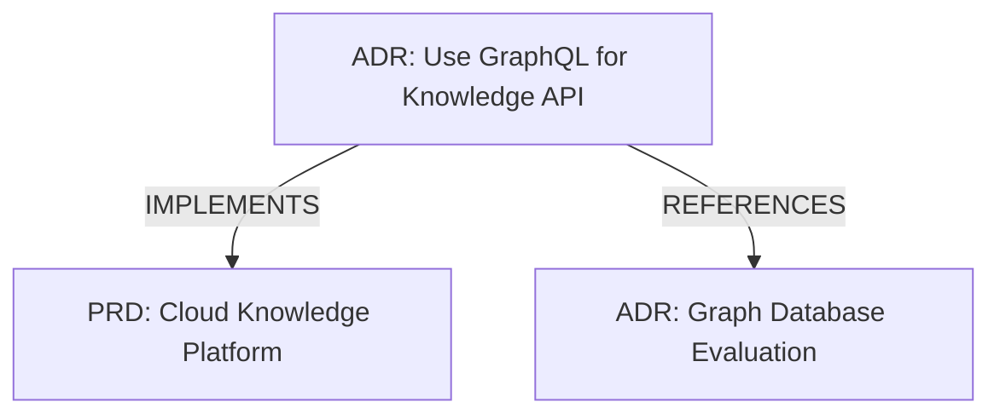

/**
 * @fileType: guide
 * @status: current
 * @updated: 2025-11-07
 * @tags: [documentation, cli, reference, commands]
 * @related: [USER-GUIDE.md, QUICK-START.md]
 * @priority: critical
 * @complexity: medium
 */

# CLI Command Reference

Complete reference for all Ginko CLI commands, options, and usage examples.

---

## Table of Contents

1. [Installation & Setup](#installation--setup)
2. [Authentication](#authentication)
3. [Knowledge Commands](#knowledge-commands)
4. [Project Commands](#project-commands)
5. [Team Commands](#team-commands)
6. [Session Commands](#session-commands)
7. [Configuration](#configuration)
8. [Environment Variables](#environment-variables)

---

## Installation & Setup

### Install

```bash
npm install -g @ginko/cli
```

### Verify Installation

```bash
ginko --version
# Output: 1.5.0
```

### Get Help

```bash
ginko --help
ginko <command> --help
```

---

## Authentication

### `ginko login`

Authenticate with GitHub OAuth and generate API key.

**Usage:**
```bash
ginko login [options]
```

**Options:**
- `--force` - Force re-authentication even if already logged in

**Example:**
```bash
ginko login
# Opens browser for GitHub OAuth
# Generates and stores API key at ~/.ginko/auth.json
```

**What Happens:**
1. Opens browser to GitHub OAuth page
2. User authorizes Ginko application
3. CLI receives OAuth callback
4. Generates long-lived API key (`gk_...`)
5. Stores credentials locally

**Output:**
```
🔐 Opening browser for GitHub authentication...
✅ Authentication successful!
👤 Logged in as: chrispangg
🔑 API Key: gk_dec052c6ca... (stored securely)
```

### `ginko whoami`

Display current authentication status.

**Usage:**
```bash
ginko whoami
```

**Output:**
```
👤 Authenticated User

Username: chrispangg
Email: chris@watchhill.ai
API Key: gk_dec052c6ca... (first 16 chars)
Auth Method: GitHub OAuth
```

### `ginko logout`

Clear local authentication credentials.

**Usage:**
```bash
ginko logout
```

**What Happens:**
- Deletes `~/.ginko/auth.json`
- Clears `GINKO_API_KEY` from environment (session only)

---

## Knowledge Commands

### `ginko knowledge search`

Search knowledge nodes using semantic similarity.

**Usage:**
```bash
ginko knowledge search <query> [options]
```

**Arguments:**
- `<query>` - Search query (natural language)

**Options:**
- `-l, --limit <number>` - Max results (default: 10, max: 100)
- `-t, --threshold <number>` - Min similarity score 0-1 (default: 0.75)
- `--type <type>` - Filter by node type (ADR, PRD, ContextModule, etc.)
- `--status <status>` - Filter by status (default: active)
- `--table` - Display results as table
- `--json` - Output raw JSON

**Examples:**

**Basic Search:**
```bash
ginko knowledge search "authentication patterns"
```

**Output:**
```
🔍 Searching for: "authentication patterns"

Found 3 results:

1. OAuth2 Implementation (ADR) - Score: 0.92
   ID: adr_abc123
   Tags: auth, oauth, security
   Created: 2025-10-15

   We chose OAuth2 with GitHub as the provider because it provides
   secure authentication without storing passwords...

2. User Login Flow (PRD) - Score: 0.87
   ID: prd_def456
   Tags: auth, users
   Created: 2025-10-20

   The user authentication system will support multiple providers
   including GitHub, Google, and email/password...

3. JWT Token Validation (ContextModule) - Score: 0.81
   ID: ctx_ghi789
   Tags: auth, jwt, security
   Created: 2025-11-01

   Always validate JWT tokens on the server side. Never trust
   client-side validation alone...
```

**With Filters:**
```bash
ginko knowledge search "database" \
  --type ADR \
  --status active \
  --limit 5 \
  --threshold 0.8
```

**Table Format:**
```bash
ginko knowledge search "security" --table
```

**Output:**
```
┌──────────────┬────────────────────────┬──────────┬───────┐
│ ID           │ Title                  │ Type     │ Score │
├──────────────┼────────────────────────┼──────────┼───────┤
│ adr_abc123   │ OAuth2 Implementation  │ ADR      │ 0.92  │
│ prd_def456   │ Auth System Redesign   │ PRD      │ 0.87  │
│ ctx_ghi789   │ JWT Token Validation   │ Module   │ 0.81  │
└──────────────┴────────────────────────┴──────────┴───────┘
```

**JSON Output:**
```bash
ginko knowledge search "auth" --json | jq
```

### `ginko knowledge create`

Create a new knowledge node.

**Usage:**
```bash
ginko knowledge create [options]
```

**Options:**
- `--type <type>` - Node type (default: ContextModule)
  - Valid types: ADR, PRD, ContextModule, Session, CodeFile
- `--title <title>` - Node title
- `--content <content>` - Node content
- `--tags <tags>` - Comma-separated tags
- `--file <file>` - Read content from file
- `--status <status>` - Status (draft, active, archived)
- `--interactive` - Force interactive mode

**Examples:**

**Interactive Mode (Default):**
```bash
ginko knowledge create
```

**Interactive Prompts:**
```
? Select node type: ADR
? Title: Use PostgreSQL for Primary Database
? Content (or path to file): We chose PostgreSQL because...
? Tags (comma-separated): database, architecture, postgres
? Status: active
```

**Non-Interactive:**
```bash
ginko knowledge create \
  --type ADR \
  --title "Use GraphQL for Knowledge API" \
  --content "We will use GraphQL Yoga for the knowledge graph API because it provides excellent TypeScript support and integrates seamlessly with Next.js App Router." \
  --tags api,graphql,architecture \
  --status accepted
```

**From File:**
```bash
ginko knowledge create \
  --type ADR \
  --title "API Decision" \
  --file docs/adr/ADR-050.md \
  --tags api
```

**Output:**
```
✅ Knowledge node created successfully!

ID: adr_xyz789
Type: ADR
Title: Use GraphQL for Knowledge API
Status: accepted
Tags: api, graphql, architecture
Created: 2025-11-07T19:30:00Z

🔗 View in dashboard: https://app.ginkoai.com/knowledge/adr_xyz789
```

### `ginko knowledge graph`

Visualize knowledge node relationships.

**Usage:**
```bash
ginko knowledge graph <node-id> [options]
```

**Arguments:**
- `<node-id>` - ID of center node

**Options:**
- `-d, --depth <number>` - Relationship depth 1-2 (default: 1)
- `--types <types>` - Filter relationship types (comma-separated)
  - Valid: IMPLEMENTS, REFERENCES, TAGGED_WITH, RELATED_TO
- `--format <format>` - Output format: tree, json, mermaid (default: tree)

**Examples:**

**Tree View (Default):**
```bash
ginko knowledge graph adr_abc123
```

**Output:**
```
📊 Knowledge Graph: Use GraphQL for Knowledge API

Center Node: ADR - Use GraphQL for Knowledge API
Created: 2025-11-07 | Status: active

Relationships (depth: 1):

├─ IMPLEMENTS
│  └─ PRD: Cloud Knowledge Platform
│     ID: prd_def456
│     Created: 2025-10-15
│
├─ REFERENCES
│  ├─ ADR: Graph Database Evaluation
│  │  ID: adr_ghi789
│  │  Created: 2025-10-20
│  │
│  └─ ContextModule: GraphQL Best Practices
│     ID: ctx_jkl012
│     Created: 2025-11-01
│
└─ TAGGED_WITH
   ├─ Tag: api
   ├─ Tag: graphql
   └─ Tag: architecture

Total Nodes: 4
Total Relationships: 6
```

**Depth 2 (More Relationships):**
```bash
ginko knowledge graph adr_abc123 --depth 2
```

**Filter Relationship Types:**
```bash
ginko knowledge graph adr_abc123 --types IMPLEMENTS,REFERENCES
```

**Mermaid Diagram:**
```bash
ginko knowledge graph adr_abc123 --format mermaid > graph.mmd
```

**Output (graph.mmd):**


**JSON Output:**
```bash
ginko knowledge graph adr_abc123 --format json | jq
```

### `ginko knowledge sync`

Sync local knowledge files to cloud graph.

**Usage:**
```bash
ginko knowledge sync <directory> [options]
```

**Arguments:**
- `<directory>` - Path to directory containing knowledge files

**Options:**
- `--type <type>` - Node type for all files (ADR, PRD, etc.)
- `--dry-run` - Preview changes without syncing
- `--force` - Overwrite existing nodes with same title
- `--pattern <pattern>` - File glob pattern (default: "*.md")

**Examples:**

**Dry Run (Preview):**
```bash
ginko knowledge sync docs/adr/ --type ADR --dry-run
```

**Output:**
```
🔍 Scanning: docs/adr/

Found 23 markdown files:
  ✅ ADR-001-use-postgresql.md → Will create
  ✅ ADR-002-graphql-api.md → Will create
  ⚠️  ADR-003-neo4j-graph.md → Already exists (use --force to overwrite)
  ✅ ADR-004-voyage-embeddings.md → Will create
  ...

Summary:
  - Will create: 20 nodes
  - Will skip (duplicates): 3 nodes
  - Total: 23 files

Run without --dry-run to sync.
```

**Actual Sync:**
```bash
ginko knowledge sync docs/adr/ --type ADR
```

**With Force (Overwrite Duplicates):**
```bash
ginko knowledge sync docs/adr/ --type ADR --force
```

**Custom Pattern:**
```bash
ginko knowledge sync docs/ --type ContextModule --pattern "**/*.context.md"
```

See [Migration Guide](./MIGRATION-GUIDE.md) for detailed sync strategies.

---

## Project Commands

### `ginko project create`

Create a new project.

**Usage:**
```bash
ginko project create <name> [options]
```

**Arguments:**
- `<name>` - Project name

**Options:**
- `--repo <url>` - GitHub repository URL
- `--visibility <public|private>` - Visibility (default: private)
- `--description <text>` - Project description

**Examples:**

```bash
ginko project create my-saas-app \
  --repo github.com/yourname/saas-app \
  --visibility private \
  --description "SaaS platform for team collaboration"
```

**Output:**
```
✅ Project created successfully!

Name: my-saas-app
ID: proj_abc123
Repository: github.com/yourname/saas-app
Visibility: private
Description: SaaS platform for team collaboration

This is now your active project.
```

### `ginko project list`

List all projects you have access to.

**Usage:**
```bash
ginko project list [options]
```

**Options:**
- `--visibility <public|private>` - Filter by visibility
- `--json` - Output raw JSON

**Example:**

```bash
ginko project list
```

**Output:**
```
📦 Your Projects (3 total)

* my-saas-app (private) ← active
  ID: proj_abc123
  Repo: github.com/yourname/saas-app
  Role: owner
  Members: 5
  Knowledge Nodes: 127

  my-oss-lib (public)
  ID: proj_def456
  Repo: github.com/yourname/oss-lib
  Role: editor
  Members: 12
  Knowledge Nodes: 84

  team-project (private)
  ID: proj_ghi789
  Repo: github.com/company/team-project
  Role: viewer
  Members: 25
  Knowledge Nodes: 456
```

### `ginko project info`

Show detailed project information.

**Usage:**
```bash
ginko project info <project-id>
```

**Example:**

```bash
ginko project info proj_abc123
```

**Output:**
```
📦 Project: my-saas-app

ID: proj_abc123
Repository: github.com/yourname/saas-app
Visibility: private
Created: 2025-10-15
Updated: 2025-11-07
Your Role: owner

Members (5):
  - alice@example.com (editor)
  - bob@example.com (editor)
  - carol@example.com (viewer)
  - dave@example.com (viewer)
  - you@example.com (owner)

Teams (2):
  - backend-team (8 members, editor role)
  - frontend-team (5 members, editor role)

Knowledge Nodes (127):
  - ADRs: 23
  - PRDs: 15
  - Context Modules: 67
  - Sessions: 22

Recent Activity:
  - alice created "OAuth Implementation" (2 hours ago)
  - bob updated "Database Schema" (4 hours ago)
  - carol created "API Endpoints" (1 day ago)
```

### `ginko project use`

Set active project for commands.

**Usage:**
```bash
ginko project use <project-id>
```

**Example:**

```bash
ginko project use proj_def456
```

**Output:**
```
✅ Active project set to: my-oss-lib
```

### `ginko project update`

Update project settings.

**Usage:**
```bash
ginko project update <project-id> [options]
```

**Options:**
- `--name <name>` - New project name
- `--description <text>` - New description
- `--visibility <public|private>` - New visibility

**Example:**

```bash
ginko project update proj_abc123 \
  --name "my-saas-platform" \
  --description "Updated description"
```

### `ginko project delete`

Delete a project (owner only).

**Usage:**
```bash
ginko project delete <project-id>
```

**Example:**

```bash
ginko project delete proj_abc123
```

**Output:**
```
⚠️  Warning: This will permanently delete the project and all its knowledge nodes.
? Are you sure you want to delete "my-saas-app"? (y/N) y

✅ Project deleted successfully.
```

### `ginko project add-member`

Add a member to project.

**Usage:**
```bash
ginko project add-member <project-id> <email> --role <role>
```

**Options:**
- `--role <role>` - Member role: owner, editor, viewer (default: viewer)

**Example:**

```bash
ginko project add-member proj_abc123 alice@example.com --role editor
```

**Output:**
```
✅ Member added successfully!

Email: alice@example.com
Role: editor
Project: my-saas-app
```

### `ginko project remove-member`

Remove a member from project.

**Usage:**
```bash
ginko project remove-member <project-id> <email>
```

**Example:**

```bash
ginko project remove-member proj_abc123 alice@example.com
```

---

## Team Commands

### `ginko team create`

Create a new team.

**Usage:**
```bash
ginko team create <name> [options]
```

**Arguments:**
- `<name>` - Team name

**Options:**
- `--description <text>` - Team description

**Example:**

```bash
ginko team create backend-team --description "Backend development team"
```

**Output:**
```
✅ Team created successfully!

Name: backend-team
ID: team_abc123
Description: Backend development team
Members: 1 (you)
```

### `ginko team list`

List all teams you belong to.

**Usage:**
```bash
ginko team list
```

**Output:**
```
👥 Your Teams (2 total)

backend-team
  ID: team_abc123
  Members: 8
  Projects: 3
  Your Role: owner

frontend-team
  ID: team_def456
  Members: 5
  Projects: 2
  Your Role: member
```

### `ginko team add-member`

Add a member to team.

**Usage:**
```bash
ginko team add-member <team-id> <email>
```

**Example:**

```bash
ginko team add-member team_abc123 alice@example.com
```

**Output:**
```
✅ Member added to team!

Email: alice@example.com
Team: backend-team
```

### `ginko team remove-member`

Remove a member from team.

**Usage:**
```bash
ginko team remove-member <team-id> <email>
```

### `ginko team add-to-project`

Add team to project with role.

**Usage:**
```bash
ginko team add-to-project <team-id> <project-id> --role <role>
```

**Options:**
- `--role <role>` - Team role in project: editor, viewer (default: viewer)

**Example:**

```bash
ginko team add-to-project team_abc123 proj_def456 --role editor
```

**Output:**
```
✅ Team added to project!

Team: backend-team (8 members)
Project: my-saas-app
Role: editor

All team members now have editor access to this project.
```

---

## Session Commands

### `ginko start`

Start a development session with context loading.

**Usage:**
```bash
ginko start [options]
```

**Options:**
- `--no-log` - Disable automatic session logging
- `--strategic` - Use legacy strategic loading (slower)

**Example:**

```bash
ginko start
```

**Output:**
```
🚀 Starting Ginko session...

Loading team context...
  - alice: Implemented OAuth flow (2 hours ago)
  - bob: Fixed database migration issue (4 hours ago)
  - carol: Updated API documentation (1 day ago)

📝 Resume Point:

Recent Work:
- Completed TASK-025: CLI Knowledge Commands
- Added semantic search with --threshold flag
- Fixed table formatting in search results

Current Focus:
- TASK-029: Documentation & Examples
- Creating comprehensive user guides
- Building example OSS project

Session started. Context loaded in 687ms.
```

**What Happens:**
1. Loads recent events from your cursor position
2. Loads high-signal events from team members
3. Generates a resume point with key context
4. Starts tracking your work in session log

### `ginko log`

Log an important insight or decision.

**Usage:**
```bash
ginko log <message> [options]
```

**Arguments:**
- `<message>` - Log message

**Options:**
- `--category <category>` - Category: fix, feature, decision, insight, achievement
- `--impact <impact>` - Impact: low, medium, high
- `--files <files>` - Related files (comma-separated)

**Examples:**

**Basic Log:**
```bash
ginko log "Discovered that async validation reduces form lag by 40%"
```

**With Metadata:**
```bash
ginko log "Fixed race condition in auth middleware" \
  --category fix \
  --impact high \
  --files packages/api/auth.ts:45
```

**Output:**
```
📝 Logged: Fixed race condition in auth middleware

Category: fix
Impact: high
Files: packages/api/auth.ts:45
Timestamp: 2025-11-07T19:45:00Z
```

### `ginko handoff`

Create a session handoff summary.

**Usage:**
```bash
ginko handoff <summary> [options]
```

**Arguments:**
- `<summary>` - Handoff summary

**Example:**

```bash
ginko handoff "Completed OAuth implementation. Next: add refresh token logic and test error cases."
```

**Output:**
```
📤 Session Handoff Created

Summary: Completed OAuth implementation. Next: add refresh token logic and test error cases.

Session Stats:
  - Duration: 3h 24m
  - Logs: 12 entries
  - Knowledge Created: 3 nodes
  - Files Modified: 8 files

Handoff saved to: .ginko/sessions/yourname/current-session-log.md
```

### `ginko status`

Show current session status.

**Usage:**
```bash
ginko status
```

**Output:**
```
📊 Session Status

Active Session: Yes
Project: my-saas-app
Duration: 2h 15m
Started: 2025-11-07 17:30:00

Recent Logs (5):
  1. [19:30] Fixed auth middleware race condition (fix, high)
  2. [19:15] Created API endpoints documentation (feature)
  3. [18:45] Discovered pagination performance issue (insight)
  4. [18:20] Implemented GraphQL schema (feature)
  5. [17:45] Updated database indexes (fix, medium)

Knowledge Created: 2 nodes
  - ADR: Use GraphQL for Knowledge API
  - ContextModule: Pagination Best Practices
```

---

## Configuration

### Configuration File

Location: `~/.ginko/config.json`

**Default Config:**
```json
{
  "apiUrl": "https://app.ginkoai.com",
  "defaultLimit": 10,
  "defaultThreshold": 0.75,
  "logLevel": "info"
}
```

### `ginko config get`

Get configuration value.

**Usage:**
```bash
ginko config get <key>
```

**Example:**
```bash
ginko config get apiUrl
# Output: https://app.ginkoai.com
```

### `ginko config set`

Set configuration value.

**Usage:**
```bash
ginko config set <key> <value>
```

**Example:**
```bash
ginko config set defaultThreshold 0.8
```

---

## Environment Variables

### `GINKO_API_KEY`

API key for authentication (alternative to `~/.ginko/auth.json`).

**Usage:**
```bash
export GINKO_API_KEY=gk_abc123...
ginko whoami  # Uses env var instead of auth.json
```

**Use Case:** CI/CD pipelines, server environments

### `GINKO_API_URL`

Override API URL (for testing or custom deployments).

**Usage:**
```bash
export GINKO_API_URL=http://localhost:3000
ginko knowledge search "test"
```

**Default:** `https://app.ginkoai.com`

### `GINKO_PROJECT_ID`

Override active project (bypasses `ginko project use`).

**Usage:**
```bash
export GINKO_PROJECT_ID=proj_abc123
ginko knowledge search "test"  # Searches in proj_abc123
```

### `GINKO_LOG_LEVEL`

Set log verbosity.

**Usage:**
```bash
export GINKO_LOG_LEVEL=debug
ginko knowledge search "test"  # Shows debug output
```

**Levels:** `error`, `warn`, `info`, `debug`

---

## Exit Codes

- `0` - Success
- `1` - General error
- `2` - Authentication error
- `3` - Network error
- `4` - Not found error
- `5` - Permission denied

---

## Examples

### Complete Workflow Example

```bash
# 1. Install and authenticate
npm install -g @ginko/cli
ginko login

# 2. Create project
ginko project create my-app --repo=github.com/me/my-app

# 3. Add knowledge
ginko knowledge create \
  --type ADR \
  --title "Use PostgreSQL" \
  --content "We chose PostgreSQL for..." \
  --tags database

# 4. Search knowledge
ginko knowledge search "database decision" --table

# 5. Start session
ginko start

# 6. Log insights
ginko log "Found optimal index strategy" --category insight

# 7. Create team
ginko team create backend-team

# 8. Add team to project
ginko team add-to-project backend-team my-app --role editor

# 9. Handoff session
ginko handoff "Completed database setup. Next: API endpoints"
```

---

## Getting Help

- **Command Help:** `ginko <command> --help`
- **User Guide:** [USER-GUIDE.md](./USER-GUIDE.md)
- **API Reference:** [API-REFERENCE.md](../api/API-REFERENCE.md)
- **GitHub Issues:** https://github.com/chrispangg/ginko/issues
- **Discord:** https://discord.gg/ginko

---

**Last Updated:** 2025-11-07
