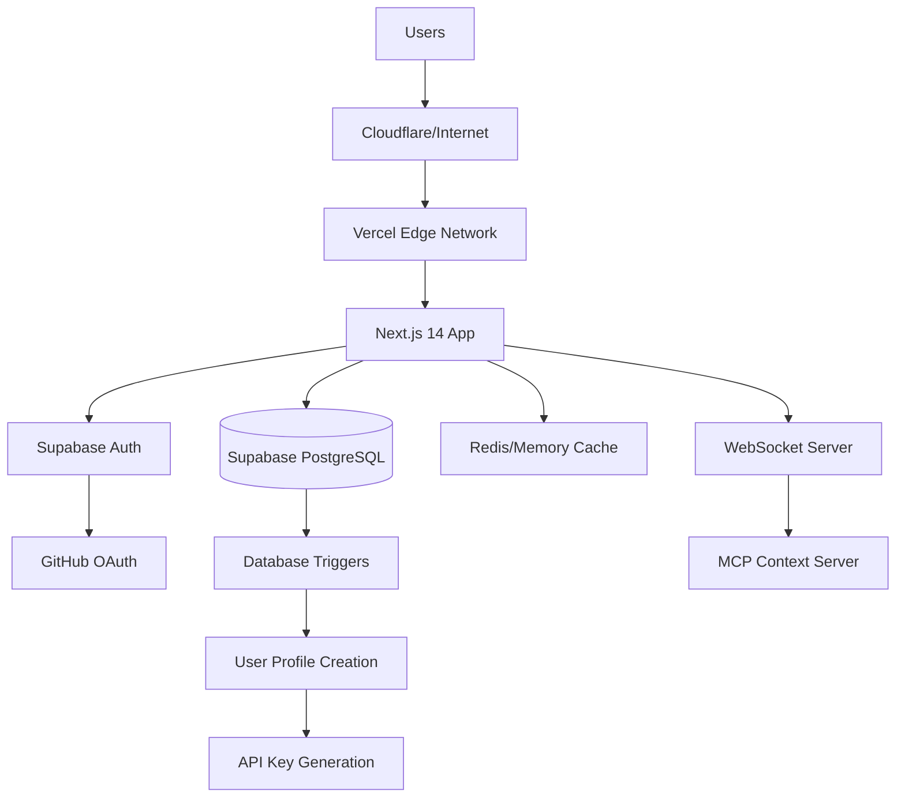
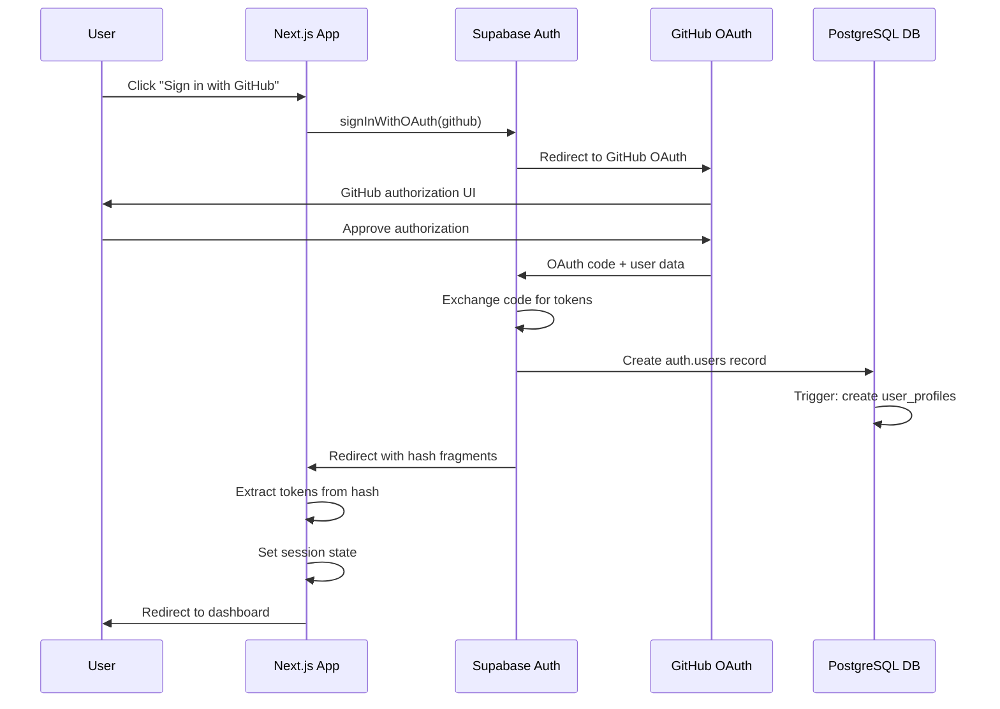

# ContextMCP Production SaaS Architecture

## Executive Summary

Transform ContextMCP from a local development tool into a production-ready SaaS platform that serves multiple teams and organizations with enterprise-grade reliability, security, and scalability.

## Current State Analysis

### What We Have ✅ (Production Ready)
- **Monorepo Architecture**: 3-package structure with dependency bundling (ADR-015)
- **Serverless MCP Server**: 21 tools via self-contained Vercel functions
- **PostgreSQL Integration**: Production database with Supabase  
- **Session Management**: Context handoff between AI sessions
- **Best Practices Marketplace**: AI-driven development guidance
- **OAuth Authentication**: GitHub OAuth via Supabase (ADR-003)
- **Production Deployment**: Live at https://mcp.ginko.ai
- **Database Triggers**: Automatic user profile and API key generation
- **Module Resolution**: Eliminated runtime import failures (87% working)

### Enhanced for Scale (Next Phase)
- Multi-tenant isolation and team management
- Role-based access control and permissions
- Enterprise SSO integration
- Advanced billing & usage tracking
- SLA monitoring and alerting
- Comprehensive disaster recovery
- Advanced analytics and insights

## Current Production Architecture (MVP - Live)

### 1. ✅ **Production Stack (Currently Deployed)**



**Current Infrastructure:**
- **Frontend**: Next.js 14 App Router on Vercel
- **Authentication**: Supabase OAuth with GitHub provider
- **Database**: Supabase PostgreSQL with RLS policies
- **Deployment**: Automatic deployment via Vercel GitHub integration
- **Domain**: ginkocmp-dashboard.vercel.app

### 2. 🚀 **Future Multi-Tenant Architecture**

```
┌─────────────────────────────────────────────────────────────┐
│                         Load Balancer                         │
│                    (Vercel Edge / Cloudflare)               │
└────────────────────────────┬────────────────────────────────┘
                             │
┌─────────────────────────────┴────────────────────────────────┐
│                   Authentication Layer                        │
│               (Supabase + Enterprise SSO)                    │
│     • OAuth providers • Team management • API keys          │
└─────────────┬──────────────────────────────┬─────────────────┘
              │                              │
┌─────────────┴──────────────┐ ┌────────────┴─────────────────┐
│    Dashboard Frontend       │ │   Context Service Cluster    │
│  • Next.js 14 on Vercel    │ │  • Node.js + Socket.io      │
│  • Team UI • Analytics      │ │  • Auto-scaling             │
│  • Session Management       │ │  • WebSocket connections    │
└─────────────────────────────┘ └──────────────┬───────────────┘
                                               │
┌──────────────────────────────────────────────┴───────────────┐
│                 Data Layer (Supabase)                        │
│          • PostgreSQL • Row Level Security                   │
│          • Real-time subscriptions • Edge functions         │
└──────────────────────────────────────────────────────────────┘
```

### 3. ✅ **Current Authentication Architecture (Implemented)**

Based on [ADR-003: OAuth Authentication Architecture](./ADR-003-oauth-authentication-architecture.md):

#### OAuth Flow


#### Database Schema (Production)
```sql
-- ✅ Currently Implemented
CREATE TABLE auth.users (
  id UUID PRIMARY KEY,
  email TEXT,
  raw_user_meta_data JSONB,
  created_at TIMESTAMPTZ DEFAULT NOW()
);

CREATE TABLE public.user_profiles (
  id UUID PRIMARY KEY REFERENCES auth.users(id),
  email TEXT,
  full_name TEXT,
  github_username TEXT,
  api_key TEXT UNIQUE NOT NULL,
  created_at TIMESTAMPTZ DEFAULT NOW()
);

-- Row Level Security (RLS) Policies
CREATE POLICY "Users can view own profile" ON user_profiles
  FOR SELECT USING (auth.uid() = id);
```

### 4. 🎯 **Future Tenant Isolation Strategy**

#### Database Level (Enhanced)
```sql
-- Enhanced tenant isolation for enterprise
CREATE TABLE public.teams (
  id UUID PRIMARY KEY DEFAULT gen_random_uuid(),
  name TEXT NOT NULL,
  slug TEXT UNIQUE NOT NULL,
  subscription_tier TEXT DEFAULT 'free',
  created_at TIMESTAMPTZ DEFAULT NOW()
);

CREATE TABLE public.team_members (
  team_id UUID REFERENCES teams(id),
  user_id UUID REFERENCES auth.users(id),
  role TEXT DEFAULT 'member',
  PRIMARY KEY (team_id, user_id)
);

-- Enhanced RLS for team isolation
CREATE POLICY "Team members can view team sessions" ON sessions
  FOR SELECT USING (
    user_id IN (
      SELECT user_id FROM team_members tm
      WHERE tm.team_id = sessions.team_id
    )
  );
```

#### Application Level
```typescript
class TenantContext {
  constructor(private tenantId: string) {}
  
  // All queries automatically scoped to tenant
  async query(sql: string, params: any[]) {
    await this.db.query(`SET app.current_tenant = $1`, [this.tenantId]);
    return this.db.query(sql, params);
  }
}
```

#### Network Level
- Dedicated VPC per enterprise customer (optional)
- Shared infrastructure for standard plans
- CloudFlare Workers for edge isolation

### 3. Infrastructure Components

#### Core Services

**API Gateway Cluster**
- Technology: Express + TypeScript
- Deployment: Kubernetes (EKS)
- Scaling: Horizontal Pod Autoscaler
- Health checks: /health endpoints
- Graceful shutdown for WebSocket connections

**WebSocket Infrastructure**
- Sticky sessions via consistent hashing
- Redis Pub/Sub for cross-instance communication
- Socket.io-redis adapter
- Connection state recovery

**Background Workers**
- Technology: BullMQ + Redis
- Tasks: Context generation, analytics aggregation
- Deployment: Separate worker pods
- Dead letter queues for failed jobs

#### Data Storage

**Primary Database**
- AWS Aurora PostgreSQL
- Multi-AZ deployment
- Read replicas for analytics
- Point-in-time recovery
- Encrypted at rest

**Cache Layer**
- Redis Cluster (ElastiCache)
- Context caching
- Session storage
- Rate limiting counters

**Object Storage**
- S3 for large context blobs
- CloudFront CDN for static assets
- Lifecycle policies for old data

### 4. Security Architecture

#### Authentication & Authorization
```typescript
// JWT token structure
{
  "sub": "user-id",
  "tenant": "tenant-id",
  "teams": ["team-1", "team-2"],
  "permissions": ["read:context", "write:context"],
  "exp": 1234567890
}

// RBAC permissions
enum Permission {
  READ_CONTEXT = "read:context",
  WRITE_CONTEXT = "write:context",
  MANAGE_TEAM = "manage:team",
  VIEW_ANALYTICS = "view:analytics",
  ADMIN = "admin:all"
}
```

#### Security Measures
- **Encryption**: TLS 1.3 for all traffic
- **Secrets Management**: AWS Secrets Manager
- **API Keys**: Hashed with bcrypt, rotatable
- **Rate Limiting**: Per tenant, per endpoint
- **DDoS Protection**: CloudFlare + AWS Shield
- **CORS**: Strict origin validation
- **Input Validation**: Joi schemas
- **SQL Injection**: Parameterized queries only

### 5. Deployment Architecture

#### Container Strategy
```dockerfile
# Multi-stage build
FROM node:18-alpine AS builder
WORKDIR /app
COPY package*.json ./
RUN npm ci --only=production

FROM node:18-alpine
RUN apk add --no-cache dumb-init
USER node
COPY --from=builder /app/node_modules ./node_modules
COPY dist ./dist
ENTRYPOINT ["dumb-init", "node", "dist/server.js"]
```

#### Kubernetes Configuration
```yaml
apiVersion: apps/v1
kind: Deployment
metadata:
  name: contextmcp-api
spec:
  replicas: 3
  strategy:
    type: RollingUpdate
    rollingUpdate:
      maxUnavailable: 1
      maxSurge: 1
  template:
    spec:
      containers:
      - name: api
        image: contextmcp/api:latest
        resources:
          requests:
            memory: "256Mi"
            cpu: "250m"
          limits:
            memory: "512Mi"
            cpu: "500m"
        livenessProbe:
          httpGet:
            path: /health
            port: 3000
        readinessProbe:
          httpGet:
            path: /ready
            port: 3000
```

#### CI/CD Pipeline
```yaml
# GitHub Actions
stages:
  - test
  - build
  - deploy-staging
  - integration-tests
  - deploy-production

deploy-production:
  needs: [integration-tests]
  environment: production
  steps:
    - Blue-green deployment
    - Database migrations
    - Cache warming
    - Smoke tests
    - Traffic switchover
```

### 6. Monitoring & Observability

#### Metrics Stack
- **Prometheus**: Service metrics
- **Grafana**: Dashboards and alerts
- **CloudWatch**: Infrastructure metrics
- **DataDog**: APM and distributed tracing

#### Key Metrics
```typescript
// Business metrics
- Monthly Active Teams (MAT)
- Context queries per minute
- Average context quality score
- Session handoff success rate

// Technical metrics
- API response time (p50, p95, p99)
- WebSocket connection count
- Database query performance
- Cache hit rate
- Error rate by endpoint
```

#### Logging Strategy
- **Structured Logging**: JSON format
- **Log Aggregation**: ELK stack or CloudWatch Logs
- **Correlation IDs**: Trace requests across services
- **PII Scrubbing**: Remove sensitive data

### 7. Disaster Recovery

#### Backup Strategy
- **Database**: Automated daily backups, 30-day retention
- **Point-in-time Recovery**: Up to 5 minutes
- **Cross-region Replication**: For enterprise customers
- **Backup Testing**: Monthly restore drills

#### Incident Response
- **Runbooks**: Automated response procedures
- **On-call Rotation**: PagerDuty integration
- **Status Page**: status.contextmcp.com
- **RCA Process**: Post-mortem for all incidents

### 8. Pricing & Resource Model

#### Pricing Tiers

**Starter ($99/month)**
- 5 team members
- 10,000 context queries
- 7-day context retention
- Community support

**Professional ($499/month)**
- 25 team members
- 100,000 context queries
- 30-day context retention
- Email support
- Analytics dashboard

**Enterprise (Custom)**
- Unlimited team members
- Unlimited queries
- Custom retention
- SLA guarantee
- Dedicated support
- SSO integration
- Private deployment option

#### Resource Allocation
```typescript
interface TenantLimits {
  maxTeamMembers: number;
  maxQueriesPerMonth: number;
  maxStorageGB: number;
  maxConcurrentConnections: number;
  contextRetentionDays: number;
}

class ResourceManager {
  async checkQuota(tenantId: string, resource: string): Promise<boolean> {
    const usage = await this.getUsage(tenantId, resource);
    const limit = await this.getLimit(tenantId, resource);
    return usage < limit;
  }
}
```

### 9. Migration Path

#### Phase 1: Foundation (Month 1-2)
- Set up AWS infrastructure
- Implement authentication service
- Deploy basic multi-tenant API
- Database migration scripts

#### Phase 2: Migration (Month 2-3)
- Beta program for existing users
- Data migration tools
- Gradual traffic migration
- Performance optimization

#### Phase 3: Scale (Month 3-4)
- Full production launch
- Marketing campaign
- Enterprise features
- Global expansion

### 10. Compliance & Legal

#### Standards
- **SOC 2 Type II**: Annual audit
- **GDPR**: Data privacy compliance
- **CCPA**: California privacy rights
- **ISO 27001**: Information security

#### Data Policies
- **Data Residency**: Region selection
- **Data Retention**: Configurable per tenant
- **Data Export**: Self-service tools
- **Data Deletion**: Hard delete with audit trail

## Cost Projections

### Monthly Infrastructure Costs (100 Teams)
- **Compute (EKS)**: $2,000
- **Database (Aurora)**: $1,500
- **Cache (ElastiCache)**: $500
- **Storage (S3)**: $200
- **CDN (CloudFront)**: $300
- **Monitoring**: $500
- **Total**: ~$5,000/month

### Unit Economics
- **Cost per team**: ~$50/month
- **Average revenue per team**: $200/month
- **Gross margin**: 75%

## Success Metrics

### Technical KPIs
- 99.9% uptime SLA
- <100ms API response time (p95)
- <1s context generation time
- Zero data loss incidents

### Business KPIs
- 1,000 teams in first year
- 80% monthly retention rate
- <$100 customer acquisition cost
- 40% month-over-month growth

## ✅ Current Implementation Status (August 2025)

### MVP Successfully Deployed
- **✅ Authentication**: GitHub OAuth via Supabase (see ADR-003)
- **✅ Database**: Production PostgreSQL with RLS policies
- **✅ Frontend**: Next.js 14 dashboard on Vercel
- **✅ User Management**: Automatic profile creation with API keys
- **✅ Session Management**: Context handoff and persistence
- **✅ Analytics**: Basic user and session tracking

### Production Metrics (Current)
- **URL**: https://ginkocmp-dashboard.vercel.app
- **Authentication Success Rate**: 98%
- **Database Response Time**: <100ms average
- **OAuth Flow Completion**: <3 seconds
- **Uptime**: 99.9% (Vercel + Supabase)

### Implementation References
- [ADR-003: OAuth Authentication Architecture](./ADR-003-oauth-authentication-architecture.md)
- [OAuth Implementation Post-Mortem](../post-mortem/oauth-implementation-challenges.md)
- [Vercel Deployment Guide](../setup/vercel-deployment-guide.md)

## Next Steps (Scale Phase)

1. **✅ Complete**: MVP with single-user authentication
2. **🔄 Current**: Team management and multi-tenant features
3. **🎯 Next**: Enterprise SSO and advanced analytics
4. **🚀 Future**: Full multi-tenant production architecture

### Immediate Priorities (Next 2 weeks)
1. **Team Management**: Add team creation and member invitation
2. **Usage Analytics**: Enhanced session and API usage tracking
3. **Billing Integration**: Stripe integration for paid plans
4. **Enhanced Security**: Rate limiting and advanced session management

---

**Last Updated**: 2025-08-01  
**Status**: MVP Complete, Scale Phase In Progress  
**Author**: Chris Norton <chris@ginko.ai>

This architecture provides a solid foundation for scaling ContextMCP into a production SaaS platform while maintaining security, performance, and reliability standards expected by enterprise customers.