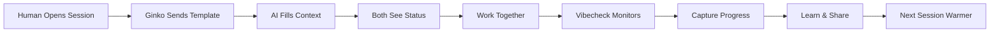

# Ginko Coaching Architecture
**Date**: August 8, 2025  
**Status**: Foundation Design  
**Paradigm**: AI-Human Collaboration Coaching Platform

## The Fundamental Insight

Ginko is not a code analysis tool. It's a **collaboration coaching platform** that teaches both humans and AI how to work together effectively by:
- Providing methodology templates
- Maintaining session continuity
- Distributing team learnings
- Removing collaboration friction

## Core Architecture Principles

### 1. Template-Driven Context
- **Server provides templates** → AI fills them with local context
- **Not**: Server tries to read files directly
- **Instead**: Server coaches AI on what context to gather

### 2. Bidirectional Coaching
- **Coaches humans**: How to work effectively with AI
- **Coaches AI**: How to follow team methodology
- **Result**: Both improve together

### 3. Friction Removal Focus
- Every tool removes a specific collaboration friction point
- Success = invisible, seamless collaboration
- Methodology becomes muscle memory for both parties

## The Coaching Tool Suite

### Core Tools (6 Essential)

#### 1. `wh.startup` - Session Initialization Coach
**Purpose**: Establish rapport and context quickly

**Server Sends**:
```markdown
Welcome back! Your team uses the enhanced methodology:
INVENTORY → CONTEXT → THINK → PLAN → PRE-MORTEM → VALIDATE → ACT → TEST

Please provide your current context:
- Working directory: [AI fills from pwd]
- Current branch: [AI fills from git branch]
- Recent commits: [AI fills from git log]
- Current task: [AI fills from session]
- Known blockers: [AI fills from context]

Your last session ended with: [previous context]
Team recent learnings: [shared discoveries]
```

**AI Responds With**: Filled template
**Server Stores**: Context for continuity
**Human Sees**: "Context loaded, AI understands your work"

---

#### 2. `wh.capture` - Progress Capture Coach
**Purpose**: Prevent context rot, enable handoffs

**Server Sends**:
```markdown
Time to capture progress. Please fill in:

What you accomplished:
- [AI summarizes completed work]

Key decisions made:
- [AI lists important choices]

Current state:
- [AI describes where things stand]

Next steps:
- [AI outlines what comes next]

Blockers discovered:
- [AI notes impediments]
```

**Value**: Creates seamless session continuity

---

#### 3. `vibecheck` - Discipline Coach
**Purpose**: Maintain methodology discipline

**Server Evaluates** (based on patterns):
- Time spent in trial-and-error
- Methodology steps skipped
- Context rot indicators

**Server Sends**:
```markdown
🎯 Vibe Check

Current discipline score: 7/10

Observations:
- You've been debugging for 23 minutes
- No pre-mortem performed
- Context getting large (approaching rot)

Suggestions:
- Take a step back and run a pre-mortem
- Consider what assumptions might be wrong
- Maybe capture session and start fresh?

Your team's reminder: "Pre-mortem saved us 3 hours last sprint"
```

---

#### 4. `wh.template` - Methodology Distribution
**Purpose**: Provide consistent templates team-wide

**Server Provides**:
```markdown
Your team templates are ready:

## Pre-Mortem Template
1. What could go wrong?
2. What are we assuming?
3. What's the stupid failure mode?

## Planning Template
- Success = [metric] + [target] + [timeline]
- Constraints: [what can't change]
- Dependencies: [what we need]

## Context Gathering
- What exists already?
- What patterns are established?
- What broke last time?
```

**Value**: Consistency across team, reduced decision fatigue

---

#### 5. `wh.status` - Connection Health
**Purpose**: "Is my shit working?"

**For Human**:
```
✅ Ginko Connected
✅ AI has your context
✅ Team methodology loaded
⚠️ Context age: 47 minutes (consider capture soon)
```

**For AI**:
```
Connection: Active
Context freshness: Good
Team patterns: Loaded
Methodology: Enhanced 9-step
```

---

#### 6. `wh.learn` - Learning Capture
**Purpose**: Continuous improvement for team

**Server Prompts**:
```markdown
Session reflection time:

For the human:
- What worked smoothly?
- Where was friction?
- What would help next time?

For the AI:
- What patterns did you notice?
- What confused you?
- What methodology helped most?

This learning helps your entire team.
```

**Server Aggregates**: Patterns across team
**Server Distributes**: Learnings in next startup

---

## The Friction Points We Solve

### P1: Context Rot (Rapport Problem)
**Friction**: Lose flow state after ~1 hour  
**Solution**: Auto-capture prompts, seamless handoffs

### P2: Reliability Confidence  
**Friction**: "Is it working?"
**Solution**: Clear status indicators for both parties

### P3: Team Knowledge Silos
**Friction**: Individual learnings lost
**Solution**: Learning capture and distribution

### P4: Complexity Overwhelm
**Friction**: Too many tools/options
**Solution**: 6 clear tools, mostly automatic

### P5: Cold Starts
**Friction**: Starting from zero
**Solution**: Warm starts with context + methodology

## Implementation Architecture

### Server (SaaS) Responsibilities
```typescript
interface GinkoServer {
  // Store and retrieve
  sessionStorage: Map<userId, SessionContext>;
  teamMethodology: Map<teamId, Methodology>;
  learnings: Map<teamId, Learning[]>;
  
  // Provide coaching
  generateTemplate(tool: string, context: Context): Template;
  evaluateDiscipline(patterns: Patterns): VibeCheck;
  aggregateLearnings(team: Team): Insights;
  
  // Distribute
  broadcastMethodology(team: Team): void;
  shareDiscoveries(team: Team): void;
}
```

### Client (AI) Responsibilities
```typescript
interface AIClient {
  // Gather local context
  async fillTemplate(template: Template): Promise<FilledTemplate>;
  async evaluateLocalState(): Promise<StateInfo>;
  
  // Apply methodology
  followMethodology(methodology: Methodology): void;
  implementSuggestions(vibecheck: VibeCheck): void;
  
  // Learn and adapt
  capturePatterns(): Patterns;
  reportFriction(): FrictionPoints;
}
```

### Human Interface
```typescript
interface HumanExperience {
  // Invisible by default
  autoLoadedContext: boolean;
  seamlessHandoffs: boolean;
  
  // Visible when needed
  statusIndicator: StatusLight;
  vibeCheckAlerts: Alert[];
  
  // Progressive disclosure
  methodologyCoaching: OptionalDepth;
  learningInsights: OnDemand;
}
```

## The Collaboration Loop



## Success Metrics

### Quantitative
- Session startup time: <5 seconds
- Context handoff success: >95%
- Methodology adoption: >80%
- Friction reduction: 50% fewer restarts

### Qualitative  
- "It just works"
- "AI understands our team"
- "Feels like continuous conversation"
- "Don't think about it anymore"

## Migration Path

### Phase 1: Core Coaching (Week 1)
- Implement template-driven startup
- Basic capture/resume
- Status indicators

### Phase 2: Methodology (Week 2)
- Vibecheck discipline monitoring
- Template distribution
- Team methodology loading

### Phase 3: Learning Loop (Week 3)
- Learning capture
- Pattern recognition
- Insight distribution

### Phase 4: Polish (Week 4)
- Auto-triggers
- Invisible optimizations
- Friction smoothing

## The Revolutionary Simplification

### Before (Wrong Mental Model)
- 19 tools trying to scan files
- Server attempting impossible tasks
- Complex broken infrastructure
- Users confused about purpose

### After (Correct Mental Model)
- 6 coaching prompts
- Server provides templates
- AI fills with local context
- Both parties improve together

## Business Model Clarity

### What We Sell
- **Not**: Code analysis tools
- **Instead**: AI-Human collaboration coaching

### Value Proposition
- **For Teams**: Consistent AI collaboration across developers
- **For Individuals**: Seamless AI rapport and continuity
- **For Organizations**: "Not doing stupid faster" guarantee

### Moat
- Aggregated team learnings
- Methodology refinement
- Network effects (more teams = better coaching)

## Next Steps

1. **Validate Core Assumption**: Can AI reliably fill templates?
2. **Build MVP**: startup + capture + status (3 tools)
3. **Test with Real Teams**: 5 beta teams for feedback
4. **Iterate on Coaching**: Refine prompts based on usage
5. **Scale Learning System**: Aggregate patterns across teams

---

## Conclusion

Ginko succeeds by **coaching collaboration**, not scanning code. This simpler, correct architecture:
- Actually works in serverless
- Solves real friction points
- Scales through learning
- Provides clear value

The shift from "tools" to "coaching" transforms everything.