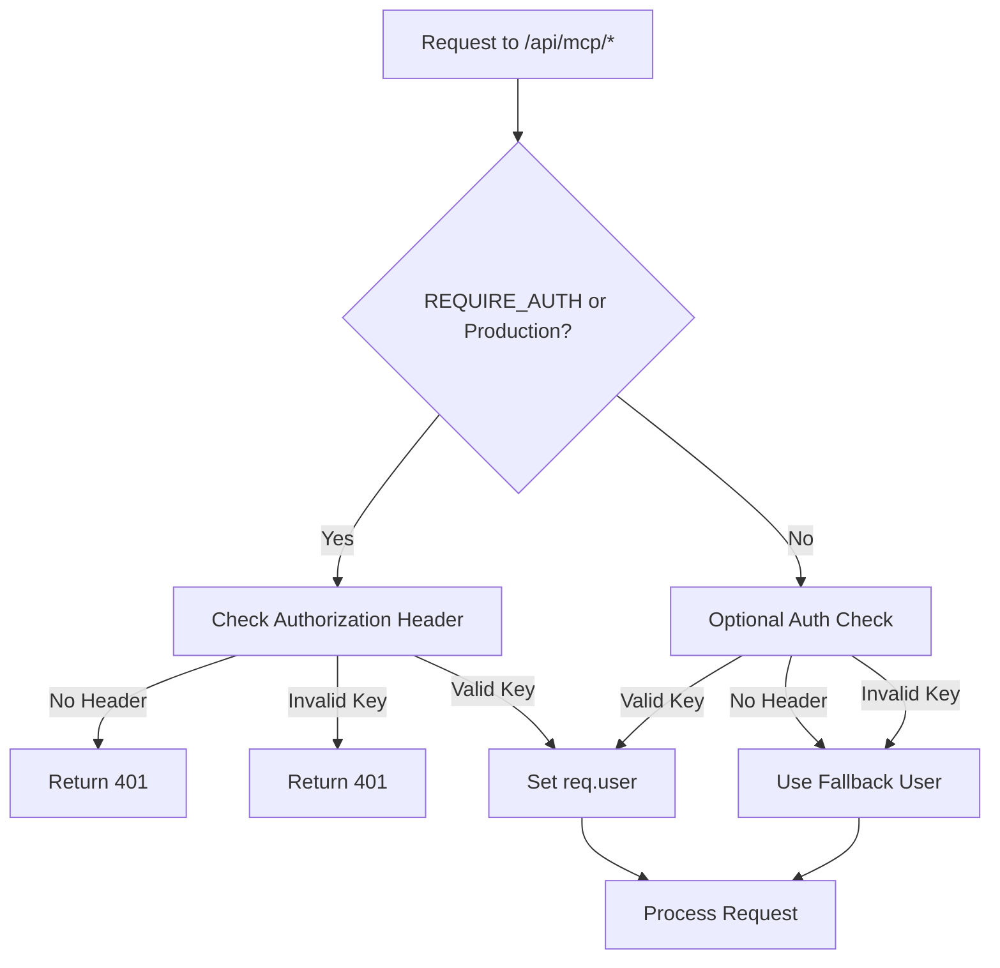

# Authentication Testing Guide

## Quick Start: Enable Required Authentication

### 1. Set Environment Variable
```bash
# Add to .env file
REQUIRE_AUTH=true

# Or set inline when starting server
REQUIRE_AUTH=true node dist/remote-server.js
```

### 2. Start the Server
```bash
# Build first if needed
npm run build

# Start with auth required
node dist/remote-server.js
```

Look for this log message:
```
[AUTH] MCP endpoints require authentication (production mode)
```

### 3. Test Authentication Enforcement
```bash
# Run the test script
./test-auth-required.sh
```

Expected results:
- ❌ Unauthenticated requests → 401 Unauthorized
- ❌ Invalid API key → 401 Unauthorized  
- ✅ Health endpoint → 200 OK (no auth required)

### 4. Generate Test API Key (Development Only)
```bash
# Generate a test key
node generate-test-api-key.js

# Copy the generated key and add to .env:
GINKO_API_KEY=cmcp_sk_test_...
```

### 5. Test with Valid API Key
```bash
# Direct curl test
curl -X POST http://localhost:3031/api/mcp/tools/list \
  -H "Content-Type: application/json" \
  -H "Authorization: Bearer YOUR_API_KEY_HERE"

# Or use the MCP client
export GINKO_API_KEY="YOUR_API_KEY_HERE"
node dist/simple-remote-client.js
```

## Environment Variables Reference

| Variable | Default | Description |
|----------|---------|-------------|
| `NODE_ENV` | development | Set to 'production' to require auth |
| `REQUIRE_AUTH` | false | Set to 'true' to require auth in dev |
| `GINKO_API_KEY` | (none) | API key for MCP client |
| `CONTEXTMCP_API_KEY` | (none) | Alternative env var for API key |

## Authentication Flow



## Troubleshooting

### "MCP endpoints using optional authentication"
- Check `REQUIRE_AUTH` is set to `true` in .env
- Check `NODE_ENV` is not set to `production`
- Restart the server after changing environment variables

### "401 Unauthorized" errors
- Verify API key format: `cmcp_sk_test_...` or `cmcp_sk_live_...`
- Check Authorization header format: `Bearer YOUR_KEY`
- Ensure API key exists in database (for real keys)

### Testing Production Behavior Locally
```bash
# Option 1: Set REQUIRE_AUTH
REQUIRE_AUTH=true node dist/remote-server.js

# Option 2: Set NODE_ENV
NODE_ENV=production node dist/remote-server.js
```

## Security Best Practices

1. **Never commit API keys** to version control
2. **Use environment variables** for API keys
3. **Rotate keys regularly** in production
4. **Monitor authentication logs** for failures
5. **Use HTTPS in production** to protect keys in transit