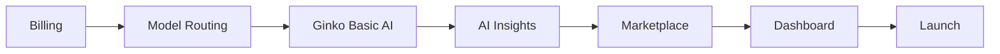

# Sprint Plan: Ginko Monetization Platform - Q1 2025

## Overview
**Start Date**: January 1, 2025  
**Duration**: 12 weeks (Q1 2025)  
**Type**: Major Platform Release  
**ADR References**: ADR-026 (Model Routing), ADR-027 (Monetization Architecture)

## Strategic Goals
Transform Ginko from free tool to monetized platform while maintaining git-native, privacy-first philosophy.

### Target Outcomes
- Launch three-tier pricing (Free/$10 Pro/$25+ Enterprise)
- Implement intelligent AI model routing (51% cost reduction)
- Deploy visualization marketplace MVP
- Enable Ginko Basic AI for solo developers
- Achieve 100+ paid customers by end of Q1

## Phase 1: Foundation & Billing (Weeks 1-2)

### Week 1: Stripe Integration & Core Infrastructure
**Goal**: Establish payment processing and subscription management

**Tasks**:
- [ ] Set up Stripe account and webhook endpoints (4 hours)
- [ ] Implement subscription models in database (4 hours)
- [ ] Create checkout flow with Stripe Elements (8 hours)
- [ ] Build webhook handlers for subscription events (6 hours)
- [ ] Add feature flags for tier-based access (4 hours)
- [ ] Create billing dashboard component (6 hours)

**Deliverables**:
- Working payment flow (test mode)
- Subscription state management
- Feature flag system

### Week 2: User Management & Tier Logic
**Goal**: Complete billing infrastructure and tier management

**Tasks**:
- [ ] Implement subscription portal for self-service (8 hours)
- [ ] Create usage tracking without data retention (6 hours)
- [ ] Build upgrade/downgrade flows (6 hours)
- [ ] Add grace period handling (4 hours)
- [ ] Create pricing page with tier comparison (6 hours)
- [ ] Test end-to-end payment scenarios (4 hours)

**Deliverables**:
- Complete billing system
- Pricing page deployed
- Usage tracking operational

## Phase 2: Intelligent Model Routing (Weeks 3-4)

### Week 3: Query Classification & Routing
**Goal**: Implement intelligent model routing per ADR-026

**Tasks**:
- [ ] Build query classifier (basic/standard/complex/realtime) (8 hours)
- [ ] Implement model router with static weights (8 hours)
- [ ] Set up API clients for all models (6 hours)
  - [ ] Claude 3 Haiku ($0.0005/request)
  - [ ] Claude 3.5 Sonnet ($0.006/request)
  - [ ] Grok ($0.007/request)
- [ ] Create fallback chain logic (4 hours)
- [ ] Add cost tracking per request (4 hours)

**Deliverables**:
- Multi-model routing operational
- Cost tracking dashboard
- 51% cost reduction achieved

### Week 4: Caching & Optimization
**Goal**: Optimize model routing for cost and performance

**Tasks**:
- [ ] Implement multi-tier cache (L1/L2/L3) (8 hours)
- [ ] Add query similarity matching (6 hours)
- [ ] Build response validator (4 hours)
- [ ] Create quality monitoring system (6 hours)
- [ ] Implement dynamic weight adjustment (4 hours)
- [ ] Add budget management controls (4 hours)

**Deliverables**:
- 30%+ cache hit rate
- Sub-second response times
- Budget controls active

## Phase 3: Ginko Basic AI (Weeks 5-6)

### Week 5: Privacy-Preserving Processing
**Goal**: Enable AI insights for users without API keys

**Tasks**:
- [ ] Build sanitization engine for metrics (8 hours)
- [ ] Create transparent processing pipeline (6 hours)
- [ ] Implement zero-retention backend (8 hours)
- [ ] Add consent and preview UI (4 hours)
- [ ] Build rate limiting system (4 hours)

**Deliverables**:
- Ginko Basic AI operational
- Privacy guarantees implemented
- Transparent processing active

### Week 6: AI Insights Command System
**Goal**: Natural language interface for insights

**Tasks**:
- [ ] Create `ginko insights` CLI command (6 hours)
- [ ] Build natural language query parser (8 hours)
- [ ] Implement context gathering system (6 hours)
- [ ] Add visualization generation (6 hours)
- [ ] Create interactive refinement loop (4 hours)

**Deliverables**:
- AI insights command working
- Natural language queries supported
- Visualizations generating

## Phase 4: Visualization Marketplace (Weeks 7-9)

### Week 7: Marketplace Infrastructure
**Goal**: Create foundation for community visualizations

**Tasks**:
- [ ] Design visualization package format (4 hours)
- [ ] Build marketplace registry system (8 hours)
- [ ] Create sandboxed execution environment (8 hours)
- [ ] Implement installation mechanism (6 hours)
- [ ] Add version management (4 hours)

**Deliverables**:
- Marketplace infrastructure ready
- Sandboxing operational
- Package format defined

### Week 8: Discovery & Submission
**Goal**: Enable creators to submit and users to discover

**Tasks**:
- [ ] Build marketplace browse interface (8 hours)
- [ ] Create search and filtering system (6 hours)
- [ ] Implement creator submission workflow (6 hours)
- [ ] Add preview system with live demos (6 hours)
- [ ] Create validation pipeline (4 hours)

**Deliverables**:
- Marketplace browsable
- Submission workflow active
- Preview system working

### Week 9: Monetization & Community
**Goal**: Enable marketplace revenue and community features

**Tasks**:
- [ ] Implement payment splitting (70/30) (6 hours)
- [ ] Add rating and review system (6 hours)
- [ ] Create creator profiles (4 hours)
- [ ] Build featured/trending logic (4 hours)
- [ ] Seed with 20 official visualizations (8 hours)

**Deliverables**:
- Revenue sharing active
- Community features live
- 20+ visualizations available

## Phase 5: Dashboard & Polish (Weeks 10-11)

### Week 10: Dashboard Enhancement
**Goal**: Upgrade dashboard with monetization features

**Tasks**:
- [ ] Create public session viewer (6 hours)
- [ ] Implement share token system (4 hours)
- [ ] Build coaching insights display (8 hours)
- [ ] Add team analytics views (6 hours)
- [ ] Create export functionality (4 hours)

**Deliverables**:
- Public sharing enabled
- Coaching insights visible
- Team features complete

### Week 11: Integration & Testing
**Goal**: Ensure all systems work together

**Tasks**:
- [ ] End-to-end integration testing (8 hours)
- [ ] Load testing (1000+ concurrent users) (6 hours)
- [ ] Security audit of all new features (8 hours)
- [ ] Performance optimization (6 hours)
- [ ] Bug fixes from testing (8 hours)

**Deliverables**:
- All systems integrated
- Performance validated
- Security verified

## Phase 6: Launch (Week 12)

### Week 12: Beta Launch & Monitoring
**Goal**: Soft launch with beta users

**Tasks**:
- [ ] Deploy to production environment (4 hours)
- [ ] Onboard 50 beta users (8 hours)
- [ ] Monitor system metrics (ongoing)
- [ ] Gather feedback and iterate (8 hours)
- [ ] Prepare marketing materials (6 hours)
- [ ] Create documentation (6 hours)

**Deliverables**:
- Platform live in production
- 50+ beta users active
- Documentation complete

## Critical Path Dependencies

## Resource Requirements

### Technical
- Stripe account (production)
- API keys for AI models
- Vercel Pro for increased limits
- Supabase Pro for database
- Redis Cloud for caching

### Human
- 2 full-time developers
- 1 part-time designer (UI/UX)
- 1 part-time marketer (launch prep)

## Risk Mitigation

| Risk | Impact | Mitigation |
|------|--------|------------|
| Stripe approval delays | High | Apply early, have backup processor |
| AI model costs exceed budget | High | Intelligent routing, strict limits |
| Marketplace security issues | High | Sandboxing, manual review initially |
| Low beta conversion | Medium | Clear value prop, generous free tier |
| Technical debt accumulation | Medium | 20% time for refactoring |

## Success Metrics

### Weekly KPIs
- Code velocity: 40+ hours/week
- Test coverage: >80%
- Bug escape rate: <5%
- User feedback score: >4.0

### Launch Targets
- 50+ beta users active
- 5+ paid conversions
- 10+ marketplace submissions
- <2s average response time
- 0 critical security issues

## Budget

### Development Costs
- Developer time: 960 hours @ $100/hr = $96,000
- Designer: 120 hours @ $80/hr = $9,600
- Infrastructure: $500/month × 3 = $1,500
- **Total: ~$107,000**

### Expected Revenue (Q1)
- Month 1: 20 users × $10 = $200
- Month 2: 50 users × $10 = $500
- Month 3: 100 users × $10 = $1,000
- **Q1 Total: $1,700**

### ROI Timeline
- Break-even: Month 9
- Profitable: Year 2
- Target: $20K MRR by end of Year 1

## Daily Standup Focus

### Weeks 1-2: Foundation
- Monday: Stripe integration review
- Wednesday: Subscription logic demo
- Friday: Billing flow testing

### Weeks 3-4: Model Routing
- Monday: Classifier accuracy check
- Wednesday: Cost reduction metrics
- Friday: Cache performance review

### Weeks 5-6: Ginko Basic AI
- Monday: Privacy validation
- Wednesday: Processing transparency demo
- Friday: User consent flow review

### Weeks 7-9: Marketplace
- Monday: Sandboxing security review
- Wednesday: Creator experience testing
- Friday: Visualization quality check

### Weeks 10-11: Dashboard
- Monday: Public sharing demo
- Wednesday: Team features review
- Friday: Integration testing results

### Week 12: Launch
- Monday: Production deployment
- Wednesday: Beta user feedback
- Friday: Metrics review and celebration

## Communication Plan

### Internal
- Daily: Slack standups (async)
- Weekly: Progress demos (30 min)
- Bi-weekly: Stakeholder updates

### External
- Week 4: Technical blog post on model routing
- Week 8: Marketplace announcement
- Week 12: Public beta launch

## Post-Launch Plan

### Week 13-14: Stabilization
- Monitor metrics closely
- Fix critical bugs immediately
- Gather user feedback

### Week 15-16: Iteration
- Implement top user requests
- Optimize based on data
- Prepare for public launch

### Month 4+: Scale
- Public launch campaign
- Enterprise features
- International expansion

## Conclusion

This sprint plan implements the complete monetization architecture while maintaining Ginko's core philosophy. The phased approach ensures each component is solid before building the next, with clear dependencies and risk mitigation throughout.

Key success factors:
1. **Privacy-first**: Zero data retention, git-native storage
2. **Cost-optimized**: 51% reduction through intelligent routing
3. **Community-driven**: Marketplace for sustainable growth
4. **Developer-focused**: Simple, transparent, valuable

The plan balances technical complexity with business goals, ensuring we deliver a monetized platform that stays true to Ginko's values while achieving financial sustainability.