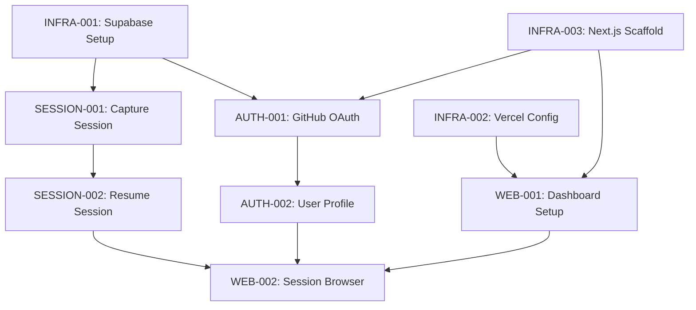

# Sprint 001: Dependency Analysis & First 20 Points

## Dependency Analysis

### Critical Path Dependencies



### Dependency Categories

#### 🟥 **Blockers** (Must be done first)
- INFRA-001: Supabase Setup → Blocks all database operations
- INFRA-003: Next.js Scaffold → Blocks all frontend work
- INFRA-002: Vercel Config → Blocks deployment

#### 🟨 **Critical Path** (Sequential dependencies)
- AUTH-001 → AUTH-002 → WEB-002
- SESSION-001 → SESSION-002
- INFRA-003 → WEB-001 → WEB-002

#### 🟢 **Parallel Work** (Can be done simultaneously)
- SESSION-003: Quality Scoring (after SESSION-001)
- AUTO-001: Startup Hook (after SESSION-002)
- DX-001: Error Handling (can start early)

## Optimal First 20 Points

### Day 1: Foundation Sprint (20 points exactly)

#### Morning: Infrastructure Foundation (7 points)
1. **INFRA-001: Supabase Project Setup** (2 points)
2. **INFRA-002: Vercel Project Configuration** (2 points)  
3. **INFRA-003: Next.js Application Scaffold** (3 points)

#### Afternoon: Core Authentication (8 points)
4. **AUTH-001: GitHub OAuth Integration** (3 points)
5. **SESSION-001: Capture Session Implementation** (5 points)

#### Evening: Error Foundation (5 points)
6. **DX-001: Error Handling & Recovery** (3 points)
7. **INFRA-004: CI/CD Pipeline** (2 points)

## Acceleration Recommendations

### 🚀 **Recommendation 1: Parallel Infrastructure Setup**
Instead of sequential setup, do all infrastructure in parallel:

```bash
# Terminal 1: Supabase
supabase init
supabase start
supabase db reset

# Terminal 2: Vercel  
vercel init
vercel env add

# Terminal 3: Next.js
npx create-next-app@latest contextmcp-dashboard
cd contextmcp-dashboard && npm install
```

**Time Saved**: 2-3 hours (from sequential to parallel)

### 🚀 **Recommendation 2: Use Supabase Auth UI**
Don't build custom auth forms - use Supabase's pre-built Auth UI:

```typescript
import { Auth } from '@supabase/auth-ui-react'
import { ThemeSupa } from '@supabase/auth-ui-shared'

// One component = complete auth flow
<Auth
  supabaseClient={supabase}
  appearance={{ theme: ThemeSupa }}
  providers={['github']}
/>
```

**Time Saved**: 4-6 hours of auth UI development

### 🚀 **Recommendation 3: Start with Simplified Session Storage**
Begin with minimal session schema, expand later:

```sql
-- MVP schema (5 minutes)
CREATE TABLE sessions (
  id UUID PRIMARY KEY DEFAULT gen_random_uuid(),
  user_id UUID REFERENCES auth.users(id),
  title TEXT,
  content JSONB,
  created_at TIMESTAMPTZ DEFAULT NOW()
);

-- Skip complex metadata initially
-- Add quality scoring later
```

**Time Saved**: 2-3 hours of schema design

### 🚀 **Recommendation 4: Use T3 Stack Template**
Start with pre-configured stack instead of manual setup:

```bash
# Instead of manual Next.js + TypeScript + Tailwind setup
npx create-t3-app@latest contextmcp-dashboard --prisma --nextAuth --tailwind

# Pre-configured with:
# ✅ TypeScript
# ✅ Tailwind CSS  
# ✅ Auth setup
# ✅ Database ORM
# ✅ Best practices
```

**Time Saved**: 3-4 hours of configuration

### 🚀 **Recommendation 5: Session Capture MVP**
Start with basic file content capture, skip complex analysis:

```typescript
// MVP version (30 minutes)
const captureSession = async (description: string) => {
  const context = {
    description,
    timestamp: new Date(),
    // Just capture basic context initially
    workingDirectory: process.cwd(),
    gitBranch: await getCurrentBranch(),
    openFiles: await getOpenFiles(), // Simple list
  }
  
  return await saveSession(context)
}

// Skip initially:
// - Git status analysis
// - File content reading  
// - Dependency mapping
// - Quality scoring
```

**Time Saved**: 4-5 hours of complex context analysis

### 🚀 **Recommendation 6: Hardcode Initial Resume Logic**
Start with template-based resume instead of AI generation:

```typescript
// MVP resume prompt (15 minutes)
const generateResumePrompt = (session) => `
I was working on: ${session.description}

Last session details:
- Date: ${session.timestamp}
- Branch: ${session.gitBranch}
- Files: ${session.openFiles.join(', ')}

Please help me continue where I left off.
`

// Skip initially:
// - Intelligent prompt generation
// - Context analysis
// - File content inclusion
```

**Time Saved**: 2-3 hours of prompt engineering

## Revised Timeline with Accelerations

### Day 1 (Accelerated): 20 points in 6-7 hours
- **Morning (2-3 hours)**: Parallel infrastructure setup
- **Afternoon (2-3 hours)**: Supabase Auth UI + basic session capture
- **Evening (2 hours)**: Simple error handling + CI/CD

### Acceleration Impact
- **Original Estimate**: 20 points = full day (8+ hours)
- **With Accelerations**: 20 points = 6-7 hours
- **Time Saved**: 2-3 hours (25-30% faster)

## Risk Mitigation

### Risk 1: Auth UI Customization Needs
**Mitigation**: Supabase Auth UI is highly customizable with CSS
**Fallback**: Can build custom later if needed

### Risk 2: Simplified Session Storage Limitations  
**Mitigation**: JSONB column allows easy schema evolution
**Fallback**: Can migrate to complex schema without data loss

### Risk 3: Template Resume Prompts Inadequate
**Mitigation**: Users can edit/improve prompts manually
**Fallback**: Add AI generation in next sprint

## Success Metrics for Day 1

✅ **Infrastructure**
- Supabase project live with auth enabled
- Vercel deployment working
- Next.js app accessible

✅ **Authentication** 
- GitHub login/logout working
- User records created in database
- Protected routes functional

✅ **Sessions**
- Basic capture command working
- Sessions stored in database
- Simple resume prompt generated

✅ **Quality**
- Error boundaries implemented
- Basic error messages shown
- CI/CD pipeline passing

## Next 20 Points Preview (Day 2)

Optimal sequence after Day 1 foundation:
1. **SESSION-002: Resume Session Implementation** (5pts)
2. **AUTH-002: User Profile & Settings** (2pts)
3. **WEB-001: Next.js Dashboard Setup** (3pts)
4. **SESSION-003: Session Quality Scoring** (3pts)
5. **SETUP-001: One-Line Installer Script** (5pts)
6. **AUTO-001: Claude Code Startup Hook** (3pts)

This maintains critical path while building user-facing value quickly.