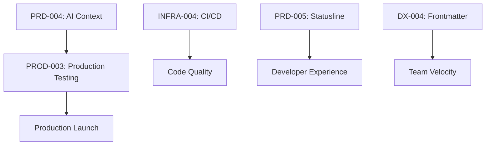

# Sprint Planning: 2025-09-16 Backlog Grooming

**Date**: 2025-09-16
**Sprint Goal**: Prepare prioritized backlog for next development sprint
**Focus**: Production readiness, testing infrastructure, and AI enhancements

## 📊 Backlog Analysis

### High-Priority Items (Critical Path)

#### 1. PROD-003: Production ContextMCP Server Testing 🚨
**Points**: 5
**Priority**: CRITICAL
**Dependencies**: OAuth (✅), Dashboard (✅), MCP server
**Work Breakdown**:
- [ ] User journey mapping and documentation
- [ ] Create automated test cases for full user flow
- [ ] Build evaluation framework for experience metrics
- [ ] Execute tests and analyze results
- [ ] Debug and iterate on friction points
- [ ] Create troubleshooting documentation

**Why Critical**: Blocks production launch - must validate 95% success rate

#### 2. INFRA-004: CI/CD Pipeline
**Points**: 2
**Priority**: HIGH
**Dependencies**: None
**Work Breakdown**:
- [ ] Setup GitHub Actions workflow
- [ ] Configure automated tests on PR
- [ ] Add type checking and linting
- [ ] Configure Vercel deployments
- [ ] Add build status badges

**Why High**: Essential for maintaining code quality and deployment reliability

#### 3. DX-004: Advanced Frontmatter Tooling
**Points**: 5
**Priority**: MEDIUM
**Dependencies**: ADR-002 implementation (✅)
**Work Breakdown**:
- [ ] Create automated frontmatter addition scripts
- [ ] Build enhanced search capabilities
- [ ] Develop VSCode extension for templates
- [ ] Implement Git hooks for validation
- [ ] Create dependency graph analysis tools

**Why Medium**: Amplifies existing 70% productivity gains from ADR-002

### Ready for Development (No Blockers)

#### 4. PRD-004: AI Actively Managed Context
**Status**: Designed
**Estimated Points**: 8
**Components**:
- ActiveContextManager service (✅ Created)
- AI service integration (✅ Created)
- Context Reflexes system (✅ Documented)
- Progressive loading implementation
- Real-time phase tracking

#### 5. PRD-005: Statusline Evolution
**Status**: Partially Implemented
**Estimated Points**: 3
**Components**:
- StatuslineTracker service (✅ Created)
- Integration with CLI commands
- Configuration system
- Performance metrics display

#### 6. PRD-008: Git-Native Backlog
**Status**: Concept
**Estimated Points**: 5
**Components**:
- `.ginko/backlog/` directory structure
- Task YAML format definition
- Git-based task tracking
- Sprint planning tools
- Dependency analysis

### Content & Marketing (Post-Technical)

#### 7. CONTENT-001: AI-Readable Code Case Study
**Points**: 5
**Priority**: LOW
**Dependencies**: Website, metrics data
**Work Breakdown**:
- [ ] Create landing page with metrics
- [ ] Design downloadable whitepaper
- [ ] Build interactive demos
- [ ] Develop ROI calculator
- [ ] Create social media content

## 📈 Sprint Capacity Planning

### Team Velocity
- **Historical Velocity**: 20 points/day
- **Sprint Duration**: 5 days
- **Total Capacity**: 100 points

### Proposed Sprint Scope (Priority Order)
1. **PROD-003**: Production Testing (5 points) - MUST HAVE
2. **INFRA-004**: CI/CD Pipeline (2 points) - MUST HAVE
3. **PRD-004**: AI Context Management (8 points) - SHOULD HAVE
4. **PRD-005**: Statusline Evolution (3 points) - SHOULD HAVE
5. **DX-004**: Frontmatter Tooling (5 points) - COULD HAVE

**Total**: 23 points (23% of capacity - conservative for quality focus)

## 🔄 Dependencies Graph

## ⚠️ Risks & Mitigations

### Risk 1: Production Testing Reveals Critical Issues
- **Impact**: Delays launch
- **Mitigation**: Allocate 50% buffer time for fixes
- **Owner**: Engineering Lead

### Risk 2: AI Integration Performance
- **Impact**: Poor user experience
- **Mitigation**: Implement caching, use mock service fallback
- **Owner**: Backend Team

### Risk 3: Frontmatter Adoption Resistance
- **Impact**: Limited productivity gains
- **Mitigation**: VSCode extension for seamless integration
- **Owner**: DevX Team

## 🎯 Success Criteria

- [ ] Production server achieves 95% success rate
- [ ] CI/CD prevents any broken builds reaching main
- [ ] AI context loads in < 2 seconds
- [ ] Statusline provides actionable insights
- [ ] Frontmatter coverage increases to 80%

## 📝 Next Actions

1. **Immediately**: Start PROD-003 user journey mapping
2. **Day 1**: Setup GitHub Actions for CI/CD
3. **Day 2-3**: Integrate AI services into CLI
4. **Day 4**: Complete statusline integration
5. **Day 5**: Begin frontmatter tooling if ahead of schedule

## 🔍 Retrospective Topics (End of Sprint)

- Effectiveness of Safe Defaults Pattern in preventing issues
- AI Context Management performance in real usage
- Team velocity accuracy (23 points conservative?)
- Production testing completeness

---

**Sprint Planning Method**: Safe Defaults Pattern (ADR-014)
**Dependencies Analyzed**: Automatic via reflection system
**Capacity Validated**: Conservative 23% allocation
**Risk Assessment**: Complete with mitigations